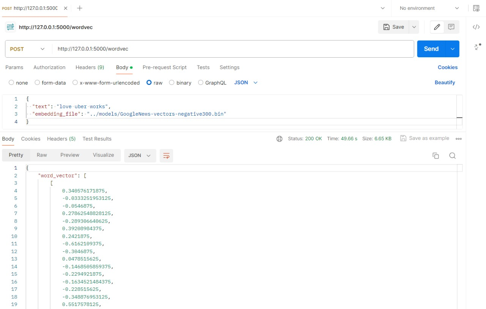

# Processamento de Linguagem Natural  - Módulo 6 - Inteli

## Thunder - Grupo 3

Daniel Augusto Rivas Mendez, Freddy Mester Harari, Izadora Luz Rodrigues Novaes, Kaylane de Cássia Vasconcelos de Brito, Marcelo Faska Sitton, Rafaella Bianca Cavalcante e Thiago Goulart de Oliveira.


## Sumário

[1. Introdução](#c1)

[2. Entendimento do Negócio](#c2)

&emsp;[2.1. Matriz de avaliação de valor Oceano Azul](#c2.1)

&emsp;[2.2. Matriz de Risco](#c2.2)

&emsp;[2.3. Canvas Proposta de Valor](#c2.3)

&emsp;[2.4. Análise financeira do projeto](#c2.4)

&emsp;[2.5. Regras de Negócio](#c2.5)

[3. Entendimento do Usuário](#c3)

&emsp;[3.1. Personas](#c3.1)

&emsp;[3.2. User Stories](#c3.2)

[4. Análise Descritiva dos Dados](#c4)

&emsp;[4.1. Análise dos Dados Iniciais](#c4.1)

&emsp;[4.2. Análise dos Dados Processados](#c4.2)

[5. Pré-processamento dos Dados](#c5)

&emsp;[5.1. Métodos](#c5.1)

&emsp;[5.2. Resultados](#c5.2)

[6. Modelo de Bag of Words (IPYNB)](#c6)

&emsp;[6.1. Métodos](#c6.1)

&emsp;[6.2. Resultados](#c6.2)

[7. Modelo utilizando: Word2Vec](#c7)

&emsp;[7.1. Métodos](#c7.1)

&emsp;[7.2. Resultados](#c7.2)

[8. Desenvolvimento da API](#c8)

&emsp;[8.1. Métodos](#c8.1)

&emsp;[8.2. Resultados](#c8.2)

&emsp;[8.3. Integrção com o Slack](#c8.3)

[9. Análise dos Modelos](#c9)

&emsp;[9.1. Vetorização do TD-IDF com XGBoost e seus testes](#c9.1)

&emsp;[9.2. Vetorização do GloVe com XGBoost e seus testes](#c9.2)

&emsp;[9.3. Vetorização do FastText com XGBoost e seus testes](#c9.3)

&emsp;[9.4. Vetorização do N-grams com XGBoost e seus testes](#c9.4)

&emsp;[9.5. Vetorização do Part-of-Speech Tagging com XGBoost e seus testes](#c9.5)

&emsp;[9.6. Conclusão: Análise e definição do melhor resultado](#c9.6)

[10. Diagrama UML da solução](#c10)

[11. Deploy](#c11)

[12. Conclusão e Sugestões de Melhorias](#c12)

[13. Referências](#c13)

<br>

# <a name="c1"></a>1. Introdução

O projeto de Processamento de Linguagem Natural desenvolvido pelo grupo *Thunder* tem como objetivo a criação de uma solução inovadora para a empresa *Uber*. Através da análise de comentários no *Twitter*, o projeto busca padronizar as análises e classificar as mensagens como "positivas", "negativas" ou "neutras", além de mitigar erros operacionais humanos.

Neste documento, apresentaremos os principais aspectos do projeto, desde o entendimento do negócio até a conclusão e sugestões de melhorias. Serão abordados tópicos como a matriz de avaliação de valor Oceano Azul, o entendimento do usuário, a análise descritiva dos dados, o pré-processamento dos dados, os modelos de *Bag of Words* e *Word2Vec*, o desenvolvimento da *API*, a análise dos modelos, o diagrama UML da solução, o *deploy* e as referências utilizadas.

Ao longo do documento, serão fornecidos detalhes sobre cada etapa do projeto, incluindo métodos utilizados, resultados obtidos e considerações relevantes. Esperamos que este documento seja uma fonte completa de informações sobre o projeto de Processamento de Linguagem Natural desenvolvido pelo grupo Thunder para a empresa Uber.


# <a name="c2"></a>2. Entendimento do Negócio

O entendimento do negócio no projeto de Processamento de Linguagem Natural desenvolvido pelo grupo *Thunder* para a empresa *Uber* é fundamental para a criação de uma solução inovadora. Neste contexto, serão abordados diversos aspectos, desde a matriz de avaliação de valor Oceano Azul até a análise dos modelos e o desenvolvimento da *API*.

## <a name="c2.1"></a>2.1. Matriz de Avaliação de Valor Oceano Azul
&emsp;A Estratégia do Oceano Azul é uma abordagem desenvolvida por W. Chan Kim e Renée Mauborgne, ambos professores da *INSEAD*, que incentiva a criação de novos mercados e oportunidades por meio da diferenciação em ambientes competitivos já estabelecidos. Essa estratégia é tipicamente usada para explorar novos mercados e criar demandas onde não há concorrência direta, mas também pode ser adaptada para otimizar processos internos, promovendo inovações que podem diferenciar sua empresa internamente.

&emsp;O projeto elaborado pela equipe *Thunder* visa impactar o processo interno da empresa, portanto, o usuário-consumidor do aplicativo da *Uber* não terá acesso a esse recurso. A solução tem como principais objetivos padronizar as análises dos _chats_ classificando-os como "positivo", "negativo" e "neutro" e mitigar erros operacionais humanos. 

&emsp;Os concorrentes utilizados para esta análise foram, *Brand24* e *Awario* - empresas americanas e concorrentes entre si. Considerando o fato de a *Uber* ser uma empresa de proporções globais, os concorrentes levados em consideração devem estar em patamares equivalentes.

- ***Brand24:*** Plataforma de monitoramento de mídia social que ajuda as empresas a rastrearem e se envolverem em conversas online sobre sua marca em tempo real. Ela oferece aos usuários a capacidade de monitorar menções em diversos canais, como mídias sociais, blogs, sites e fóruns. Isso permite que as empresas obtenham insights sobre as percepções dos clientes, gerenciem sua reputação online, respondam rapidamente ao feedback dos clientes e identifiquem oportunidades de marketing.

- ***Awario:*** A plataforma oferece recursos de monitoramento de marca e escuta social, permitindo que você rastreie citações online em várias plataformas de mídia social e compare sua participação de menções com os concorrentes. É particularmente útil para um monitoramento de marca mais competitivo e para o atendimento ao cliente em tempo real nas redes sociais.

&emsp;Para a análise do mercado foram considerados oito atributos, que são pontos onde a *Thunder* pode se diferenciar da concorrência por meio das ações de reduzir, eliminar, aumentar e criar. Os valores atribuídos na figura 1 são ilustrativos. Por exemplo, se a sua reputação é maior em relação aos competidores, pode considerar o valor 10 para ela, 8 para o concorrente A e 8 para o concorrente B. 

&emsp;Apresenta-se abaixo a figura 1 com os oito atributos avaliados. As notas atribuídas para cada empresa foram geradas a partir da pesquisa de mercado e encontros com a empresa parceira. 

<div align="center">
<sub>Figura 1 - Avaliação de Valor Matriz Oceano Azul</sub>

<sup>Fonte: Material produzido pelos autores (2024)</sup>
</div>

``Explicando os Atributos``

&emsp;Os atributos selecionados foram levantados para a realização de uma pesquisa de mercado comparando o grupo *Thunder* com as demais empresas, sendo realizada uma análise a partir da visão da empresa *Uber*:
 - **Preço:** Para a *Uber* implementar e desenvolver um MVP com esse escopo de projeto seria necessário desembolsar o valor de R$ 1.157.300,80, além de um custo anual de R$ 982.300,80 (para mais detalhes sobre esse valor, consulte nossa  ["Análise Financeira"](#c2.4)). Mesmo sendo uma empresa multinacional com bilhões de faturamento, cada área da Uber tem um orçamento estipulado para realizar novos investimentos e abrir novas frentes. Um valor dessa magnitude, investido de maneira equivocada — ou seja, sem trazer o ROI esperado — certamente fará falta para outros projetos, impactando diretamente não apenas o resultado financeiro, mas também o ambiente interno da empresa.
 - **Qualidade:** Levando em consideração que o projeto é um MVP, a qualidade do projeto em linha de produção estará atrelada à equipe da *Uber*. Porém, com os acompanhamentos feitos quinzenalmente, será possível prever a qualidade do entregável, assim evitando surpresas indesejáveis. 
 - **Inovação:** Esta ferramenta foi desenvolvida sob demanda da *Uber*, o que significa que não há no mercado outra ferramenta com um nível tão alto de personalização voltada para os desafios específicos da *Uber*.
 - **Segurança:** Foram utilizados dados reais, portanto há mecanismos de defesas presentes no projeto. Um deles é o arquivo ".gitignore" - qualquer _pull request_ que tenha dados sensíveis, o ".gitignore" impede que eles sejam mostrados no repositório. A *Uber* leva bem a sério a sua política de dados e gestão. Resumindo, soluções de seguranças para problemas da *Uber*. 
 - **Usabilidade:** O projeto foi desenvolvido a partir das exigências e questões abordadas pela *Uber*, portanto, a UX é personalizada para eles.  
 - **Praticidade:** Uma vez que se entende o código, lógica e o intuito do projeto se torna simples implementá-lo.
 - **Comunicação:** A *Uber* além de ter o meio de comunicação com os desenvolvedores do projeto, possuem a comunicação com a equipe do *Inteli*. 
 - **Reputação:** O *Inteli* e o grupo *Thunder*, quando comparados com as demais empresas, possuem menos presença e reconhecimento de mercado. Uma solução produzida pelas empresas norte-americanas têm mais reputação, porém menos atenção, isto é, a *Thunder* possui um cliente único e, com isso, consegue ter foco total a ele. 

<div align="center">
<sub>Figura 2 - Gráfico de Valor Matriz Oceano Azul</sub>

<sup>Fonte: Material produzido pelos autores (2024)</sup>
</div>

``Matriz EREC``

&emsp;Para avaliar a estratégia do Oceano Azul, foram adotados oito atributos dentro da metodologia EREC. Essa ferramenta estratégica facilita a visualização e classificação das métricas, que são divididas em quatro categorias: o que deve ser Eliminado, Reduzido, Elevado e Criado.

<div align="center">
<sub>Figura 3 - Matriz EREC</sub>

<sup>Fonte: Material produzido pelos autores (2024)</sup>
</div>

&emsp;De maneira suscinta, foram definidas as seguintes frases que englobam as metas estabelecidas dentro da matriz EREC:

- **Eliminar:** Custo para testar a viabilização de projeto;
- **Reduzir:** Erros operacionais humanos; 
- **Elevar:** O nível de automatização de processos manuais, garantindo a qualidade, segurança, usabilidade, comunicação, reputação e praticidade;
- **Criar:** Sistema que consiga mapear e ler conversas nos chats atribuindo classificações.
 

&emsp;O grupo *Thunder* identificou novas demandas e vantagens competitivas, onde o projeto torna a empresa parceria única diante de seus concorrentes. Isso foi alcançado através de inovação, agregação de valor e redefinição do serviço manual para automático, o que permitiu que a *Uber* se sobressaísse com uma tecnologia fundamentada em análise de dados (Data Analysis).

## <a name="c2.2"></a>2.2. Matriz de Risco

&emsp;A matriz de risco é uma ferramenta de gestão essencial para avaliar e classificar riscos segundo sua probabilidade de ocorrência e o impacto que podem ter em operações ou projetos. Ela é representada por um quadro bidimensional que organiza os riscos conforme esses critérios, facilitando a identificação de quais riscos exigem atenção imediata e quais podem ser acompanhados com menos urgência.

&emsp;Sua relevância se destaca na capacidade de orientar equipes na tomada de decisões conscientes sobre a distribuição de recursos para a mitigação de riscos, assegurando a continuidade dos negócios, a segurança operacional e a otimização de resultados positivos.

&emsp;É crucial destacar que a matriz de risco é atualizada a cada sprint, refletindo a natureza dinâmica dos desafios e problemas que podem variar periodicamente e serem gerenciados conforme sua importância para o projeto. Para os riscos mais críticos, será desenvolvido um plano de ação específico para prevenir ou atenuar seus impactos negativos.

<div align="center">
<sub>Figura 4 - Matriz de Risco</sub>

<sup>Fonte: Material produzido pelos autores (2024)</sup>
</div>

``Ameaças``

&emsp;**Não comprimento das entregas e combinados (Interno):** Por esta sprint o número de integrantes ativos no desenvolvimento do projeto foi reduzido, o não comprimento das entregas e combinados por parte de algum outro integrante impacta diretamente o avanço do grupo no projeto. 

- Nota de urgência: 5/5. Se não houver uma entrega na data estipulada e/ou uma entrega mal feita, o grupo todo deverá parar e trabalhar em cima desta tarefa. 

- Plano de ação:
		 O P.O da sprint deverá ter um controle das entregas acima do normal, portanto, sua fiscalização e participação será mais acentuada.  
		// Se houver o indício de que a tarefa não será entregue, o P.O deverá comunicar com o grupo e traçar um plano de ação em que todos estejam de acordo. 


&emsp;**Dificuldade em entender o Notebook e a Documentação (Uber)** Após a apresentação final, a *Uber* irá receber todo o material que embasa o desenvolvimento do projeto. Dito isso, possivilmente surgirão dúvidas e dificuldades em entender todos os pontos elaborados. 

- Nota de urgência: 4/5. Se a *Uber* não entender o projeto desenvolvido e/ou tiver uma alta taxa de resistência de aderência e/ou dificuldades para implementar, o trabalho desenvolvido em dez semanas, terá sido em vão.  

- Plano de ação:
		O *Inteli*, juntamente com a *Thunder*, deve manter um canal de comunicação com a empresa para que, caso exista algum impedimento, uma solução em conjunto possa ser encontrada.

&emsp;**Integração Slack Falhar** Mesmo que o Back-End esteje funcionando, a *Uber* informou que o projeto será utlizado à partir da plataforma Slack. Portanto, não serão apenas pessoas especializadas em tecnologia que o utilizarão. A UX e a integração com o Slack devem estar funcionando. 

- Nota de urgência: 5/5. Todo o projeto será utilizado à partir do Slack, portanto, é prioridade que esta integração esteje funcionando.

- Plano de ação:
		Realizar testes com frequência para garantir que a integração esteje funcionando. 

&emsp;**Má apresentação da Entrega Final** Apesar do grupo *Thunder* se prepar com antecedência, imprevistos podem acontecer. Por ser a última apresentação e novos integrantes da *Uber* estarem presentes o peso é diferente das demais que já ocorreram. 

- Nota de urgência: 5/5. A comunicação e o visual é uma parte vital para qualquer entrega de projeto. 

- Plano de ação:
		Terá mais de um integrante que saberá realizar a aprensentação em caso de faltas e mais de um dispositivo terá o material. 


&emsp;**Entrega final - Não atender as Expectativas** Apesar da *Uber* validar o progresso com o grupo a cada quize dias desde o início de projeto, a entrega final sempre tem um peso maior quando comparada as demais. 

- Nota de urgência: 3/5. Por ser um atributo no qual depende de uma perspectiva e aprovação de um terceiro não está no controle do grupo. 

- Plano de ação:
		Trabalhar em cima dos feedbacks que a *Uber* apresentou para evitar ao máximo o sentimento de frustração na última entrega. 


<div align="center">
<sub>Figura 5 - Matriz de Oportunidades </sub>

<sup>Fonte: Material produzido pelos autores (2024)</sup>
</div>

``Oportunidades``

&emsp;**OBS:** A matriz de oportunidade tem os mesmos critérios de avaliação lógica como a matriz de risco, ou seja, no quadrado verde (atenção mínima), quadrado amarelo (atenção mediana com rotina de monitoramento), quadrado vermelho (atenção alta e tenha um plano de ação)

&emsp;Como pode se observar a cima, a matriz de oportunidade está auto-explicativa. Além disso, ela não possui nota de urgência e tampouco um plano de ação para caso acontece alguma imprevisto que possa impactar o projeto. 


## <a name="c2.3"></a>2.3. Canvas Proposta de Valor

&emsp;De acordo com o autor Adam Fard, *"The goal behind the framework is to ensure that a product or service is centered around customers’ needs and values"*[5], ou seja, o Canvas Proposta de Valor busca garantir que as empresas compreendam profundamente os problemas e desejos dos clientes, o que possibilita a construção de soluções que agreguem valor às suas vidas. Dessa forma, essa ferramenta é dividida em dois segmentos, a Proposta de Valor e o Perfil do Cliente, que serão explicados a seguir: 

- &emsp;O primeiro bloco de construção do Value Proposition Canvas é o Perfil do Cliente, que é subdividido em três subgrupos: Dores, Ganhos e Tarefas do Cliente. Neste segmento, a empresa se concentra em entender profundamente quem são seus clientes, quais são suas necessidades, desafios e vantagens. Assim, ao construir esse bloco, a empresa consegue visualizar melhor os trabalhos que os clientes estão tentando realizar, os ganhos que esperam alcançar e as dores que enfrentam ao tentar realizar esses trabalhos.

- &emsp;O segundo bloco de construção é o Proposta de Valor, a qual também é subdividida em três subgrupos: Produto ou Serviço, os Criadores de Ganhos e os Aliviadores de Dores (Analgésicos). Assim, a empresa descreve seus produtos e serviços, detalhando como eles contribuem para os ganhos dos clientes e aliviam suas dores.

&emsp; No contexto do atual projeto em desenvolvimento, foi desenvolvido um Canvas Proposta de Valor, conforme ilustrado na imagem X abaixo:

<div align="center">
<sub>Figura 6 - Value Proposition Canvas</sub>

<sup>Fonte: Material produzido pelos autores (2024)</sup>
</div>

&emsp;Conforme apresentado na imagem, no bloco *Customer Segments*, são identificados os principais ganhos, dores e trabalhos dos clientes. Nesse sentido, como apresentado na imagem, a *Uber* apresenta como tarefas a obtenção de feedbacks de clientes para respondê-los, além de tomar decisões estratégicas de maneira rápída de acordo com estes. Dessa forma, as principais dores levantadas foram: análise de sentimentos manualmente (o que demanda um tempo muito alto para ser feita); alto tempo de resposta da análise de sentimentos, pois até o momento é realizada de maneira manual; e ferramentas externas caras. Por outro lado, a *Uber* gostaria de ter como ganhos a resolução de maneira mais rápida dos problemas de seus clientes e a obtenção insights contínuos por meio de uma análise de dados em tempo real, além de ter uma alta escalabilidade. Além disso, a solução permite atender às crescentes demandas dos clientes em qualquer momento e em qualquer lugar.

&emsp;No bloco *Value Proposition*, é apresentado que o software de análise de sentimentos automatizada oferecerá uma solução eficiente e ágil para a *Uber*, uma vez que resolve problemas de seus clientes em um tempo mais curto, além de oferecer escalabilidade global por conta de ser um software interno da empresa. Além disso, os analgésicos principais da solução são: análise automatizada das percepções dos clientes da *Uber*; redução de custos de ferramentas (por ser uma ferramenta que será interna da empresa); e rápida identificação de problemas dos clientes, uma vez que a análise é feita em tempo real. Assim, com a solução que o grupo *Thunder* está criando, a *Uber* terá suas dores aliviadas, proporcionando uma análise automatizada e precisa dos sentimentos dos clientes em tempo real, o que fará com que a empresa tenha uma vantagem competitiva em relação aos seus concorrentes e mantenha a satisfação de seus clientes.

## <a name="c2.4"></a>2.4. Análise financeira do projeto

### **2.4.1. Introdução**

&emsp;A análise financeira do projeto tem como objetivo esclarecer os principais custos e ganhos relacionados ao desenvolvimento do produto, desde o MVP desenvolvido pelo grupo *Thunder* até a fase de monitoramento do produto pela Uber. Desse modo, a análise realizada desempenha um papel de extrema importância, pois serve como um guia para a tomada de decisões estratégicas, ao fornecer informações fundamentais para avaliar a viabilidade financeira, calcular o período de *payback* do investimento e estimar o impacto do projeto nos resultados financeiros da Uber.

&emsp;Nesta análise, será apresentado o levantamento dos custos para o desenvolvimento do MVP, além dos gastos de implantação e manutenção do produto. Além disso, com o aprofundamento da análise, foi realizado o cálculo do período de *payback* para uma compreensão mais completa do investimento, também foram examinados os lucros indiretos do projeto. 

### **2.4.2. Custos de Desenvolvimento do MVP**

&emsp;Para realizar o orçamento do desenvolvimento do MVP, faz-se necessário considerar os gastos que estariam envolvidos na contratação da equipe. O passo a passo para esse levantamento foi feito considerando as seguintes contas e valores:

1. **Salário de um Software Engineer na Uber [7]:** R$125,00 a hora.
2. **Cálculo de custo para contratação de um profissional freelancer, pessoa física e CLT [8]:** Considera-se o salário multiplicado por 2, para incluir os benefícios que um funcionário deveria receber, dividido pelo total de horas trabalhadas por este profissional em um mês, o que resultaria em R$250,00 a hora.
3. **Cálculo de custo da equipe como um todo:** Para realizar este cálculo, deve-se levar em consideração as 100 horas que o grupo trabalhará no projeto, multiplicar pelo número de 7 integrantes do grupo e, em seguida, multiplicar o resultado pelo valor da hora de trabalho dos membros, R$250,00.**

&emsp;Considerando todas as variáveis apresentadas acima, o resultado do valor do MVP foi calculado em R$175.000,00.

### **2.4.3. Custos de Implantação do MVP**

&emsp;Ao pensar no custo de implantação, foram colocados em perspectiva o tempo necessário para implementar o projeto na empresa, o custo tecnológico e o custo de um time formado por dois _software engineers_, para realizar a implantação em si, e um _compliance specialist_, que será responsável por monitorar os limites dos dados coletados, o que garante a conformidade com os regulamentos e políticas da empresa.

&emsp;O custo deverá ser calculado com a premissa de que será implantada uma solução utilizando uma ferramenta em nuvem de terceiros. Considerando que o tempo de implantação da Uber é usualmente de 3 anos, será adotado o período de 1 ano para fazer os cálculos, tendo em vista que o projeto entregue será um MVP e considerando a hipótese de que ele seria implantado inicialmente em uma cidade e, após isso, se expandiria para todo o Brasil em 1 ano. Com base nesses dados, é possível elaborar um planejamento financeiro mais detalhado para o projeto.

&emsp;Em uma empresa, para calcular o custo de uma ferramenta de armazenamento em nuvem, o CTO realiza um _Business Enterprise Discussion_ (BID) [9], que é um levantamento de ofertas do mercado. Durante esse processo, o CTO apresenta os dados necessários e solicita um orçamento das principais empresas do mercado, como Google, Oracle, entre outras. A escolha pode ser guiada por diversas vantagens, considerando o número de transações por mês, o tamanho do sistema, os sistemas personalizados, como gerenciador de segurança e gestão, e o número de colaboradores que terão acesso. Esse processo permite uma seleção mais informada e alinhada com as necessidades específicas do projeto.

&emsp;No caso do projeto apresentado, o grupo *Thunder* realizou a cotação através da calculadora de _pricing_ do Google Cloud, isso ao utilizar um banco de dados MySQL e uma _Compute Engine_, para que o projeto tenha capacidade de execução 24 horas. Nesse cenário de cotação, temos as seguintes configurações:

- Duas CPUs virtuais;
- 7.5GB de memória RAM;
- Sistema Operacional Ubuntu Pro;
- Uma instância de _compute engine_;
- Uma instância de banco de dados.

&emsp;Ao final desta cotação, é encontrado o valor de R$1.338,40 por mês, resultando em R$16.060,80 no período previsto para implantação, 1 ano.

&emsp;Para calcular o preço da equipe, é necessário levar em consideração o valor de R$20.000,00, que é a média do salário de um _Software Engineer_ na *Uber* [7], e o valor de R$4.000,00, que é a média do salário de um _Compliance Specialist_ [10]. Além disso, é preciso considerar que o gasto que uma empresa tem com funcionários pode chegar a até 183% do seu salário bruto [11], e para fins de especulação, utiliza-se essa mesma porcentagem. Com isso, tem-se os valores de R$878.400,00 para ambos os _software engineers_ e R$87.840,00 para o _compliance specialist_, ao ano, o que totaliza o gasto de R$966.240,00 com os três funcionários.

&emsp;Por fim, a soma total dos gastos previstos para implantação do projeto no período de 1 ano é de R$982.300,80. Com essa previsão financeira,faz-se possível uma análise precisa para a tomada de decisão estratégica da Uber no momento da implantação do MVP desenvolvido.

### **2.4.4. Custos de Manutenção do Projeto Final**

&emsp;Os custos de manutenção do projeto final foram estimados com base nos mesmos princípios adotados para o custo de implantação, uma vez que, coincidentemente, por conta do projeto levar 1 ano para ser implantado, o custo de implantação será o mesmo que o de manutenção, pois os gastos são os mesmos e a manutenção deve ser feita levando em consideração os mesmos custos.

&emsp;Em suma, os custos anuais de manutenção do projeto são de R$982.300,80 com uma equipe, composta por dois _software engineers_ e um _compliance specialist_, e uma ferramenta externa de nuvem, no caso Google Cloud.

### **2.4.5. Levantamento de Lucros Indiretos do Projeto**

&emsp;Devido ao projeto desenvolvido não ser um produto de consumo direto do usuário final da Uber, faz-se necessário entender quais são os ganhos de valor e como isso impacta financeiramente a empresa. Para realizar o levantamento de lucros do projeto, vamos detalhar os seguintes levantamentos:

1. **Melhoria da Experiência do Cliente e Retenção:**
    - A implementação da ferramenta de monitoramento de imagem nas redes sociais pode levar a uma melhoria geral da experiência do cliente.
    - Ao responder rapidamente a feedbacks e preocupações expressas nas redes sociais, a *Uber* pode demonstrar um compromisso com a satisfação do cliente, o que pode resultar em maior lealdade e retenção de clientes.
    - Estudos mostram que um aumento na taxa de retenção de clientes pode levar a um aumento nos lucros a longo prazo. [12]
2. **Identificação de Tendências e Oportunidades de Mercado:**
    - O monitoramento constante das redes sociais permite à *Uber* identificar tendências emergentes, preferências dos clientes e oportunidades de mercado.
    - Ao capturar essas informações em tempo real, a empresa pode adaptar rapidamente suas estratégias de marketing e operações para melhor atender às necessidades dos clientes e aproveitar novas oportunidades de negócios.
    - A capacidade de capitalizar essas tendências pode levar a um aumento nas vendas e na participação de mercado da *Uber*.
3. **Fortalecimento da Marca e Parcerias Estratégicas:**
    - Uma presença positiva e ativa nas redes sociais pode fortalecer a imagem de marca da *Uber* e aumentar sua influência no mercado.
    - Uma reputação sólida e uma forte presença online podem atrair novos clientes e parceiros estratégicos, como empresas de tecnologia, investidores e até mesmo governos locais.
    - Parcerias estratégicas podem abrir novas oportunidades de receita, como colaborações em serviços de mobilidade, programas de fidelidade e marketing conjunto.
4. **ROI (Retorno sobre o Investimento) e Payback:**
    - O cálculo do retorno sobre o investimento (ROI) e do payback do projeto poderia ser realizado com base na estimativa da redução de custos da empresa, caso esses dados fossem fornecidos, e na hipótese de valorização de sua imagem no mercado.
    - Através da ferramenta desenvolvida, a *Uber* terá um controle mais preciso de sua reputação, o que permite a implementação de medidas preventivas contra assédio, ações de marketing estratégicas e outras iniciativas que impulsionem o crescimento da empresa.
    - Ao quantificar os benefícios financeiros diretos e indiretos do projeto, a *Uber* pode determinar o ROI e o período de payback do investimento, fornecendo uma base sólida para avaliar a viabilidade financeira e estratégica da iniciativa.

&emsp;O projeto em questão demonstra um potencial significativo para gerar lucros indiretos à Uber, através da redução de custos com processos jurídicos, do aumento da receita e do ganho reputacional. A implementação da ferramenta de monitoramento de imagem nas redes sociais se configura como um investimento estratégico e impacto positivo duradouro na empresa.

### 2.4.6. Conclusão

&emsp;A análise financeira detalhada deste projeto é essencial para esclarecer os principais custos e ganhos associados ao desenvolvimento do produto, desde o MVP concebido pelo grupo até a fase de monitoramento do produto pela Uber. Este processo desempenha um papel crítico, fornecendo informações fundamentais para avaliar a viabilidade financeira, calcular o período de *payback* do investimento e estimar o impacto do projeto nos resultados financeiros da Uber.

&emsp;Tendo em vista a análise realizada pelo grupo *Thunder*, obtêm-se os seguintes valores, apresentados no "Quadro 1", "Quadro 2" e "Quadro 3" abaixo:

&emsp;**Custos de Desenvolvimento do MVP:**

<div align="center">

<sub>Quadro 1 - Valores Desenvolvimento MVP</sub>

</div>


| Descrição                                                       | Valor                 |
|-----------------------------------------------------------------|-----------------------|
| Salário de um Software Engineer na Uber [7]                     | R$125,00 por hora     |
| Cálculo de custo para contratação de um profissional freelancer, pessoa física e CLT [8] | R$250,00 por hora     |
| Cálculo de custo da equipe como um todo                          | R$250,00 por hora     |
| Total de horas trabalhadas no projeto                            | 100 horas             |
| Número de integrantes da equipe                                  | 7                     |
| Valor total do projeto                                          | R$175.000,00          |


<div align="center">

<sup>Fonte: Material produzido pelos autores (2024)</sup>

</div>

&emsp;**Custos de Implantação do MVP:**

<div align="center">

<sub>Quadro 2 - Valores Implantação MVP</sub>

</div>

| Descrição                                                               | Valor           |
|-------------------------------------------------------------------------|-----------------|
| Custo do Google Cloud (MySQL + Compute Engine) por mês                  | R$1.338,40      |
| Custo do Google Cloud (MySQL + Compute Engine) por ano                  | R$16.060,80     |
| Custo total da equipe (2 Software Engineers + 1 Compliance Specialist) | R$966.240,00    |
| Total dos gastos previstos para implantação do projeto (1 ano)          | R$982.300,80    |

<div align="center">

<sup>Fonte: Material produzido pelos autores (2024)</sup>

</div>

&emsp;**Custos de Manutenção do MVP para o período de 1 ano:**

<div align="center">

<sub>Quadro 3 - Valores Manutenção MVP</sub>

</div>

| Descrição                                                               | Valor           |
|-------------------------------------------------------------------------|-----------------|
| Custo do Google Cloud (MySQL + Compute Engine) por mês                  | R$1.338,40      |
| Custo do Google Cloud (MySQL + Compute Engine) por ano                  | R$16.060,80     |
| Custo total da equipe (2 Software Engineers + 1 Compliance Specialist) | R$966.240,00    |
| Total dos gastos previstos para implantação do projeto (1 ano)          | R$982.300,80    |

<div align="center">

<sup>Fonte: Material produzido pelos autores (2024)</sup>

</div>

&emsp;Com base nas análises detalhadas dos custos associados ao desenvolvimento, conclui-se que, ao somar os valores de desenvolvimento e implantação do MVP, a *Uber* investirá um total de R$ 1.157.300,80. Entretanto, após isso, ela terá custos anuais de R$982.300,80.

&emsp;Portanto, após a análise de custos de manutenção do MVP realizado pelo grupo *Thunder*, fica evidente a importância de uma avaliação minuciosa para a *Uber*. Os valores apresentados fornecem uma visão abrangente dos investimentos necessários, desde os salários da equipe envolvida até os custos de infraestrutura na nuvem. Considerando esses dados, a conclusão é que a *Uber* precisa ponderar cuidadosamente os benefícios esperados em relação aos custos totais, garantindo que o projeto esteja alinhado com suas metas financeiras e estratégicas. A análise detalhada fornece uma base sólida para avaliar a viabilidade do investimento, calcular o período de *payback* e tomar decisões informadas para maximizar o retorno sobre o investimento.

## <a name="c2.5"></a>2.5. Regras de Negócios

&emsp;O projeto de rastreamento de sentimentos para clientes da *Uber*, utilizando tecnologias de processamento de linguagem natural (PLN), propõe uma solução inovadora para compreender e analisar as emoções e percepções dos usuários expressas através de diferentes canais de comunicação. Esta abordagem busca não apenas aprimorar a experiência do cliente, mas também fornecer insights valiosos para a tomada de decisões estratégicas da empresa. A adoção de regras de negócio bem definidas é crucial para alinhar as expectativas do projeto com as necessidades do negócio e garantir a integridade e a segurança dos dados coletados.

&emsp;Abaixo, as regras de negócios definidas pela equipe *Thunder*:
1. **Coleta de Dados**
- 1.1. Os dados coletados devem incluir feedbacks de clientes provenientes de várias plataformas, como aplicativos móveis, redes sociais e e-mails.
- 1.2. Todos os dados coletados devem ser anonimizados para proteger a privacidade dos usuários antes do processamento.
- 1.3. Os textos devem incluir avaliações positivas, negativas e neutras em proporções balanceadas para garantir a confiabilidade do modelo.

2. **Processamento dos Dados**
- 2.1. Antes do treinamento, os dados passarão por etapas de pré-processamento que incluem: remoção de ruídos, normalização de texto, remoção de stopwords e tokenização, entre outros.
- 2.2. A base de dados para treinamento e testes deve ser dividida em uma proporção de 80/20, onde 80% será para treinamento e 20% para testes.

3. **Desenvolvimento do Modelo**
- 3.1. Será utilizado um modelo de processamento de linguagem natural que é capaz de classificar sentimentos como positivo, negativo ou neutro.
- 3.2. O modelo deverá ser treinado com os dados pré-processados e ajustado para maximizar a precisão e a recall.
- 3.3. O desempenho do modelo será avaliado usando métricas padrão, como precisão, recall e F1-score.

4. **Segurança e Acesso aos Dados**
- 4.1. Acesso aos dados e ao modelo será restrito a usuários autorizados, definidos pela *Uber* e pelo corpo docente do *Inteli*.
- 4.2. Qualquer compartilhamento de dados fora do escopo estabelecido requer aprovação adicional destes dois institutos.

5. **Implementação e Operacionalização**
- 5.1. A solução deverá ser capaz de atualizar continuamente o modelo à medida que novos dados são disponibilizados, sem comprometer de forma considerável a eficácia, como é evidenciado na User Story 4 e 5 na seção [3.2. User Stories](#c3.2).
- 5.2. Os resultados do modelo serão apresentados de forma simplificada no Slack para facilitar a tomada de decisão rápida pelos líderes do projeto, como evidenciado na [Tapi do projeto](https://drive.google.com/file/d/1ZiitoByeWNFFSP1NG7S9ymnl3iZgw2lJ/view?usp=sharing).

6. **Limitações e Exclusões**
- 6.1. O modelo a nível MVP não tratará de ironias ou sutilezas linguísticas complexas que exigem entendimento contextual avançado.
- 6.2. Não estão incluídos no escopo do projeto o desenvolvimento de dashboards executivos ou a aquisição de hardwares e softwares especiais, como evidenciado na [Tapi do projeto](https://drive.google.com/file/d/1ZiitoByeWNFFSP1NG7S9ymnl3iZgw2lJ/view?usp=sharing) e no modelo Lean Canvas, que pode ser encontrado na seção [3.1. Personas](#c3.1).

&emsp;As regras de negócio delineadas para o projeto são essenciais para garantir a eficácia e a conformidade da solução proposta. Elas estabelecem uma estrutura que abrange desde a coleta e processamento de dados até a implementação e operacionalização do modelo de *PLN*. Ao seguir estas diretrizes, o projeto não apenas atenderá às necessidades operacionais e estratégicas da *Uber*, mas também respeitará a privacidade e a segurança dos dados dos usuários. Com a implementação dessas regras, espera-se que o projeto contribua significativamente para a melhoria contínua da satisfação do cliente e do posicionamento de mercado da *Uber*.

# <a name="c3"></a>3. Entendimento do Usuário

&emsp;A seção de Entendimento do Usuário busca fazer uma análise dos usuários finais do projeto e é uma prática para desenvolvimento de soluções centradas no humano. Isso envolve a criação de personas, que são representações fictícias, mas realistas, dos usuários finais. As personas são desenvolvidas através de pesquisas e análises detalhadas do público-alvo, como pode ser melhor análisado no parágrafo de metodologias da seção de [personas](#c3.1). Elas ajudam a equipe de projeto a visualizar as necessidades, experiências, comportamentos e objetivos dos usuários.

&emsp;Além das personas, as [user stories](#c3.2) desempenham um papel muito importante. Elas são descrições simples e concisas de uma característica ou funcionalidade do ponto de vista das personas. As user stories ajudam a equipe a manter o foco nas necessidades do usuário ao longo do desenvolvimento do projeto, garantindo que as funcionalidades entregues proporcionem valor real e que estejam dentro de um escopo pré-estabelecido. Através da utilização de personas e user stories, o projeto visa criar um modelo de compreensão do usuário que pode ser aplicado para melhorar a experiência do cliente e a eficácia operacional dos processos da *Uber*, como pode ser observado a seguir.

## <a name="c3.1"></a>3.1. Personas

&emsp;A criação de personas é um componente vital em qualquer projeto de desenvolvimento, especialmente quando focado em aplicações que utilizam processamento de linguagem natural, como é o caso do projeto em parceria com a *Uber*. Personas são representações fictícias, porém realisticamente detalhadas, dos usuários finais do produto. Elas são fundamentais para guiar decisões de design e funcionalidade, assegurando que o produto final atenda às necessidades e expectativas dos usuários.

&emsp;Segundo Pruitt e Adlin (2006), as personas ajudam a equipe de projeto a entender motivações, experiências, comportamentos e metas dos usuários, funcionando como um farol para o desenvolvimento centrado no cliente. Cooper, Reimann e Cronin (2007) destacam que as personas permitem a visualização de diferentes cenários de uso do produto, facilitando a identificação de funcionalidades necessárias e potenciais pontos de falha.

&emsp;A metodologia para definir as personas seguiu um processo interativo que começou com uma conversa detalhada com o cliente. Nessa etapa inicial, foi buscado compreender quem seria o usuário final do produto. Com base nessas informações, foi estabelecido pela turma, e ratificado pela equipe *Moodfy* no documento que se segue, o *Lean Canvas* do projeto, uma ferramenta estratégica que permitiu a equipe *Thunder* mapear aspectos cruciais como problemas, soluções, métricas chave e canais. O *Lean Canvas* também contribuiu para uma visão mais clara das necessidades do projeto e, por extensão, das personas. Segue o *Lean Canvas* estabelecido para o projeto:

<div align="center">
<sub>Figura 7 - Lean Canvas</sub>

<sup>Fonte: Material produzido pela equipe Moodfy (2024)</sup>
</div>

&emsp;Complementar a essa abordagem, foi realizado uma pesquisa qualitativa nas páginas do *LinkedIn da* *Uber* e de seus colaboradores. Essa investigação  ofereceu insights sobre os perfis profissionais e pessoais que interagem com a solução, permitindo-se esculpir personas que refletissem as nuances e diversidades do público-alvo. Esse cruzamento de informações diretas do cliente com dados extraídos de pesquisas de campo garantiu a criação de personas bem fundamentadas, preparadas para direcionar o desenvolvimento do projeto com foco nas reais necessidades dos usuários.

&emsp;Assim, a aplicação dessas técnicas de empatia e análise sistematizou a construção de personas pertinentes. Esse processo assegurou que as decisões de funcionalidades fossem informadas por um entendimento preciso dos usuários finais, maximizando a relevância e o impacto do produto no seu contexto de uso.

&emsp;Por fim, no contexto do projeto, que visa desenvolver uma ferramenta capaz de mensurar sentimentos dos clientes da *Uber* para antecipar crises e melhorar a percepção da marca, as seguintes personas foram identificadas:

1. **Gabriela Souza**: Trabalha na área de Monitoramento de Redes Sociais na *Uber*. Gabriela utiliza a ferramenta para coletar e analisar as reações dos usuários nas plataformas sociais, visando identificar tendências de sentimentos que possam impactar a marca positivamente.

2. **Mark Wolf**: Também integrante da equipe de Monitoramento de Redes Sociais, Mark foca em filtrar e priorizar alertas de sentimentos negativos que exigem atenção imediata para o melhoramento de questões de seguranã da *Uber*.

3. **Amber Romanish**: Membro do time de Data da *Uber*, Amber assumirá o projeto após a conclusão do MVP (Produto Mínimo Viável). Seu papel é crucial para a integração da ferramenta com as estratégias de dados mais amplas da empresa, garantindo que o uso da ferramenta seja otimizado e que continue evoluindo conforme as necessidades da empresa e dos usuários mudam.

&emsp;Essas personas são essenciais para garantir que o produto final seja não apenas tecnicamente viável, mas também alinhado com as demandas do negócio, que foram definidas na seção [2. Entendimento do Negócio](#c2), e expectativas dos usuários. Através de um entendimento dessas figuras representativas, pode ser direcionado esforços para entregar soluções que verdadeiramente agreguem valor tanto para a empresa quanto para os seus clientes. Segue as descrições mais detalhadas de cada uma das personas em questão:

&emsp;**Persona 1: Gabriela Souza**

<div align="center">
<sub>Figura 8 - Persona 1: Gabriela Souza</sub>

<sup>Fonte: Material produzido pelos autores (2024)</sup>
</div>

&emsp;Gabriela Souza é uma Analista de Mídias Sociais Sênior de 29 anos, nascida e criada em São Paulo - Brasil. Formada em Comunicação Social com especialização em Marketing Digital, Gabriela é uma usuária ativa de redes sociais e está sempre atenta às tendências de tecnologia e inovação, com uma responsabilidade particular em monitorar e analisar tendências no aplicativo *X* na América Latina. Ela ajuda na tomada de decisões, oportunidades de melhoria da imagem da *Uber*.

&emsp;Ela se depara com obstáculos notáveis em sua rotina de trabalho, especialmente no que tange à agilidade na obtenção de dados relevantes. Os relatórios de mídia social, fornecidos mensalmente, retardam a identificação de tendências emergentes, deixando-a muitas vezes um passo atrás das "trends" no seu ponto mais crítico. Há um anseio em Gabriela para encurtar o ciclo entre a coleta e a análise desses dados, com o intuito de intervir de forma eficaz enquanto as conversas e sentimentos estão vivos e em evidência. Além disso, ela sente a limitação imposta pela ausência de ferramentas analíticas que possam iluminar os tópicos de maior impacto e alcance nas redes sociais, elementos essenciais para a tomada de decisão estratégica e gestão proativa da imagem da *Uber*.

&emsp;Paralelo a isso, é possível entender suas dores, relacionando com as user stories elaboradas para Gabriela e como ela se integraria no projeto:

1. **Detecção de Tendências**: Gabriela utilizaria a aplicação para detectar as principais "trends" do *X* e conseguir tomar decisões estratégicas para promover a marca da *Uber*.
2. **Percepção de Produtos**: Ao categorizar sentimentos dos usuários baseando-se em produtos específicos, como *Uber Black* ou *Uber Vip*, Gabriela poderia entender melhor a percepção do serviço da *Uber* e auxiliar a empresa a ser mais estratégica e menos reativa nos produtos, como apontado em suas citações.

&emsp;Em conclusão, Gabriela Souza é uma figura importante na identificação e análise de tendências nas redes sociais para a *Uber*. A sua habilidade de navegar no complexo ecossistema das mídias sociais e sua dedicação em manter a empresa à frente de tendências que possam melhorar a imagem da marca. O desenvolvimento de uma ferramenta que atenda às suas necessidades permitirá não apenas otimizar seu trabalho, mas também trazer um impacto positivo direto na gestão da reputação e na estratégia de comunicação da empresa. Ao equipá-la com a capacidade de reagir proativamente, a *Uber* poderá capitalizar em oportunidades de melhoria, consolidando sua posição no mercado latino-americano e global. 

&emsp;**Persona 2: Mark Wolf**

<div align="center">
<sub>Figura 9 - Persona 2: Mark Wolf </sub>

<sup>Fonte: Material produzido pelos autores (2024)</sup>
</div>

&emsp;Mark Wolf é um Gerente de Monitoramento de Redes Sociais na Uber com uma paixão por segurança e análise de dados. Aos 34 anos, ele traz consigo um MBA em *Business Intelligence e Analytics*, alinhado à sua responsabilidade de garantir que a voz do cliente não apenas seja ouvida, mas influencia ativamente as decisões de produto relacionadas à segurança. Morando em São Francisco, onde está localizada a principal cede da *Uber*, Mark está sempre conectado e utiliza sua experiência para integrar tecnologia e estratégia, certificando-se de que a segurança de motoristas e passageiros seja uma prioridade na tomada de decisões dos produtos da *Uber*, que consequentemente aumentem a confiança dos usuários na marca.

&emsp;Dentre os desafios diários de Mark está a gestão da complexidade dos dados sociais. Ele está sempre na busca por tendências que ressoem com as expectativas dos usuários e à cultura da *Uber*. Seu papel é vital no monitoramento de padrões de feedback que possam indicar uma série de problemas que afetem a segurança ou integridade dos usuários da *Uber*, e por entender a importância da sua área, trabalha incansavelmente para melhorar a experiência dos usuários.

&emsp;&emsp; Isso pode ser visto mais claramente nas user stories, onde suas necessidades e contribuições específicas são incorporadas para garantir a eficácia do projeto:

1. **Monitoramento de Segurança Através de Mídias Sociais**: Utilizando a aplicação, Mark pode antecipar e prevenir incidentes de segurança. Ele busca um sistema que o auxilie na missão de monitorar possíveis riscos à integridade física e moral, tanto dos passageiros quanto dos motoristas.

&emsp;Em resumo, Mark Wolf desempenha um papel essencial como Gerente de Monitoramento de Redes Sociais na *Uber*. Seu enfoque está em transformar a escuta ativa do cliente em ações que fortalecem a segurança e, por conseguinte, a confiança na marca. Os desafios de Mark estão relacionados à identificação de tendências de dados dentro de um período de tempo que ele considera aceitável já que, como já foi citado, atualmente o processo de coleta de feedbacks em redes sociais é mensal. E a monitoração de feedback que pode sinalizar questões de segurança. Seu empenho para aprimorar a experiência do usuário é o que faz de sua contribuição algo tão importante para a empresa. A solução desenvolvida para o projeto será uma ferramenta poderosa em suas mãos, permitindo a antecipação de incidentes em um tempo mais curto, com atualizações diárias, e a implementação de medidas preditivas para fortalecer ainda mais a segurança, essenciais para a sustentação da integridade e do compromisso da *Uber* com seus usuários.


&emsp;**Persona 3: Amber Romanish**

<div align="center">
<sub>Figura 10 - Persona 3: Amber Romanish</sub>

<sup>Fonte: Material produzido pelos autores (2024)</sup>
</div>

&emsp;Amber Romanish é uma Cientista de Dados Sênior na *Uber*, destacando-se por sua perspicácia analítica e compromisso com a otimização de algoritmos de aprendizado de máquina para análise de sentimentos. Com 32 anos, Amber construiu uma carreira marcada pela busca de precisão e eficácia em aprendizado de máquina. Seu foco atual é aprimorar os modelos de processamento de linguagem natural que serão desenvolvidos em parcelia com o *Inteli* e o grupo *Thunder*, para se adaptarem aos novos padrões dos usuários e manter os algoritmos responsáveis pelo processamento de linguagem natural, visando aprimorar a identificação de sentimentos nos comentários dos usuários e melhorar a funcionalidade do aplicativo, e em suma transformar o MVP criado em um produto final de uso pela *Uber*. 

&emsp;A rotina profissional de Amber apresenta desafios significativos, pois ela lida com a complexidade de processar grandes volumes de dados não estruturados. Ela reconhece a importância essencial do seu trabalho, considerando o impacto direto que tem na reputação da *Uber*. Amber esforça-se por uma solução que permita respostas ágeis a situações adversas, antecipando crises de imagem potenciais que podem surgir de feedbacks negativos nas plataformas digitais, além de garatir a segurança dos clientes da *Uber*, entendendo padrões de comentários nas redes sociais. Seu objetivo é por processos que a mantenham sempre um passo à frente, pronta para agir antes que potenciais problemas se intensifiquem.

&emsp;Alinhando com as user stories desenvolvidas para Amber, sua integração no projeto foca em:

1. **Melhoria Contínua através de Machine Learning**: Amber deseja por um sistema eficaz de monitoramento de reputação, e para isso ela espera que a aplicação desenvolvida pela equipe *Thunder* suporte melhoramentos contínuos feitos por ela e sua equipe.

2. **Análise Eficiente de Grandes Volumes de Dados**: Ao categorizar sentimentos dos usuários com base em eventos específicos, Amber busca aprimorar a percepção do serviço da *Uber* e auxiliar a empresa a ser mais estratégica e menos reativa, conforme indicado em suas citações. E para isso ela espera que a aplicação desenvolvida seja capaz de suportar uma quantidade grande de dados sem mudar sua precisão. 

&emsp;É importante notar que as user stories de Amber, assim como a das demais personas citadas, embora mencionadas brevemente nessa seção, são expandidas e detalhadas na próxima seção do documento - [3.2. User Stories](#c3.2), garantindo que as estratégias e ferramentas desenvolvidas estejam bem alinhadas com as necessidades expressas pela persona.

&emsp;A integração de Amber ao projeto permite à Uber não apenas responder às expectativas do mercado, mas também liderar inovações em sua categoria. Através da aplicação desenvolvida, a empresa poderá identificar sentimentos negativos e positivos expressos pelos usuários, permitindo reações rápidas e eficazes a feedbacks específicos. Além disso, o trabalho de Amber contribui diretamente para a segurança e a satisfação do cliente, interpretando padrões em grandes volumes de dados não estruturados para melhorar a funcionalidade do aplicativo e a experiência do usuário. Isso se alinha com a missão da *Uber* de criar oportunidades e facilitar o movimento em escala global, destacando a importância de uma análise de dados precisa e uma tomada de decisão estratégica.

&emsp;Ao finalizar a descrição das personas envolvidas no projeto com a *Uber*, torna-se evidente a importância destas representações no direcionamento e na execução estratégica do desenvolvimento da ferramenta de análise de sentimentos. Cada persona criada, Gabriela Souza e Mark Wolf no Monitoramento de Redes Sociais e Amber Romanish no time de Data, desempenha um papel importante na análise de qualidade sa solução que será criada pela equipe *Thunder*.

&emsp;A definição das personas humaniza o processo de desenvolvimento, além de servir como um lembrete constante das necessidades reais dos usuários finais. Assim, a ferramenta não só atende às exigências técnicas e de negócios, mas também se alinha com os objetivos mais amplos da empresa de aprimorar a experiência do usuário e fortalecer a marca.

## <a name="c3.2"></a>3.2. User Stories

&emsp;As user stories servem para capturar requisitos de software de uma perspectiva do usuário final, ajudando a equipe a entender o que os usuários realmente precisam e querem do software a ser desenvolvido. No projeto desenvolvido em parceria com a *Uber*, o uso da metodologia ágil e o desenvolvimento de user stories são cruciais para alinhar as entregas com as necessidades reais dos usuários e parceiros. De acordo com Cohn e Ford (2003) no artigo Agile Software Development: The Business of Innovation, as user stories são uma ferramenta eficaz para capturar os requisitos do usuário de maneira iterativa e incremental, melhorando a comunicação e aumentando a adaptabilidade às mudanças de requisitos dos usuários. Na prática, as user stories são discutidas nas reuniões de planejamento de sprint, onde cada história é, então, quebrada em tarefas menores que podem ser executadas pela equipe. A conclusão de cada user story ajuda na entrega incremental de valor ao cliente. Portanto, para cada persona foram feitas, pelo menos, uma User Story. Dessa forma, é possível compreender quais possíveis problemas devem ser resolvidos com a solução. A seguir estão presentes as User Stories criadas para a solução baseada em processamento de linguagem natural para analisar o sentimento dos clientes da *Uber*.

<div align="center">
  
<sub>Tabela 1 - User Story 1</sub>

</div>

| Número: 1.0 | Título: Detecção de Tendências |
|-----------|--------------------------------|
| *Personas* | Gabriela Souza (Analista de Mídias Sociais Sênior) |
| *História* | Como Analista de Mídias Sociais, quero uma ferramenta que me permita detectar tendências emergentes nas redes sociais, para que eu possa agir de forma proativa na gestão da imagem da Uber e aproveitar oportunidades de engajamento no aplicativo *X*. |
| *Critérios de aceitação* | 1 - Capacidade de detectar tendências a partir dos comentários do aplicativo *X*. 2 - Fornecimento de relatórios que categorize o comentário em questão de forma automatizada. |
| *Testes de aceitação* | *Critério de aceitação 01:* Gabriela recebe alertas de tendências emergentes. - Alerta recebido = correto. - Sem alerta = errado, deve ser corrigido. *Critério de aceitação 02:* Os relatórios fornecidos trazem análise de prioridade, validados pelo volume de dados - Gabriela recebe relatórios com análise de prioridade = correto. - Gabriela recebe relatórios sem análise de prioridade = errado, deve ser corrigido. |

<div align="center">

<sup>Fonte: Material produzido pelos autores (2024)</sup>

</div>

&emsp;É possível converter a User Story 1 em tarefas, o que é inclusive um dos objetivos cruciais das User Stories. Dessa forma, analisando a User Story, equipe *Thunder* precisa se concentrar na construção de um sistema ágil que habilite Gabriela a capturar tendências. As tarefas envolvem programar algoritmos que vasculhem os dados oferecidos. A equipe também deve implementar um sistema de alerta que notifique Gabriela sobre qualquer tendência emergente. Além disso, a equipe deverá desenvolver um mecanismo que automatize a categorização do comentário, destacando tópicos prioritários baseados em volume de dados e interações. Esses relatórios devem ser projetados para serem intuitivos, fornecendo insights que possam ser utilizados para engajar com o público ou ajustar estratégias de comunicação.


<div align="center">

<sub>Tabela 2 - User Story 2</sub>

</div>

| Número: 2.0 | Título: Percepção de Produtos |
|-----------|-------------------------------|
| *Personas* | Gabriela Souza (Analista de Mídias Sociais Sênior) |
| *História* | Como Analista de Mídias Sociais, preciso de uma metodologia que consolide a percepção e sentimentos dos usuários em relação aos diferentes produtos da *Uber*, para fornecer insights detalhados que apoiem a tomada de decisão estratégica. |
| *Critérios de aceitação* | 1 - A compilação de sentimentos dos usuários especifica o produto. 2 - Funcionalidade para destacar feedbacks de alto impacto. |
| *Testes de aceitação* | *Critério de aceitação 01:* Gabriela consegue acessar o canal do *Slack* que categoriza a percepção dos usuários por produto específico. - Canal funcional = correto. - Canal não disponível ou ineficaz = errado, deve ser corrigido. *Critério de aceitação 02:* A ferramenta prioriza automaticamente os comentários e feedbacks mais impactantes nas redes sociais. - Priorização eficaz validada pela volume de dados = correto. - Falha no Priorização = errado, deve ser corrigido. |

<div align="center">

<sup>Fonte: Material produzido pelos autores (2024)</sup>

</div>

&emsp;Ao analisar a User Story 2.0 e entender as tarefa derivada dela, é possível entender que ela demanda a elaboração de um sistema capaz de analisar e interpretar as interações sociais online referentes aos produtos da Uber, para identificar tendências do mercado e das redes sociais e promover a Uber e seus produtos a partir disso. A equipe *Thunder* será incumbida de desenvolver funcionalidades de mineração de dados que identifiquem as tendências emergentes de sentimentos relacionados aos produtos e permitam uma análise ágil dessas informações. Deverão ser estabelecidos algoritmos que, através de técnicas como machine learning e análise de sentimentos, possam fornecer insights confiáveis e precisos. Estes insights permitirão à Gabriela não apenas perceber a imagem atual dos produtos da Uber no mercado, mas também prever e reagir proativamente a mudanças na percepção do público. Será essencial garantir que os resultados sejam consistentes e verificáveis para que sejam confiáveis para tomadas de decisão estratégica. Além disso, as informações devem ser dadas de forma direta e clara, permitindo que a Gabriela e outros analistas de mídia social possam facilmente acessar e compreender os dados processados para acelerar o processo de tomada de decisão.

<div align="center">

<sub>Tabela 3 - User Story 3</sub>

</div>

| Número: 3.0 | Título: Monitoramento de Segurança Através de Mídias Sociais |
|-------------|--------------------------------|
| *Personas* | Mark Wolf (Gerente de Monitoramento de Redes Sociais) |
| *História* | Como Gerente de Monitoramento de Redes Sociais, quero monitorar e analisar conversas sobre segurança relacionadas à Uber, para garantir que possamos responder prontamente a qualquer ameaça à segurança ou à reputação da empresa. |
| *Critérios de aceitação* | 1 - Os alertas no slack fornecem insights sobre segurança relacionada à Uber. 2 - A análise de sentimentos negativos deve incluir a classificação da gravidade dos eventos.|
| *Testes de aceitação* | *Critério de aceitação 01:* Os insights no slack são claros e atendem os padrões estabelecidos, para ajustar as práticas de segurança. - Insights úteis = correto. - Insights genéricos ou inúteis = errado, deve ser corrigido. *Critério de aceitação 02:* A análise de sentimentos da prioridade a sentimentos negativos com maior gravidade. - Análise da prioridade para sentimentos negativos mais graves = correto. - Não da prioridade para erros mais graves = errado, deve ser corrigido |

<div align="center">

<sup>Fonte: Material produzido pelos autores (2024)</sup>

</div>

&emsp;A história de usuário número 3 destaca a necessidade de monitorar e analisar conversas sobre segurança relacionadas à Uber, além de dar prioridade a conversas com insatisfações mais graves, presente na base de dados. Isso permite que Mark Wolf, o Gerente de Monitoramento de Redes Sociais, identifique rapidamente as ameaças mais perigosas à segurança ou reputação da empresa. Os critérios de aceitação focam em desenvolver os insights acionáveis e classificados de acordo com maior nível de prioridade, como descrito no TAPI.


<div align="center">

<sub>Tabela 4 - User Story 4</sub>

</div>

| Número: 4.0 | Título: Melhoria contínua através de machine learning |
|-------------|---------------------------------------------------|
| *Personas* | Amber Romanish (Cientista de Dados Sênior)        |
| *História* | Como uma cientista de dados, eu quero implementar um sistema de aprendizado contínuo para o modelo de análise de sentimentos, para adaptar-se a novos padrões e feedbacks dos usuários da *Uber*. |
| *Critérios de aceitação* | 1 - Integração do modelo com as tecnologias usadas pela *Uber*. 2- Capacidade do sistema de adaptar-se, perdendo até no máximo 20% da eficácia, a novos padrões de dados. |
| *Testes de aceitação* | *Critério de aceitação 01:* A equipe de Amber é capaz de integrar a aplicação com suas tecnologias. - Integração verificada = correto. - Integração não verificada = errado, deve ser corrigido. *Critério de aceitação 02:* Sistema adapta-se a novas adaptações de forma harmoniosa, sem perder mais de 20% de eficácia. - Adaptação efetiva = correto. - Falha na adaptação = errado, deve ser corrigido. |

<div align="center">

<sup>Fonte: Material produzido pelos autores (2024)</sup>

</div>

&emsp;A user storie 4 descrita na tabela acima alerta para a realização de um pesquisa para entender como funciona o processo e as tecnologias usadas pelo parceiro atualmente. Dessa forma, será possível desenvolver o software pensando em como ele será implementado pela equipe de Data, que precisará "alimentar" a solução com novos dados e realizar as manutençães necessárias. Além disso, Aber se preocupa com adaptação do modelo com novos dados, portanto a equipe deve fazer o possível, com os dados que lhe foram oferecidos, para cumprir uma quantidade relevantes de casos, para isso é imprecindível a criação de casos de uso, que podem ser encontrados na seção a escolha de 80% como meta reflete o equilíbrio entre aspiração e realismo, considerando a complexidade de identificar e adaptar-se a padrões emergentes em dados de sentimentos, que são altamente variáveis e subjetivos. Esta métrica garante que o sistema permaneça responsivo e atualizado com as tendências atuais dos dados de usuário, enquanto ainda deixa espaço para contínuo aperfeiçoamento e ajustes baseados em padrões de dados menos frequentes ou mais sutis que podem exigir análises mais profundas. 

<div align="center">

<sub>Tabela 5 - User Story 5</sub>

</div>

| Número: 5.0 | Título: Análise eficiente de grandes volumes de dados |
|-------------|----------------------------------------------------|
| *Personas* | Amber Romanish (Cientista de Dados Sênior)         |
| *História* | Como uma cientista de dados, eu quero otimizar algoritmos para processar grandes volumes de dados eficientemente, para melhorar a velocidade e a precisão da análise de sentimentos de forma escalável. |
| *Critérios de aceitação* | 1 - Com o aumento da quantidade de dados não há um comprometimento com o tempo de processamento do modelo. 2- Capacidade do sistema de adaptar-se, perdendo até no máximo 10% da eficácia, a novas quantidades de dados.|
| *Testes de aceitação* | *Critério de aceitação 01:* Amber observa mesmo com o aumento de grandes volumes de dados, o tempo de processamento não se altera significamente. - Redução comprovada = correto. - Sem redução = errado, deve ser corrigido. *Critério de aceitação 02:* A precisão da análise perdendo até no máximo 10% da eficácia. - Precisão mantida = correto. - Precisão reduzida = errado, deve ser corrigido. |

&emsp;A User Story 5 mencionada na tabela tem como objetivo transformar a escolha do melhor modelo de processamento de linguagem natural em uma tarefa concreta, buscando alcançar uma acurácia elevada mesmo diante de grandes volumes de dados. Para isso, será necessário realizar testes comparativos entre diferentes modelos. É crucial também que haja uma atenção especial para a otimização e refatoração dos códigos, de modo a não prejudicar o tempo de execução do aplicativo. Adicionalmente, é vital que os códigos sejam bem documentados, permitindo que a equipe de Amber compreenda facilmente a lógica aplicada e possa efetuar melhorias. A preocupação com o volume crescente de dados está ligada tanto aos dados usados para treinamento e testes quanto aos dados que serão processados em produção e utilizados para a melhoria contínua do sistema. Conforme J. Brownlee em seu artigo para a Machine Learning Mastery, embora o número médio de dados necessários para treinamento varie, grandes empresas frequentemente lidam com milhões de dados, especialmente em tarefas que envolvem aprendizado profundo e algoritmos complexos. No entanto, para a produção do MVP, serão utilizados apenas cerca de 3.000 dados. É fundamental que a solução seja capaz de escalar eficientemente, mantendo a precisão mesmo com o aumento do volume de dados.

&emsp;A implementação das user stories detalhadas contribui significativamente para alinhar a solução de análise de sentimentos com as demandas reais e urgentes da *Uber*, especialmente na antecipação e gestão de crises potenciais, assim como na identificação de tendências e percepções sobre os produtos.

&emsp;Ao desenvolver essas funcionalidades específicas, a equipe de desenvolvimento está não apenas atendendo às necessidades imediatas de monitoramento em tempo real, mas também equipando a *Uber* com ferramentas poderosas para a tomada de decisões estratégicas baseadas em dados confiáveis e atuais. Este esforço colaborativo entre a equipe *Thunder* e a *Uber* demonstra um comprometimento com a excelência operacional e a satisfação do cliente, fundamentais para a sustentabilidade e o crescimento contínuo da empresa no setor de mobilidade .

# <a name="c4"></a>4. Análise Descritiva dos Dados

Na seção "Análise Descritiva dos Dados", procede-se com uma análise dos dados fornecidos pela *Uber*, estruturada em duas subseções principais:

1. **Análise de Dados Iniciais**: Esta subseção foca na avaliação inicial dos dados tal como recebidos, antes de serem submetidos a qualquer forma de manipulação ou limpeza. Investiga-se a configuração inicial dos dados, abrangendo os tipos de dados, a existência de valores ausentes, e fornece estatísticas descritivas elementares. Realiza-se também uma análise visual inicial das distribuições e inter-relações entre variáveis, essa subseção pode também ser acessada [nesse link](#c4.1).

2. **Análise de Dados Processados**: A partir dos insights obtidos na Análise de Dados Iniciais, foram aplicadas técnicas específicas de pré-processamento, que incluem limpeza, remoção de stop-words, e a aplicação de *oversample* para equilibrar as classes minoritárias, esta subseção examina as modificações nos dados e avalia o impacto dessas alterações. Engloba a análise de estatísticas descritivas após o processamento, a comparação das distribuições de dados antes e depois das intervenções, e reavalia as correlações entre as variáveis. O objetivo é garantir que os dados estejam devidamente preparados para etapas subsequentes de modelagem, essa subseção pode também ser acessada [nesse link](#c4.2).

## <a name="c4.1"></a> 4.1. Análise dos Dados Iniciais

&emsp;Segundo Solberg et al. (2021), a "análise de dados textuais, quando bem conduzida, pode revelar padrões inesperados e insights que são críticos para o sucesso de aplicações em linguagem natural" (SOLBERG, S.; LEE, J.; SILVA, C. "Text Data Management and Analysis: A Practical Introduction to Information Retrieval and Text Mining", 2021). Dessa forma, a seção de Análise Descritiva dos Dados é a seção a qual a equipe *Thunder* pretende explorar os dados oferecidos pelo parceiro *Uber*, os quais serão realizadas uma exploração do *corpus* utilizado, o que inclui a explicação das colunas, além da identificação de valores inúteis - que são eliminados através de técnicas de limpeza textual. 

&emsp;Além disso, a análise abrangerá também a organização dos dados, com ênfase na contagem de palavras e uso de emojis. Por fim, a visualização gráfica dos dados permitirá uma compreensão visual das tendências e padrões, abordando tópicos como frequência de palavras e classificação de frasest.

&emsp;A conclusão desta seção reunirá todos os insights gerados, preparando o ambiente para as próximas fases do projeto, como o pré-processamento dos dados, o desenvolvimento do modelo de Bag of Words (BoW) e a aplicação das técnicas de *Machine Learning*. Por fim, a Análise Descritiva reflete o compromisso da equipe com a clareza e a profundidade analítica, assegurando que cada etapa do processo seja documentada e contribua significativamente para o sucesso do projeto.

### <a name="c4.1.1"></a> 4.1.1 Análise das Colunas

&emsp;O conjunto de dados fornecido pela *Uber* consiste em uma coleção de comentários textuais (em inglês), cada um associado a um identificador próprio e a uma classificação de sentimento que indica se o comentário expressa uma opinião positiva, negativa ou neutra. Desse modo, o conjunto de dados fornecido contém três colunas:

1. **id**: Esta coluna representa o identificador único associado a cada comentário. Cada comentário é atribuído a um número exclusivo, o que permite sua identificação e referência no conjunto de dados. O propósito principal dessa coluna é fornecer uma maneira de distinguir e indexar os diferentes comentários dentro do conjunto de dados. Entretanto, essa coluna será posteriormente removida da análise, pois não contribui para a previsão do sentimento, além de ser muito dinâmico, já que se trata de uma rede social.

2. **comment**: A coluna "comment" contém os próprios comentários (em inglês) coletados para análise de sentimentos. Cada entrada nesta coluna é uma string que representa o conteúdo textual de um comentário feito pelos usuários. Esses comentários são o foco o que serão examinados para determinar o sentimento associado a cada um deles.

3. **sentiment**: A coluna "sentiment" é a classificação de sentimento atribuída a cada comentário. Esta coluna contém valores numéricos que representam o sentimento geral expresso no comentário. Essa classificação permite categorizar os comentários com base em sua polaridade emocional, fornecendo informações sobre a percepção dos usuários em relação ao objeto de análise. Os valores possíveis são -1, 0 ou 1, os quais:
   - -1 indica um sentimento negativo;
   - 0 indica um sentimento neutro; e
   - 1 indica um sentimento positivo.

Além disso, a Tabela 6 apresenta uma descrição de todos os campos originais das bases de dados.

<sub>Tabela 6 - Descrição dos campos da base de dados</sub>

| Coluna | Descrição | Tipo |
|--------|-----------|-----|
| `id`| Identificador único do comentário | Numérico |
| `comment`| Texto do comentário | Texto |
| `sentiment`| Classificação de sentimento do comentário | Numérico |

<sup>Fonte: Material produzido pelos autores (2024)</sup>

&emsp;Assim, essas colunas formam a estrutura básica do conjunto de dados e são importantes para conduzir a análise de sentimentos e extrair insights destes. No entanto, posteriormente serão adicionadas mais colunas (como o tamanho do texto e a quantidade de emoji na frase) para aprimorar a análise de dados.


### <a name="c4.1.2"></a> 4.1.2 Organização dos Dados

**1. Contagem de Palavras**

&emsp;Para entender melhor a comunicação dos clientes e analisar a densidade e a complexidade dos comentários, foi realizada a contagem de palavras em cada entrada. Isso ajuda a equipe a metrificar a quantidade de informação que cada cliente escolhe compartilhar em seus feedbacks, o que pode ser indicativo de seu envolvimento e emoção relacionada aos serviços da *Uber*. A contagem de palavras é uma métrica básica em análise de texto, essencial para:

- Análise Preliminar de Dados: Ajuda a entender o volume de texto que os usuários estão produzindo, o que pode indicar o grau de detalhamento do feedback ou a intensidade da experiência do usuário.

-  Base para Análises Mais Complexas: Serve como um parâmetro inicial para análises mais profundas, como complexidade de texto, que podem correlacionar-se com a satisfação do cliente.

&emsp;Código Utilizado:


```` python
import pandas as pd

# Carregar os dados do arquivo CSV
df = pd.read_csv('classification-labeled.csv', delimiter=';', encoding='ISO-8859-1')

def word_count(texto):
    """
    Conta o número de palavras em uma string fornecida.

    Inputs:
    texto (str): Uma string da qual as palavras serão contadas.

    Outputs: int: O número de palavras na string.
    """
    return len(texto.split())

# Aplicar a função à coluna 'comment' e criar uma nova coluna 'word_counter'
df['word_counter'] = df['comment'].apply(word_count)

# Calcular a média de palavras na coluna 'word_counter'
media_words = df['word_counter'].mean()

# Mostrar as primeiras linhas do DataFrame para verificar a aplicação da contagem de palavras
print(df[['comment', 'word_counter']].head())

# Mostrar a média de palavras por frase na coluna 'comment'
print(f"\nA média de palavras por frase na coluna 'comment' é: {media_words:.2f}")

````

 Insights Obtidos:

- Comentários mais longos frequentemente indicam maior engajamento, refletindo experiências marcantes, seja positivamente ou negativamente.

- Uma possível correlação foi observada entre o número de palavras e a intensidade dos sentimentos expressos, com detalhes mais ricos surgindo em textos mais extensos.


**2. Contagem do Uso de Emoji na Base de Dados:**

&emsp;Emojis são frequentemente usados para expressar sentimentos e emoções de maneira concisa. Analisar a presença e a frequência de emojis nos comentários dos clientes pode oferecer insights valiosos sobre o estado emocional dos usuários em relação aos serviços da Uber.

Importância do Uso de Emoji:

- Enriquecimento da Análise de Sentimentos: Emojis podem fortalecer a análise de sentimentos ao proporcionar uma camada adicional de expressão emocional que pode não ser capturada apenas pelo texto.
- Identificação de Tendências de Comunicação: A análise do uso de emojis pode revelar tendências em como diferentes demografias expressam sentimentos e reações.

&emsp;Um aspecto importante a considerar é que, na fase de Produto Mínimo Viável (MVP) do projeto, o sistema ainda não terá capacidade para interpretar ironias ou identificar o uso de emojis com significados implícitos, diferentes dos seus usos explícitos mais comuns. Isso significa que, inicialmente, algumas nuances na comunicação podem não ser completamente captadas pela análise.

&emsp;Código Utilizado:
`````python
import pandas as pd
import emoji

# Carregar os dados do arquivo CSV
df = pd.read_csv('classification-labeled.csv', delimiter=';', encoding='ISO-8859-1')

def account_emojis(texto):
    """
    Conta o número de emojis em uma string fornecida.

    inputs: texto (str): Uma string da qual os emojis serão contados.

    Outputs: int: O número de emojis na string.
    """
    return emoji.emoji_count(texto)

# Aplicar a função à coluna 'comment' para contar emojis
df['count_emojis'] = df['comment'].apply(account_emojis)

# Mostrar as primeiras linhas do DataFrame para verificar a aplicação da contagem de emojis
print(df[['comment', 'count_emojis']].head())

# Calcular a média de emojis na coluna 'count_emojis'
media_emojis = df['count_emojis'].mean()

# Mostrar a média de emojis por frase na coluna 'comment'
print(f"\nA média de emojis por frase na coluna 'comment' é: {media_emojis:.2f}")
`````

Insights Obtidos:

&emsp;A análise da base de dados revelou uma ausência de emojis, o que pode ser atribuído às etapas anteriores de pré-processamento ou filtragem de dados realizadas antes mesmo da equipe ter acesso ao banco de dados. Embora os emojis sejam ferramentas valiosas para enriquecer a análise de sentimentos, proporcionando uma expressão emocional mais direta e discernível, a falta deles nesta fase do projeto significa que outras formas de expressão emocional nos comentários devem ser avaliadas com maior atenção. 

**3. Remoção de ID:**

&emsp;Para otimizar o processamento de dados e sua subsequente transmissão via email, foi removido identificadores únicos dos textos, a coluna 'ID', antes de proceder com análises mais profundas. 

Esta prática tem como principais objetivos a facilitação de processamento pois remoção de campos como IDs reduz a carga de dados, facilitando processamentos mais rápidos e eficientes, essencial para a agilidade das operações.


&emsp;Código Utilizado:

```python
import pandas as pd

def remove_column(dataframe, column_name):
    """
    Remove uma coluna específica de um DataFrame pandas.

    Input:
    dataframe (pd.DataFrame): O DataFrame do qual a coluna será removida.
    column_name (str): O nome da coluna a ser removida.

    Output:
    pd.DataFrame: O DataFrame com a coluna especificada removida.

    """
    dataframe.drop(columns=column_name, inplace=True)
    return dataframe

# Carregar os dados do arquivo CSV
df = pd.read_csv('classification-labeled.csv', delimiter=';', encoding='ISO-8859-1')

# Excluir a coluna 'id' usando a função definida
df = remove_column(df, 'id')

# Exibir as primeiras linhas do DataFrame para verificar se a coluna foi removida corretamente
print(df.head())
```

### <a name="c4.1.3"></a> 4.1.3 Visualização Gráfica dos Dados Iniciais

&emsp;A visualização gráfica dos dados desempenha um papel fundamental em uma análise descritiva inicial, o que permite uma compreensão mais profunda da estrutura e das características dos dados. Nesta seção, o grupo *Thunder* construiu cinco gráficos que fornecem insights importantes sobre o conjunto de dados de análise de sentimentos. Esses insights são essenciais para orientar o pré-processamento dos dados e para o desenvolvimento de modelos mais precisos de análise de sentimentos. Assim, abaixo são melhores explicados os cinco gráficos feitos pelo grupo *Thunder.*

**1. Valores Nulos por Coluna:**

<div align="center">
<sub>Figura 11 - Gráfico de Valores Nulos por Coluna</sub>

<sup>Fonte: Material produzido pelos autores (2024)</sup>
</div>

&emsp;O gráfico de valores nulos por coluna permite verificar se há dados faltantes no conjunto de dados fornecido pela *Uber*. Felizmente, ao realizar essa análise, não foi encontrado nenhum valor nulo nas colunas existentes. Nesse sentido, isso indica a integridade e a qualidade dos dados fornecidos. A figura acima representa este gráfico.

**2. Nuvem de Palavras**

<div align="center">
<sub>Figura 12 - Nuvem de Palavras</sub>

<sup>Fonte: Material produzido pelos autores (2024)</sup>
</div>

&emsp;Utilizando a nuvem de palavras é possível identificar as palavras mais frequentes nos comentários da base de dados. Esta visualização destaca palavras-chave e temas predominantes. Observa-se a presença constante de *stop words* e links (evidenciados pelo *https*), que podem distorcer a análise. Essas serão removidas durante o pré-processamento para garantir uma análise mais precisa. A figura acima representa este gráfico.

**3. Distribuição de Sentimentos**

<div align="center">
<sub>Figura 13 - Gráfico de Distribuição de Sentimentos</sub>

<sup>Fonte: Material produzido pelos autores (2024)</sup>
</div>

&emsp;A distribuição de sentimentos fornece uma visão geral da proporção de comentários classificados como positivos, neutros e negativos no conjunto de dados. A análise dessa distribuição revela uma grande disparidade, com uma quantidade significativamente maior de comentários negativos (cerca de 2.010 dados negativos) em comparação com os positivos (196 dados) e neutros (671 dado). Essa desproporção pode introduzir um viés nos modelos de análise de sentimentos. Uma ideia interessante para corrigir esse desequilíbrio, é a aplicação técnica de *oversampling* após o pré-processamento. A figura acima representa este gráfico.

**4. Relação entre Tamanho da Frase e Classificação de Sentimento**

<div align="center">
<sub>Figura 14 - Gráfico de Relação entre Tamanho da Frase e Classificação de Sentimento</sub>

<sup>Fonte: Material produzido pelos autores (2024)</sup>
</div>

&emsp;Este gráfico explora a relação entre o tamanho das frases e a classificação de sentimento dos comentários. Para sua construção, as frases foram agrupadas por intervalos de dez palavras, resultando em sete grupos distintos. Observou-se, por exemplo, uma notável concentração de frases com 10 a 20 palavras. Esses padrões fornecem insights valiosos sobre como as opiniões são expressas em diferentes comprimentos de frases e destacam a importância do tamanho das frases na análise de sentimentos. A figura acima representa este gráfico.

**5. Classificação de Sentimentos das Vinte Palavras Mais Frequentes**

<div align="center">
<sub>Figura 15 - Gráfico de Classificação de Sentimentos das Vinte Palavras Mais Frequentes</sub>

<sup>Fonte: Material produzido pelos autores (2024)</sup>
</div>

&emsp;Neste gráfico, foram analisadas a classificação de sentimentos das vinte palavras mais frequentes nos comentários. Desse modo, embora o time *Thunder* tenha obtido insights importanes sobre essas palavras, é importante notar a presença de *stop words*, que podem interferir na análise. Como apresentado anteriormente nessa seção, as *stop words* serão removidas após o pré-processamento, para garantir que a análise seja mais precisa e relevante. A figura acima representa este gráfico.

&emsp;Portanto, esses gráficos fornecem uma visão holística dos dados e possibilitam tomar decisões precisas durante o pré-processamento e modelagem dos dados de análise de sentimentos. Assim, a compreenssão desses insights é essencial para a construção de modelos eficazes e para extrair informações significativas dos dados.

### <a name="c4.1.4"></a> 4.1.4 Análise do Modelo *Naive Bayes*
&emsp;Antes de prosseguir para a conclusão da análise descritiva dos dados brutos, o grupo optou por aplicar o modelo *Naive Bayes* com os dados inciais para fazer uma análise dos resultados para fins de comparação entre o antes e depois do pré-Processamento. 

&emsp;O *Naive Bayes* é uma técnica utilizado em tarefas aprendizado de máquina e o foi escolhida para esta análise inicial devido à sua eficiência e relativa simplicidade na predição de categorias a partir de um conjunto de *features* independentes entre si. Este modelo é particularmente adequado para classificação de sentimentos porque pode rapidamente analisar grandes volumes de texto e é eficaz mesmo com bases de dados menores.

&emsp;Para este projeto, o modelo *Naive Bayes* foi configurado para classificar frases em sentimentos positivos, negativos ou neutros, com base nas informações contidas em, inicialmente, duas colunas: uma contendo o comentário e a outra indicando o sentimento (1 para positivo, -1 para negativo, e 0 para neutro). No entanto, os resultados iniciais revelaram algumas discrepâncias que merecem uma análise cuidadosa, segue os resultados obtidos:

```markdown
              precision    recall  f1-score   support
          -1       0.86      0.81      0.83       417
           0       0.43      0.58      0.49       122
           1       0.21      0.11      0.14        37
    accuracy                           0.72       576
   macro avg       0.50      0.50      0.49       576
weighted avg       0.73      0.72      0.72       576
```

&emsp;A acurácia do modelo foi reportada em 72%, com as médias macro e ponderada também em torno de 72%, indicando um desempenho razoável. Porém, a simplicidade deste resultado mascara possíveis problemas subjacentes, como a baixa precisão e recall para algumas classes, sugerindo que o modelo pode estar enfrentando dificuldades com a distribuição desbalanceada dos dados. Nota-se que apesar de ter acertado 86% dados negativos, houve uma acurácia de apenas 21% nos dados positivos. A análise das métricas detalhadas revela uma eficácia limitada do modelo em diferenciar entre as categorias, particularmente entre frases neutras e positivas ou negativas, o que é indicado pelos valores idênticos para a média macro de precisão e recall (50%).

&emsp;Uma hipótese plausível para essa performance pode ser a qualidade e estruturação inicial dos dados. Dados coletados em um período muito curto, e sem um processo de limpeza e pré-processamento adequados, podem não representar verdadeiramente a variedade e complexidade dos sentimentos expressos pelos usuários. Além disso, o desbalanceamento significativo na distribuição das classes — com 196 positivos, 671 neutros, e 2010 negativos de um total de 2877 frases — pode estar afetando a capacidade do modelo de generalizar adequadamente, tendendo a favorecer a classe majoritária (negativos).

&emsp;Para corrigir essas distorções e melhorar a precisão do modelo, assim como citado anteriormente, o grupo utilizará o método *oversampling*. Ao ajustar essas variáveis e aplicar as correções necessárias com o pré-processamento, pode-se melhorar significativamente a performance do *Naive Bayes* e obter insights mais precisos e úteis sobre os sentimentos dos usuários da Uber, contribuindo para uma avaliação mais acurada e eficaz das tendências de satisfação ou insatisfação dos clientes.

### <a name="c4.1.5"></a> 4.1.5 Conclusão

&emsp;A análise descritiva realizada no contexto deste projeto, focada em extrair e compreender as nuances do *corpus* de dados da *Uber*, revelou aspectos importantes para o entendimento do sentimento dos clientes da *Uber*. Nesta etapa, foram explorados diversos aspectos, incluindo a organização das colunas de dados, tratamento de valores inúteis e visualização gráfica dos dados.

&emsp;Conforme os insights obtidos, foram observados alguns aspectos relevantes, como: necessidade de acrescentar mais uma coluna com a contagem de palavras de cada frase; remoção da coluna ID, já que não impacta na classificação do sentimento; necessidade de remover as *stop words*, já que há muitas delas no *dataset* original; e a necessidade de fazer um balanceamento dos dados, uma vez que há muitos dados negativos e, comparado com estes, pouco dados positivos e neutros. Assim, essas observações encaminham a equipe *Thunder* para fazer melhorias no *dataset*, sejam elas antes, dutante e depois do pré-processamento.

&emsp; Além disso, uma consideração importante que a equipe observou é o desequilíbrio significativo na distribuição de sentimentos, com uma predominância de comentários negativos em relação aos positivos e neutros. Para lidar com esse desequilíbrio, o grupo *Thunder* aplicará a técnica de *oversampling* após o pré-processamento, a fim de aumentar a representação das classes minoritárias e melhorar a capacidade do modelo de capturar a variabilidade nos dados.

&emsp;Portanto, a análise descritiva cumpriu seu objetivo ao proporcionar uma visão detalhada do conteúdo do *dataset* e estabelecer um caminho claro para as etapas subsequentes, garantindo que as intervenções realizadas durante e após o pré-processamento estejam alinhadas com as necessidades do projeto e com as práticas recomendadas na área de ciência de dados. Assim, isso permite a equipe avançar com confiança para a modelagem e avaliação das tendências de sentimentos dos usuários, com o objetivo final de proporcionar à *Uber* insights valiosos para a melhoria contínua de seus serviços.

## <a name="c4.2"></a>4.2. Análise dos Dados Processados

&emsp;Após a execução do pipeline de pré-processamento dos dados, que está disponível no Jupyter Notebook do projeto denominado BOW.ipynb e melhor descrito na seção [5. Pré-processamento dos Dados](#c5) desta documentação, que consistiu em técnicas de limpeza dos dados oferecidos pela *Uber*, a equipe *Thempus* optou por  realizar uma nova análise descritiva dos dados já pré-processados. Essa nova seção fornecerá uma visão refinada dos dados, ressaltando as características transformadas e explorando como o pré-processamento impactou a estrutura do *dataset* original.

&emsp;A análise após o pré-processamento dos dados permitirá identificar padrões, tendências e distribuições relevantes de uma forma mais precisa. A estrutura resultante do pipeline fornecerá uma representação padronizada dos comentários e sentimentos, facilitando o entendimento e a visualização das tendências dominantes. Serão apresentadas a contagens de palavras, frequências das palavras mais comuns, distribuições das classificações e outros insights quantitativos, semelhantes aos oferecidos anteriormente, mas agora posteriormente aos dados pré-processados.

&emsp;Além disso, nessa seção, será realizado um balanceamento na distribuição de sentimentos, uma vez que foi notado que há uma predominância de comentários negativos em relação aos positivos e neutros. Nesse sentido, o grupo *Thunder* aplicará a técnica de *oversampling*, para de aumentar a representação das classes minoritárias e melhorar a capacidade do modelo de capturar a variabilidade nos dados.

&emsp;A avaliação dessas estatísticas proporcionará um ponto de partida sólido para a construção e calibração do modelo de Bag of Words (BoW), bem como a análise dos modelos que serão aplicados durante o decorrer do projeto, como o *Naive Bayes*, alinhando-o de forma precisa com as características únicas dos dados processados. Por meio dessa análise, será possível identificar e documentar as principais diferenças entre os dados brutos e processados, evidenciando como as etapas de pré-processamento contribuiu para aprimorar a qualidade e a precisão dos resultados.

### <a name="c4.2.1"></a> 4.2.1 Oversampling

&emsp;Oversampling é uma técnica utilizada para corrigir desequilíbrios entre classes em conjuntos de dados utilizados para treinamento de modelos de *machine learning*. Este método envolve o aumento artificial do número de instâncias na classe minoritária, replicando dados existentes ou gerando dados sintéticos. No contexto deste projeto, aplicou-se a técnica de Oversampling Synthetic Minority Over-sampling Technique (SMOTE), para equilibrar a distribuição das classes de sentimentos no conjunto de dados.

**Motivação para o uso de Oversample**

&emsp;Durante a execução do primeiro modelo *Naive Bayes* e a realização da análise descritiva dos dados iniciais, constatou-se uma predominância de dados negativos em comparação com os positivos. Esta discrepância pode levar a um viés no modelo, favorecendo a classe majoritária, como de fato aconteceu. A técnica de oversample foi escolhida como uma forma de balancear os dados, melhorando assim a generalização do modelo sobre dados novos. A decisão de utilizar oversampling neste projeto foi motivada pela análise descritiva dos dados iniciais, que revelou uma predominância de dados negativos em relação aos positivos. A aplicação de oversampling, especificamente através do método SMOTE (Synthetic Minority Over-sampling Technique), permite criar exemplos sintéticos, ao invés de simplesmente replicar dados existentes, promovendo uma maior diversidade no conjunto de dados resampleado (Silva et al., 2021).

&emsp;Não se optou pela técnica de undersample devido à já limitada quantidade de dados disponíveis, que poderia resultar na perda de informações.

**Implementação do Oversample**

```python
# Carregar o dataset
processed_text_data = pd.read_csv('processed_text_data.csv')

# Substituir valores NaN por strings vazias
processed_text_data['processed_text'].fillna('', inplace=True)

# Separar os dados em features e target
X = processed_text_data['processed_text']
y = processed_text_data['sentiment']

# Vetorizar o texto processado
vectorizer = CountVectorizer()
X_vectorized = vectorizer.fit_transform(X)

# Aplicar SMOTE para balancear os dados
smote = SMOTE(random_state=42)
X_resampled, y_resampled = smote.fit_resample(X_vectorized, y)

# Converter a matriz esparsa de volta para texto 
X_resampled_text = vectorizer.inverse_transform(X_resampled)

# Criar um DataFrame com os dados resampleados
data_resampled = pd.DataFrame({
    'processed_text': [' '.join(text) for text in X_resampled_text],  # Simplificado para sempre juntar o texto
    'sentiment': y_resampled
})

# Visualizar a distribuição dos sentimentos
print('Distribuição dos sentimentos após o oversampling:', pd.Series(y_resampled).value_counts())
```

&emsp;A aplicação de SMOTE no processamento de linguagem natural, especificamente para o balanceamento de classes em análises de sentimento, permite que o modelo Naive Bayes opere com uma representação mais equilibrada dos dados, potencialmente aumentando sua acurácia e capacidade de generalização. As análise subsequentes foram feitas com os dados  passados pela técnica de oversampling, porém o método de [*Bag of Words*](#c6) foi utilziada apenas dados do pré-processamento, sem a técnica de oversampling.

### <a name="c4.2.2"></a> 4.2.2 Análise das Colunas

&emsp;Após o pré-processamento dos dados e desde a Análise Descritiva Inicial, foram realizadas modificações no conjunto de dados para prepará-lo para uma maior performance nos modelos. Nesta etapa, foram adicionadas duas novas colunas e removida uma coluna existente, conforme descrito abaixo:

1. **word_counter**: Esta coluna representa o número de palavras em cada comentário após o pré-processamento. Foi adicionada para fornecer informações sobre a extensão dos comentários, o que pode influenciar a classificação de sentimentos associada a cada um deles. Essa contagem é útil para entender a estrutura dos comentários e pode ser utilizada em modelos para identificar padrões de linguagem e estilo de escrita.

2. **processed_text**: A coluna "processed_text" contém o texto dos comentários após o pré-processamento. Durante essa etapa, foram aplicadas técnicas de limpeza de texto, como remoção de pontuação, stopwords e lematização. O objetivo dessa coluna é fornecer uma versão processada e padronizada dos comentários, que seja mais adequada para análises de sentimentos e modelagem de aprendizado de máquina.

3. **Remoção da Coluna `id`**: A coluna "id", que representava o identificador único associado a cada comentário, foi removida do conjunto de dados. Essa remoção foi realizada porque o identificador não contribui diretamente para a previsão do sentimento dos comentários e sua dinamicidade não permite uma utilização significativa na análise de sentimentos.

4. **Remoção da Coluna 'comment'**: A coluna "comment", que continha o texto original dos comentários, foi removida do conjunto de dados após o pré-processamento. Essa remoção foi realizada porque o texto original foi processado e armazenado na nova coluna "processed_text", tornando a coluna "comment" redundante para análises futuras.

&emsp;Essas modificações visam preparar o conjunto de dados de maneira adequada para modelagem mais avançadas, permitindo uma compreensão mais profunda dos sentimentos dos clientes expressos nos comentários da *Uber*. As novas colunas adicionadas fornecem informações adicionais e estruturadas, essenciais para uma análise de sentimentos eficaz e para a construção de modelos de aprendizado de máquina precisos. Essas colunas, juntamente com as remoções realizadas, constituem a estrutura atualizada do conjunto de dados, pronta para análises mais detalhadas e modelagem preditiva.

Além disso, a Tabela 7 apresenta uma descrição de todos os campos atuais das bases de dados.

<sub>Tabela 7 - Descrição dos campos da base de dados</sub>

| Coluna | Descrição | Tipo |
|--------|-----------|-----|
| `sentiment`| Classificação de sentimento do comentário | Numérico |
| `processed_text`| Texto do comentário após o pré-processamento | Texto |
| `word_counter`| Contagem de palavras do texto pré-processado | Texto |

<sup>Fonte: Material produzido pelos autores (2024)</sup>

### <a name="c4.2.3"></a> 4.2.3 Organização dos Dados

&emsp;Diferentemente da seção anterior, não foi necessário realizar a remoção da coluna de ID, pois esta já havia sido excluída do banco de dados em etapas anteriores. Além disso, a contagem de emojis por frase foi omitida, uma vez que esses elementos foram removidos durante o pré-processamento. No entanto, procedeu-se com a contagem de palavras, uma métrica que sofreu alterações consideráveis após o pré-processamento, como é mostrado nos insights. Esta análise busca compreender as modificações induzidas pelos processos de pré-processamento e oversample.

````python
def word_count(texto):
    """
    Conta o número de palavras em uma string fornecida, tratando possíveis valores não-string.

    Inputs:
    texto (str): Uma string da qual as palavras serão contadas.

    Outputs:
    int: O número de palavras na string, ou 0 se o input não for uma string.
    """
    if isinstance(texto, str):
        return len(texto.split())
    return 0

oversampled_text_data['word_counter'] = oversampled_text_data['processed_text'].apply(word_count)

# Calcular a média de palavras na coluna 'word_counter'
media_words = oversampled_text_data['word_counter'].mean()

# Mostrar as primeiras linhas do DataFrame para verificar a aplicação da contagem de palavras
oversampled_text_data = oversampled_text_data[['processed_text', 'sentiment', 'word_counter']]
print(oversampled_text_data.head())

# Mostrar a média de palavras por frase na coluna 'processed_text'
print(f"\nA média de palavras por frase na coluna 'processed_text' é: {media_words:.2f}")

````

&emsp;**Insights**  

&emsp;Analisando os resultados obtidos, observa-se que a média de palavras por coluna agora é de 6,64. Anteriormente, a média era de 20,94, o que mostra uma queda considerável no número de palavras. Isso se deve a dois motivos principais:

- **Pré-processamento**: Após a aplicação de diversas técnicas de pré-processamento, como a retirada de stop-words, a quantidade de palavras presente em cada uma das frases reduziu significativamente.

- **Oversample**: Além disso, com a aplicação de técnicas de oversample, as novas frases geradas tendem a ser menores que as originais, às vezes consistindo de apenas uma única palavra, ou nenhuma, contribuindo para a redução da média geral, o que pode sim interferir negativamente no processo de processamento do modelo.

&emsp;No entanto, mesmo com uma queda tão significativa na quantidade de palavras, esses processos foram considerados essenciais para garantir que apenas os elementos mais relevantes para o modelo sejam considerados, otimizando o desempenho e a eficácia das análises.

### <a name="c4.2.4"></a> 4.2.4 Visualização Gráfica dos Dados Processados

&emsp;A análise descritiva dos dados após o pré-processamento é essencial para compreender as mudanças no conjunto de dados resultantes das transformações aplicadas. O pré-processamento desempenha um papel fundamental na preparação dos dados para modelagem de machine learning, pois permite um *dataset* mais limpo e com menos informações inítros, como *stop words*. Nesse sentido, nesta seção serão apresentados novamente cinco gráficos, com uma análise descritiva do que o pré-Processamento alterou.

**1. Valores Nulos por Coluna**

<div align="center">
<sub>Figura 16 - Gráfico de Valores Nulos por Coluna Após o Pré-Processamento</sub>

<sup>Fonte: Material produzido pelos autores (2024)</sup>
</div>

&emsp;Após a aplicação da técnica de *oversampling*, alguns valores nulos podem surgir em colunas específicas do conjunto de dados - isso acontece porque o *oversampling* funciona criando exemplos sintéticos da classe minoritária, gerando novos pontos de dados que estão "entre" pontos existentes dessa classe. No caso deste projeto, o gráfico de valores nulos por coluna revela seções do *dataset* onde valores nulos podem ter sido introduzidos como resultado desta técnica e do pré-processamento. Como apresentado na figura, surgiram valores nulos na coluna *processed_text*. Isso será tratado após a validação do parceiro *Uber* da Segunda Sprint.

**2. Nuvem de Palavras**

<div align="center">
<sub>Figura 17 - Nuvem de Palavras Após o Pré-Processamento</sub>

<sup>Fonte: Material produzido pelos autores (2024)</sup>
</div>

&emsp;A nuvem de palavras é uma representação visual das palavras mais frequentes no conjunto de dados após o pré-processamento. Neste gráfico, as *stop words* foram removidas e as palavras mais proeminentes emergem com maior destaque. A observação das palavras que mais aparecem pode fornecer insights sobre os principais temas e tópicos abordados nos comentários. Palavras como "dupe", "polic", "uber", "broke", "leak" e outras podem revelar áreas de preocupação ou interesse comuns entre os usuários. A figura acima representa este gráfico.

**3. Distribuição de Sentimentos**

<div align="center">
<sub>Figura 18 - Gráfico de Distribuição de Sentimentos Após o Pré-Processamento</sub>

<sup>Fonte: Material produzido pelos autores (2024)</sup>
</div>

&emsp;A distribuição de sentimentos após o pré-processamento e a aplicação da técnica de *oversampling* mostra como os dados foram equilibrados em relação às diferentes classificações de sentimento. Esta visualização é essencial para entender se o processo de geração de dados sintéticos (*oversampling*) foi eficaz na criação de uma distribuição balanceada de sentimentos. Uma distribuição equilibrada é fundamental para garantir que o modelo de machine learning seja treinado de maneira justa e representativa de todas as classes de sentimento. A figura acima representa este gráfico.

**4. Relação entre Tamanho da Frase e Classificação de Sentimento**

<div align="center">
<sub>Figura 19 - Gráfico de Relação entre Tamanho da Frase e Classificação de Sentimento Após o Pré-Processamento</sub>

<sup>Fonte: Material produzido pelos autores (2024)</sup>
</div>

&emsp;Após o pré-processamento, é possível observar mudanças na relação entre o tamanho das frases e a classificação de sentimento. Este gráfico revela insights sobre como o pré-processamento, incluindo a remoção de *stop words* e a aplicação de técnicas como *oversampling*, afeta a estrutura e distribuição das frases no conjunto de dados. Por exemplo, pode-se notar alterações nos intervalos de tamanho das frases em relação às classificações de sentimentos, indicando como as transformações influenciaram a composição e a polaridade dos comentários. Um insight interessante que se pode obter é que frases curtas, entre 0 e 10 palavras são mais frequentes em comentários positivos e neutros, e frases longas entre 10 e 30 palavras, são mais frequentes em comentários negativos. A figura acima representa este gráfico.

**5. Classificação de Sentimentos das Vinte Palavras Mais Frequentes**

<div align="center">
<sub>Figura 20 - Gráfico de Classificação de Sentimentos das Vinte Palavras Mais Frequentes Após o Pré-Processamento</sub>

<sup>Fonte: Material produzido pelos autores (2024)</sup>
</div>

&emsp;Este gráfico destaca as classificações de sentimentos associadas às vinte palavras mais frequentes no conjunto de dados após o pré-processamento. Ao observar as tendências de sentimentos para palavras-chave, como "uber", "leak", "reveal", "lobbi" e outras, podemos identificar padrões e associações entre palavras específicas e as emoções expressas nos comentários. Essa análise permite uma compreensão mais profunda das principais preocupações e opiniões dos usuários em relação ao serviço da Uber, por exemplo, as palavras "uber" e "driver" aparecem uniformemente em todos os tipos de frase, "leak", "reaveal" e "lobbi" aparecem quase que completamente em frases de teor negativo e "eat" parece estar mais presente em frases positivas. A "figura acima representa este gráfico.

&emsp;Portanto, essa análise descritiva dos dados após o pré-processamento tem sua importância ao oferecer um efeito de comparação e validação das etapas anteriores, garantindo que as transformações aplicadas foram eficazes na preparação dos dados para análises mais avançadas e modelagem de *machine learning*.

### <a name="c4.2.5"></a> 4.2.5 Análise do Modelo *Naive Bayes*

&emsp;Após a implementação de técnicas de pré-processamento e *oversampling*, realizou-se uma nova análise utilizando o modelo *Naive Bayes* para avaliar as mudanças no desempenho de classificação. Estas técnicas foram empregadas para resolver desafios identificados na análise inicial e visam oferecer um tratamento mais equilibrado e representativo dos dados.

&emsp;**Diferenças na Abordagem de Processamento**:

- **Pré-Processamento**: Incluiu limpeza de texto, remoção de *stop-words*, normalização de texto e extração de características relevantes para reduzir o ruído nos dados e melhorar a relevância das informações processadas, pode ser melhor analisado [aqui](#c5).
- **Oversampling**: Utilizou-se o método *SMOTE* para balancear a distribuição de classes no conjunto de dados, aumentando a quantidade de exemplos nas classes minoritárias (dados positivos e neutros) para reduzir o viés em direção à classe majoritária observada anteriormente, a aplicação dessa técnica pode ser melhor observada na subseção de oversampling, [aqui](#c4.2.1).

&emsp;**Comparação das Métricas de Desempenho**:

&emsp;**Dados Iniciais:**
```markdown
              precision    recall  f1-score   support
          -1       0.86      0.81      0.83       417
           0       0.43      0.58      0.49       122
           1       0.21      0.11      0.14        37
    accuracy                           0.72       576
   macro avg       0.50      0.50      0.49       576
weighted avg       0.73      0.72      0.72       576
```

&emsp;**Dados Processados:**
```markdown
              precision    recall  f1-score   support
          -1       0.75      0.84      0.79       396
           0       0.60      0.30      0.40       408
           1       0.61      0.84      0.71       402
    accuracy                           0.66      1206
   macro avg       0.65      0.66      0.63      1206
weighted avg       0.65      0.66      0.63      1206
```


&emsp;A acurácia do modelo caiu de 72% para 66% após o pré-processamento e *oversampling*. Essa redução pode inicialmente parecer contraintuitiva; no entanto, é um indicativo de que o modelo agora está operando com um conjunto de dados mais equilibrado e menos enviesado. Anteriormente, o modelo tendia a favorecer a classe majoritária (negativos), mas com o equilíbrio proporcionado pelo *oversampling*, começou a identificar mais eficazmente os dados positivos e neutros. A melhora no recall e na precisão das classes minoritárias confirma que o modelo está agora mais capacitado para generalizar além da classe dominante, resultando em uma avaliação mais equitativa entre as diferentes categorias de sentimentos. Os ajustes nas técnicas de pré-processamento e a implementação do *oversampling* mostraram-se benéficos para reduzir o viés anteriormente dominante e melhorar a capacidade do *Naive Bayes* de classificar de forma mais justa todas as categorias de sentimentos. O que evidencia uma melhora contínua para o modelo final.

### <a name="c4.2.6"></a> 4.2.6 Conclusão

&emsp;Após o processo de pré-processamento e aplicação da técnica de *oversampling*, a análise dos dados processados forneceu insights ajudou a equipe *Thunder* com a compreensão e o tratamento do *dataset*. Este procedimento refinou a qualidade dos dados ao eliminar ruídos e inconsistências, enquanto o balanceamento através do *oversampling* assegurou uma representação mais justa e equitativa das diversas classes de sentimentos. 

&emsp;A aplicação das técnicas de [pré-processamento](#c5) resultou em uma modificação dos dados, como demonstrado pelas estatísticas descritivas que destacam uma redução significativa no número médio de palavras por frase. Essa transformação não apenas reflete a eficácia das técnicas aplicadas, mas também realça a precisão dos dados que agora se apresentam menos enviesados e mais alinhados com o objetivo de uma análise equilibrada de sentimentos. 

&emsp;Com a aplicação do [*oversampling*](#c4.2.1), o modelo [*Naive Bayes*](#c4.2.5) passou a operar com um conjunto de dados que reflete melhor a diversidade de sentimentos, mesmo que isso tenha implicado uma ligeira queda na acurácia global. Esta redução na acurácia pode ser interpretada positivamente, uma vez que indica uma melhor capacidade do modelo em generalizar sobre as classes minoritárias, que antes eram sub-representadas. Isso é um desenvolvimento encorajador, pois sugere que o modelo agora é mais confiável na identificação precisa de diferentes sentimentos, refletindo uma verdadeira melhoria em termos de justiça e eficácia. Mas é claro que ainda é passível a mudanças no decorrer do avanço do projeto, sempre buscando resultado melhores com base em pesquisa e testes.

&emsp;Comparativamente aos dados iniciais, onde o desbalanceamento e a qualidade inconsistente dos dados limitavam a capacidade de interpretação do modelo, agora os dados processados oferecem uma perspectiva mais detalhada e refinada. Portanto, esta análise conclui que os esforços para aperfeiçoar os dados foram bem-sucedidos. Estes ajustes asseguraram que as bases do projeto estão estabelecidas, permitindo que futuras análises e modelagens sejam construídas sobre um fundamento confiável, como pode ser observado nas próximas seções desta documentação, garantindo que as soluções propostas sejam tanto valiosas para o parceiro *Uber* e seus clientes.

# <a name="c5"></a>5. Pré-processamento dos Dados

&emsp;Haddi, Liu e Shi (2013) descrevem o pré-processamento de texto como o ato de limpar e preparar o texto para análise de classificação. Textos disponíveis online frequentemente incluem elementos não essenciais como tags HTML, scripts e propagandas. Adicionalmente, no contexto das palavras, várias delas não contribuem para a mensagem global do texto e sua presença pode complicar tanto a compreensão quanto a classificação do mesmo. Portanto, uma estratégia eficaz para o pré-processamento de texto é eliminar essas impurezas, melhorando assim a eficiência do classificador e facilitando a análise de sentimentos em tempo real.

&emsp;Para desenvolver uma solução de processamento de linguagem natural que analise o sentimento em relação à Uber, foram realizadas as seguintes etapas de pré-processamento:
- Conversão de emojis para palavras;
- Remoção de URLs, tags HTML, caracteres especiais e números;
- Tokenização;
- Remoção de Stop-Words;
- Stemming e lematização.

&emsp;Cada uma dessas etapas de pré-processamento foi inserida dentro de uma função de *pipeline* que gerou um arquivo csv com dados processados para que a etapa de BOW (Bag-of-words) pudesse ser realizada gerando um resultado mais acertivo. Nesta seção, será explicada cada etapa realizada através dos métodos e resultados do pré-processamento dos dados.

## <a name="c5.1"></a>5.1. Métodos


&emsp; Para alcançar os objetivos do pré-processamento, são utilizadas diversas técnicas e ferramentas, incluindo o uso de bibliotecas como NLTK (Natural Language Toolkit) e recursos como expressões regulares (re) em Python. Essas bibliotecas fornecem funcionalidades essenciais, como tokenização, remoção de stopwords, lematização e muito mais, que são fundamentais para o pré-processamento eficaz do texto. Abaixo, está uma ilustração do pipeline do pré processamento, ou seja, um conjunto de procedimentos essenciais reunidos em uma única função que ajudam a transformar dados brutos em um formato mais útil e eficiente para análise e modelagem.


<div align="center">
<sub>Figura 21 - Ilustração do Pipeline de Pré Processamento</sub>

<sup>Fonte: Material produzido pelos autores (2024)</sup>
</div>
&emsp; Segue uma breve descrição de cada etapa do pipeline de pré-processamento de texto apresentado na imagem acima:

&emsp;*convert_emojis*(texto): Esta função converte emojis no texto em palavras. Ela utiliza um dicionário chamado *UNICODE_EMOJI*, que presume-se conter mapeamentos de emojis para suas palavras correspondentes. Itera sobre cada emoji no texto e o substitui pela palavra correspondente. 

&emsp;*clean_text*(texto): Esta função é responsável por limpar o texto removendo URLs, *tags* HTML, caracteres especiais e números. Ela faz uso de expressões regulares para aplicar sequencialmente diferentes padrões de *regex*, os quais têm o propósito de remover esses elementos indesejados do texto. Isso prepara o texto para análise, eliminando ruídos que podem interferir nas análises de texto.

&emsp;*tokenize*(texto): Esta função realiza a tokenização do texto limpo em palavras. Primeiramente, ela converte todo o texto para minúsculas e, em seguida, utiliza a função *word_tokenize* da biblioteca NLTK para dividir o texto em tokens, ou seja, em unidades individuais de palavras.

&emsp;*remove_stopwords*(tokens): Esta função tem como objetivo remover as palavras de parada *stopwords* do texto tokenizado. As *stopwords* são palavras comuns que geralmente não contribuem muito para o significado de uma frase. Para isso, ela utiliza o conjunto de *stopwords* em inglês disponibilizado pela biblioteca NLTK para filtrar palavras como "o", "é", "e", entre outras.

&emsp;*stem_and_lemmatize(tokens)*: Esta função aplica duas técnicas de processamento linguístico: *steamming* e lematização. O *steamming* consiste na redução de palavras à sua forma radical ou raiz, enquanto a lematização reduz as palavras à sua forma base, levando em consideração a sua classe gramatical. Para realizar essas operações, a função utiliza o PorterStemmer da NLTK para realizar o *steamming* e o *WordNetLemmatizer* para realizar a lematização.

## <a name="c5.2"></a>5.2. Resultados

&emsp;Nessa subseção, será explorado mais detalhadamente cada etapa de pré-processamento aplicada aos dados de texto, com referências específicas aos resultados ilustrados nas imagens anexadas e aos trechos de código pertinentes. Em cada imagem, será mostrado o *dataframe* gerado com a coluna `comment` que mostra os comentários originais retirados da base de dados e outra coluna com o resultado da etapa espefífica do pré-processamento, para que assim seja possível realizar as devidas comparações.

1. Conversão de Emojis para Texto

```python
def convert_emojis(text):
    for emot in UNICODE_EMOJI:
        text = text.replace(emot, "_".join(UNICODE_EMOJI[emot].replace(",", "").replace(":", "").split()))
    return text
```

<div align="center">
<sub>Figura 22 - Dataframe com os resultados da conversão de emojis para textos</sub>

<sup>Fonte: Material produzido pelos autores (2024)</sup>
</div>

&emsp;A imagem acima mostra a tabela com os resultados dos emojis convertidos em texto, tornando explícitas as emoções e sentimentos que podem ser cruciais para a análise de sentimentos. Por exemplo, um emoji de sorriso é traduzido para *"smile"*, adicionando uma camada de significado textual que pode ser interpretada por algoritmos de PLN. 

&emsp;É importante ressaçtar que quando analisado o banco de dados oferecido pelo parceiro, e evnidenciado durante a [Análise Descritiva](#c4), nota-se a auxência de emojis no *dataset* oferecido. Porém essa etapa foi realizada pois a base de dados futura, se é formada por comentários realizados em redes sociais, canal onde o uso de emojis é frequênte, pode haver a presença de emojis e portanto a necessidade do tratamento.

2. Limpeza de Texto

```python
def clean_text(text):
    text = re.sub(r'http\S+', '', text)  # Remove URLs
    text = re.sub(r'<[^>]+>', '', text)  # Remove tags HTML
    text = re.sub(r'[^a-zA-Z\s]', '', text)  # Remove caracteres especiais e números
    text = re.sub(r'\s+', ' ', text).strip() # Corrige espaços extras

    return text
```

<div align="center">
<sub>Figura 23 - Dataframe com os resultados limpeza do texto</sub>

<sup>Fonte: Material produzido pelos autores (2024)</sup>
</div>

&emsp;A imagem acima ilustra a remoção efetiva de URLs, tags HTML e caracteres não alfabéticos. Esta limpeza é essencial para focar na análise textual pura sem interferências de elementos externos ou irrelevantes. Essa etapa foi entendida como essencial pois existem muitas dessas informações durante toda a base de dados.

3. Tokenização

```python
def tokenize(text):
    return word_tokenize(text.lower())  # Convertendo para minúsculas e tokenizando
```

<div align="center">
<sub>Figura 24 - Dataframe com os resultados da tokenização</sub>

<sup>Fonte: Material produzido pelos autores (2024)</sup>
</div>

&emsp;Como visto na imagem acima, o texto limpo é dividido em palavras individuais ou *tokens*, é possível identificar que foram adicionados colchetes no início e fim das frases e cada uma das frases é dividida em palavras (*tokens*) e limitadas por vírgulas. Essa etapa facilita o processamento linguístico subsequente, como a remoção de *stopwords* e a lematização, ao transformar o texto em uma lista de palavras. 

4. Remoção de Stopwords

```python
def remove_stopwords(tokens):
    stop_words = set(stopwords.words('english'))
    return [token for token in tokens if token not in stop_words]
```

<div align="center">
<sub>Figura 25 - Dataframe com os resultados da remoção de stopwords</sub>

<sup>Fonte: Material produzido pelos autores (2024)</sup>
</div>

&emsp;A imagem acima mostra a remoção de palavras comuns que não contribuem para o significado essencial do texto. Esta etapa resulta em um conjunto de *tokens* mais focado e relevante para análises que dependem da interpretação de palavras significativas. Ao observar a linha 4 do *dataframe* é possível identificar a diminuição da quantidade de palavras após a remoção das *stopwords*, deixando apenas palavras que podem ter valor para o aprendizado de máquina.

5. Stemming e Lematização

```python
def stem_and_lemmatize(tokens):
    stemmer = PorterStemmer()
    lemmatizer = WordNetLemmatizer()
    return [lemmatizer.lemmatize(stemmer.stem(token)) for token in tokens]
```

<div align="center">
<sub>Figura 26 - Dataframe com os resultados do stemming e lematização</sub>

<sup>Fonte: Material produzido pelos autores (2024)</sup>
</div>

&emsp;A imagem acima destaca como as palavras são reduzidas às suas formas base ou radicais de forma uniforme, aumentando a precisão da análise. Na linha 1 do *dataframe* representado na imagem, a palavra *listening* foi processada sendo alterada para *listen*.

6. Pipeline Completo de Preprocessamento

```python
def preprocess_pipeline(dataframe, text_column):
    # Aplicando funções de pré-processamento
    dataframe['processed_text'] = dataframe[text_column].apply(convert_emojis)
    dataframe['processed_text'] = dataframe['processed_text'].apply(clean_text)
    dataframe['processed_text'] = dataframe['processed_text'].apply(tokenize)
    dataframe['processed_text'] = dataframe['processed_text'].apply(remove_stopwords)
    dataframe['processed_text'] = dataframe['processed_text'].apply(stem_and_lemmatize)
    dataframe['processed_text'] = dataframe['processed_text'].apply(lambda x: ' '.join(x))
    return dataframe
```

&emsp;Após a aplicação de todas as etapas de pré-processamento em sequência, o *DataFrame* é transformado, consolidando os textos pré-processados em uma coluna chamada `processed_text`. Este processo é crucial para garantir que os dados estejam prontos para análises subsequentes, como a aplicação do modelo de *Bag of Words*.


&emsp;O resultado final é um conjunto de dados limpo, conciso e otimizado para análises de PLN, onde cada texto foi reduzido aos seus componentes mais informativos e relevantes, proporcionando uma base sólida para o desenvolvimento de insights acionáveis para a *Uber*.

&emsp;Assim, o pré-processamento de texto desempenha um papel fundamental no sucesso do projeto, fornecendo a fundação sobre a qual análises sofisticadas de sentimentos podem ser construídas. Ao garantir que os dados estejam bem preparados, o projeto está melhor equipado para ajudar a *Uber* a entender melhor e responder às necessidades de seus usuários e parceiros globalmente.


# <a name="c6"></a>6. Modelo de Bag of Words (IPYNB) 

O modelo Bag of Words (BoW) é uma técnica simplificada de representação de texto usada em processamento de linguagem natural e recuperação de informações. Nesse modelo, um texto (como uma frase ou um documento) é representado como o conjunto das suas palavras, desconsiderando a gramática e até a ordem das palavras, mas mantendo a multiplicidade.

&emsp;Nessa subseção, será explorado mais detalhadamente cada etapa de pré-processamento aplicada aos dados de texto, com referências específicas aos resultados ilustrados nas imagens anexadas e aos trechos de código pertinentes. Em cada imagem, será mostrado o *dataframe* gerado com a coluna `comment` que mostra os comentários originais retirados da base de dados e outra coluna com o resultado da etapa espefífica do pré-processamento, para que assim seja possível realizar as devidas comparações.

1. Conversão de Emojis para Texto

```python
def convert_emojis(text):
    for emot in UNICODE_EMOJI:
        text = text.replace(emot, "_".join(UNICODE_EMOJI[emot].replace(",", "").replace(":", "").split()))
    return text
```

<div align="center">
<sub>Figura 27 - Dataframe com os resultados da conversão de emojis para textos</sub>

<sup>Fonte: Material produzido pelos autores (2024)</sup>
</div>

&emsp;A imagem acima mostra a tabela com os resultados dos emojis convertidos em texto, tornando explícitas as emoções e sentimentos que podem ser cruciais para a análise de sentimentos. Por exemplo, um emoji de sorriso é traduzido para *"smile"*, adicionando uma camada de significado textual que pode ser interpretada por algoritmos de PLN. Essa etapa foi realizada pois a base de dados se é formada por comentários realizados em redes sociais, canal onde o uso de emojis é frequênte.

2. Limpeza de Texto

```python
def clean_text(text):
    text = re.sub(r'http\S+', '', text)  # Remove URLs
    text = re.sub(r'<[^>]+>', '', text)  # Remove tags HTML
    text = re.sub(r'[^a-zA-Z\s]', '', text)  # Remove caracteres especiais e números
    return text
```

<div align="center">
<sub>Figura 28 - Dataframe com os resultados limpeza do texto</sub>

<sup>Fonte: Material produzido pelos autores (2024)</sup>
</div>

&emsp;A imagem acima ilustra a remoção efetiva de URLs, tags HTML e caracteres não alfabéticos. Esta limpeza é essencial para focar na análise textual pura sem interferências de elementos externos ou irrelevantes. Essa etapa foi entendida como essencial pois existem muitas dessas informações durante toda a base de dados.

3. Tokenização

```python
def tokenize(text):
    return word_tokenize(text.lower())  # Convertendo para minúsculas e tokenizando
```

<div align="center">
<sub>Figura 29 - Dataframe com os resultados da tokenização</sub>

<sup>Fonte: Material produzido pelos autores (2024)</sup>
</div>

&emsp;Como visto na imagem acima, o texto limpo é dividido em palavras individuais ou *tokens*, é possível identificar que foram adicionados colchetes no início e fim das frases e cada uma das frases é dividida em palavras (*tokens*) e limitadas por vírgulas. Essa etapa facilita o processamento linguístico subsequente, como a remoção de *stopwords* e a lematização, ao transformar o texto em uma lista de palavras. 

4. Remoção de Stopwords

```python
def remove_stopwords(tokens):
    stop_words = set(stopwords.words('english'))
    return [token for token in tokens if token not in stop_words]
```

<div align="center">
<sub>Figura 30 - Dataframe com os resultados da remoção de stopwords</sub>

<sup>Fonte: Material produzido pelos autores (2024)</sup>
</div>

&emsp;A imagem acima mostra a remoção de palavras comuns que não contribuem para o significado essencial do texto. Esta etapa resulta em um conjunto de *tokens* mais focado e relevante para análises que dependem da interpretação de palavras significativas. Ao observar a linha 4 do *dataframe* é possível identificar a diminuição da quantidade de palavras após a remoção das *stopwords*, deixando apenas palavras que podem ter valor para o aprendizado de máquina.

5. Stemming e Lematização

```python
def stem_and_lemmatize(tokens):
    stemmer = PorterStemmer()
    lemmatizer = WordNetLemmatizer()
    return [lemmatizer.lemmatize(stemmer.stem(token)) for token in tokens]
```

<div align="center">
<sub>Figura 31 - Dataframe com os resultados do stemming e lematização</sub>

<sup>Fonte: Material produzido pelos autores (2024)</sup>
</div>

&emsp;A imagem acima destaca como as palavras são reduzidas às suas formas base ou radicais de forma uniforme, aumentando a precisão da análise. Na linha 1 do *dataframe* representado na imagem, a palavra *listening* foi processada sendo alterada para *listen*.

6. Pipeline Completo de Preprocessamento

```python
def preprocess_pipeline(dataframe, text_column):
    # Aplicando funções de pré-processamento
    dataframe['processed_text'] = dataframe[text_column].apply(convert_emojis)
    dataframe['processed_text'] = dataframe['processed_text'].apply(clean_text)
    dataframe['processed_text'] = dataframe['processed_text'].apply(tokenize)
    dataframe['processed_text'] = dataframe['processed_text'].apply(remove_stopwords)
    dataframe['processed_text'] = dataframe['processed_text'].apply(stem_and_lemmatize)
    dataframe['processed_text'] = dataframe['processed_text'].apply(lambda x: ' '.join(x))
    return dataframe
```

&emsp;Após a aplicação de todas as etapas de pré-processamento em sequência, o *DataFrame* é transformado, consolidando os textos pré-processados em uma coluna chamada `processed_text`. Este processo é crucial para garantir que os dados estejam prontos para análises subsequentes, como a aplicação do modelo de *Bag of Words*.


&emsp;O resultado final é um conjunto de dados limpo, conciso e otimizado para análises de PLN, onde cada texto foi reduzido aos seus componentes mais informativos e relevantes, proporcionando uma base sólida para o desenvolvimento de insights acionáveis para a Uber.

&emsp;Assim, o pré-processamento de texto desempenha um papel fundamental no sucesso do projeto, fornecendo a fundação sobre a qual análises sofisticadas de sentimentos podem ser construídas. Ao garantir que os dados estejam bem preparados, o projeto está melhor equipado para ajudar a Uber a entender melhor e responder às necessidades de seus usuários e parceiros globalmente.

# <a name="c6"></a>6. Modelo de Bag of Words (IPYNB)

&emsp;O Modelo Bag of Words (BoW) é uma técnica simples e efetiva para representar textos em forma de vetores numéricos, amplamente utilizada em Processamento de Linguagem Natural (PLN). Sua ideia central é representar cada documento (ou sentença) como uma contagem de palavras individuais, ignorando a ordem das palavras e a gramática. Em outras palavras, ele trata cada documento como um conjunto de palavras. 

&emsp;Reforçando que, antes de aplicar o modelo BoW, o texto passa por várias etapas de [pré-processamento](#c4).  

### Como Funciona o BoW
- **Vocabulário:** Constrói-se um vocabulário, que é uma lista única de todas as palavras que ocorrem em um corpus (conjunto de textos).
- **Frequência:**
Cada palavra é representada como um vetor numérico, onde cada elemento do vetor é a contagem de ocorrências de uma palavra específica na frase.
As palavras que não aparecem na frase recebem um valor zero.
- **Ponderação:** *ITF-IDF (Term Frequency-Inverse Document Frequency)*, uma variação do BoW que pondera os vetores com base na frequência inversa do termo.

&emsp;A *Uber* tem como objetivo desenvolver uma aplicação capaz de mensurar o sentimento dos clientes da Uber usando PLN. Para isso, diversas etapas devem acontecer para garantir a eficiência apliada no modelo. O BoW entra nesse momento fornecendo uma versão em matriz numérica que melhor é compreendida pela máquina do que a decimal, o que garante resultados cada vez melhores para a solução.

## <a name="c6.1"></a>6.1. Métodos


&emsp;No contexto do projeto da Uber, o BoW pode ser utilizado como parte do pré-processamento dos textos, preparando os dados para a classificação de sentimento.

**Passos para Utilização do BoW no Projeto**

1.  Coleta e Preparação dos Dados:
    - Obter os dados de diferentes plataformas como Facebook, Twitter, Instagram, etc. 
    - Limpar os dados removendo URLs, símbolos especiais, emojis e aplicando a normalização das palavras.

&emsp;Neste caso, a Uber já forneceu os dados à serem utilizados para o projeto. Que vieram de diversas fontes: como Twitter, Matérias de Jornais, Facebook... Os dados já passaram por etapas de pré-processamento anterior, mas foram realizados novamente, com mais pronfundidade, pela equipe *Thunder*.

2.  Construção do Vocabulário:
    - O grupo gerou um vocabulário único a partir do conjunto de dados coletados.

3.  Representação Vetorial (BoW):
    - Implementação da biblioteca `sklearn` para implementar o BoW. (Mostrada na seção [6.2 Resultados](#c6.2)).
4.  Ponderação com TF-IDF:
    - Aplicação  da ponderação com `TfidfVectorizer` para aprimorar o modelo (Mostrada na seção [6.2 Resultados](#c6.2))
5.  Classificação de Sentimento:
    - Após a obtenção dos vetores BoW ou TF-IDF, há de se alimentar um modelo de classificação, que nesse caso é o Naive Bayes. Ele é utilizado para detectar os sentimentos positivos, negativos e neutros (o exemplo com Naive Bayes também é mostrado na seção [6.2 Resultados](#c6.2)).

### Métricas do BoW
&emsp;Foram analisados algumas métricas para o modelo Bag of Words que analisa:

1. Número de Zeros
2. Colunas Utilizadas
3. Tamanho do Arquivo

### Métricas do Modelo Naive Bayes
&emsp;Além dos métodos utilizados na implementação da BoW, utiliza-se métricas específicas para avaliar o modelo de classificação *Naive Bayes*. Para esse projeto as métricas são: 

1.  Acurácia: É a métrica mais intuitiva e fornece uma visão geral rápida da eficácia do modelo em todos os casos. No entanto, ela pode ser enganosa em conjuntos de dados desbalanceados onde uma classe é muito mais frequente que as outras.

2.  Precisão: É crucial quando o custo de um falso positivo é alto. Por exemplo, em um sistema de detecção de fraudes, um falso positivo (marcar uma transação legítima como fraude) pode ser mais problemático do que um falso negativo. A precisão ajuda a entender melhor quão confiáveis são as previsões positivas do modelo.

3.  Recall (Sensibilidade): É importante quando é crítico detectar todos os casos positivos. Por exemplo, no diagnóstico médico de uma doença grave, é preferível errar por excesso (falsos positivos) do que por omissão (falsos negativos), pois falhar em diagnosticar um paciente pode ter consequências sérias.

4.  F1-Score: É uma métrica que combina precisão e recall em um único número, proporcionando um equilíbrio entre eles. É particularmente útil quando você deseja um equilíbrio entre identificar corretamente os casos positivos (recall) e manter um número baixo de falsos positivos (precisão).

5.  Matriz de Confusão: Oferece uma visão detalhada do desempenho do modelo, mostrando exatamente onde os erros estão sendo cometidos. Ela permite aos desenvolvedores e cientistas de dados identificar se o modelo está confundindo duas classes específicas, o que pode ser crítico para ajustes e melhorias no modelo.

6.  Médias (Macro e Ponderada): A média macro é útil para verificar se o modelo está tratando todas as classes de maneira justa, mesmo que algumas tenham muito menos amostras. A média ponderada, por outro lado, dá uma noção do desempenho global do modelo, levando em conta o tamanho de cada classe, o que é importante em conjuntos de dados desbalanceados.


## <a name="c6.2"></a>6.2. Resultados

### Bag of Words
Após os métodos e métricas terem sidos estabelecidos, há de se conseguir analisar detalhadamente como o modelo de Bag of Words desempenhou. Em cada etapa será mostrado o código e o resultado que gerou. 

- Esse código é usado para gerar a representação vetorial utilizando a biblioteca `sklearn`

```python 
from sklearn.feature_extraction.text import CountVectorizer
import numpy as np
# Inicialize o vetorizador de contagem
vectorizer = CountVectorizer()

# Ajuste e transforme os dados
X = vectorizer.fit_transform(data['processed_text'])

# Obtém o vocabulário
vocab = vectorizer.get_feature_names_out()

vectorized_df = pd.DataFrame(X.toarray(), columns=vocab)

# Exiba o DataFrame
print(vectorized_df)
```
&emsp;A imagem abaixo, é o output gerado pelo código acima. As 5023 colunas representam as palavras e as 2876 linhas representam as frases. No caso da coluna "abl" na linha 2875 está o número 1, pois a palavra apareceu uma vez na frase. 

<div align="center">
<sub>Figura 32 - OutPut oferecido pelo BoW</sub>

<sup>Fonte: Material produzido pelos autores (2024)</sup>
</div>


### Análise de Métricas do Modelo Bag of Words

Esta subseção fornece uma análise das métricas essenciais associadas ao DataFrame do modelo Bag of Words. Avaliamos a predominância de zeros, a utilização de colunas e o tamanho do arquivo gerado a partir dos dados processados.

**1. Número de Zeros**
A matriz do modelo Bag of Words geralmente contém uma alta quantidade de zeros, indicando a ausência de certas palavras nos documentos. Vamos calcular a proporção de zeros no DataFrame:

```python
total_elements = vectorized_data.size
total_zeros = (vectorized_data == 0).sum().sum()
zero_percentage = (total_zeros / total_elements) * 100
```
**Descrição**: Este código calcula o total de elementos no DataFrame, identifica a quantidade de zeros e determina a porcentagem de zeros em relação ao total de elementos.

**Resultados**: A porcentagem de zeros na matriz é de 99,74%, um número esperado considerando o tamanho da matriz comparada com a média de tamanho por frase (métrica a seguir).

**2. Colunas Utilizadas**
O número de colunas em um DataFrame Bag of Words corresponde ao tamanho do vocabulário. Vamos determinar o número de colunas utilizadas:

```python
total_columns = vectorized_data.shape[1]
```
**Descrição**: Este código extrai o número de colunas do DataFrame, que também representa a quantidade de palavras distintas identificadas no conjunto de dados.

**Resultado:** O tamanho do vocabulário construído é de 5034 palavras únicas dentro do método Bag of Words, um número experado, principalmente depois do pré-processamento, onde foi retirada uma quantidade considerável de *stop-words* (entre outros valores).

**3. Tamanho do Arquivo**

O tamanho do arquivo gerado por este DataFrame é uma métrica crucial para entender o armazenamento necessário. Para estimar o tamanho do arquivo:

```python
from sys import getsizeof
file_size = getsizeof(vectorized_data)
```
**Descrição**: Usando a função `getsizeof` do módulo `sys`, estimamos o tamanho aproximado em bytes do DataFrame em memória, que pode ser um indicativo do tamanho quando salvo em disco.

**Resultados**: O tamanho do arquivo com a matriz criada é de 115569348 bytes, o que representa 115,569348 megabytes.

A análise do modelo Bag of Words revela informações críticas sobre a eficiência e a viabilidade do modelo em termos de armazenamento e processamento. A predominância de zeros sugere uma matriz esparsa, o que é típico em modelos de texto. O número de colunas nos fornece uma ideia sobre a diversidade do vocabulário, enquanto o tamanho estimado do arquivo nos ajuda a avaliar requisitos de armazenamento. 


### Modelo Naive Bayes 
&emsp;O script mostrado abaixo está configurando um fluxo de trabalho completo para modelar dados de texto para prever sentimentos, otimizando os parâmetros para melhor desempenho. 

```python 
# Importações necessárias
import pandas as pd
from imblearn.over_sampling import SMOTE
from sklearn.model_selection import train_test_split, GridSearchCV
from sklearn.feature_extraction.text import TfidfVectorizer
from sklearn.naive_bayes import MultinomialNB
from sklearn.pipeline import Pipeline
from sklearn.metrics import classification_report
from imblearn.pipeline import make_pipeline as make_pipeline_imb

# Carrega os dados processados
data = pd.read_csv('classification-labeled.csv', delimiter=';', encoding='ISO-8859-1')

# Define as variáveis independentes e dependentes
X = data['comment']         # Textos pré-processados
y = data['sentiment']       # Labels de sentimento

# Divide os dados em conjuntos de treino e teste
X_train, X_test, y_train, y_test = train_test_split(X, y, test_size=0.2, random_state=42)

# Criação do pipeline com SMOTE, TF-IDF e Naive Bayes
pipeline = make_pipeline_imb(
    TfidfVectorizer(),
    SMOTE(random_state=42),
    MultinomialNB()
)

# Define o grid de hiperparâmetros para GridSearchCV
param_grid = {
    'tfidfvectorizer__ngram_range': [(1, 1), (1, 2), (1, 3)],  # Unigrams, bigrams, and trigrams
    'tfidfvectorizer__max_df': [0.5, 0.75, 1.0],
    'tfidfvectorizer__min_df': [1, 2, 3],
    'multinomialnb__alpha': [0.01, 0.1, 1]  # Suavização aditiva (Laplace/Lidstone)
}

# Configuração do GridSearchCV
grid_search = GridSearchCV(pipeline, param_grid, cv=5, scoring='accuracy', verbose=2)
grid_search.fit(X_train, y_train)  # Certifique-se de que não há espaços não quebráveis aqui

# Imprime a melhor acurácia encontrada e os parâmetros correspondentes
print("Melhor acurácia de validação cruzada: {:.2f}%".format(grid_search.best_score_ * 100))
print("Melhores parâmetros:", grid_search.best_params_)

# Avalia o modelo no conjunto de teste
y_pred = grid_search.predict(X_test)
print("Acurácia no conjunto de teste:", (y_test == y_pred).mean() * 100, "%")

# Relatório de classificação
print(classification_report(y_test, y_pred))
```

&emsp;Ele utiliza um conjunto de ferramentas e técnicas comuns em aprendizado de máquina, e eles: 

1.  *Carregamento de Dados*: Os dados são carregados de um arquivo CSV, que contém textos pré-processados e suas respectivas etiquetas de sentimento.

2. *Preparação dos Dados*: Os dados são divididos em conjuntos de treino e teste, para que o modelo possa aprender com uma parte dos dados e ser avaliado em outra parte que não viu durante o treinamento.

3. *Pipeline de Processamento*: Um pipeline é construído usando três componentes principais:
   - *SMOTE*: Uma técnica para balancear as classes ao sintetizar novos exemplos da classe minoritária.
   - *TF-IDF Vectorizer*: Transforma os textos em um formato numérico que o modelo pode processar, dando peso às palavras baseadas na sua frequência nos documentos e no corpus como um todo.
   - *Multinomial Naive Bayes*: Um algoritmo de classificação que assume independência entre as características e é frequentemente usado em classificação de texto.
4.  *Ajuste de Hiperparâmetros*: Utiliza GridSearchCV para encontrar a melhor combinação de parâmetros para o vetorizador TF-IDF e o modelo Naive Bayes, melhorando a performance do modelo.

Ao rodar o script, os resultados obtidos foram os seguintes:

<div align="center">
<sub>Figura 33 - OutPut oferecido pelo Modelo Naive Bayes</sub>

<sup>Fonte: Material produzido pelos autores (2024)</sup>
</div>

### Análise das Métricas do Modelo Naive Bayes
&emsp;As métricas foram utilizadas para avaliar um modelo de classificação, pois cada uma delas fornece uma visão diferente sobre o desempenho do modelo em tarefas de classificação. Segue abaixo seu script: 

```python 
from sklearn.metrics import accuracy_score, confusion_matrix, classification_report, roc_curve, roc_auc_score
import matplotlib.pyplot as plt

# 1. Accuracy
accuracy = accuracy_score(y_test, y_pred)
print(f"Accuracy: {accuracy:.2f}")

# 2. Confusion Matrix
conf_matrix = confusion_matrix(y_test, y_pred)
print("Confusion Matrix:")
print(conf_matrix)

# 3. Precision, Recall, F1-Score
class_report = classification_report(y_test, y_pred)
print("Classification Report:")
print(class_report)

# 4. ROC Curve and AUC - Note: This requires binary or binary-converted labels
if len(set(y_test)) == 2:  # Check if the problem is binary classification
    fpr, tpr, thresholds = roc_curve(y_test, y_pred)
    auc_score = roc_auc_score(y_test, y_pred)

    plt.figure()
    plt.plot(fpr, tpr, color='darkorange', lw=2, label=f'ROC curve (area = {auc_score:.2f})')
    plt.plot([0, 1], [0, 1], color='navy', lw=2, linestyle='--')
    plt.xlim([0.0, 1.0])
    plt.ylim([0.0, 1.05])
    plt.xlabel('False Positive Rate')
    plt.ylabel('True Positive Rate')
    plt.title('Receiver Operating Characteristic')
    plt.legend(loc="lower right")
    plt.show()
else:
    print("ROC and AUC not applicable for multi-class classification.")

```
&emsp;Ao rodar o script acima, se obtém os seguintes resultados:
 1. *Acurácia (0.69)*: Este valor indica que o modelo está correto em 69% dos casos. Isso significa que, de todas as previsões feitas, 69% foram corretas, considerando todas as classes.

2. *Matriz de Confusão*:
   - A matriz mostra a distribuição das previsões em relação aos valores verdadeiros. Para a classe -1 (primeira linha), o modelo previu corretamente 322 casos, mas errou em 90 casos, prevendo-os como 0, e 5 como 1. 
   - Para a classe 0 (segunda linha), 75 casos foram corretamente identificados, mas 35 foram erroneamente classificados como -1, e 12 como 1.
   - Para a classe 1 (terceira linha), apenas 2 casos foram corretamente previstos, enquanto 7 e 28 casos foram classificados incorretamente como -1 e 0, respectivamente.
   
3. *Relatório de Classificação*:
   - *Precisão*:
     - Classe -1: 88% - do que o modelo previu como -1, 88% realmente pertence a essa classe.
     - Classe 0: 39% - do que o modelo previu como 0, 39% realmente pertence a essa classe.
     - Classe 1: 11% - do que o modelo previu como 1, apenas 11% realmente pertence a essa classe.
   - *Recall* (Sensibilidade):
     - Classe -1: 77% - dos verdadeiros casos de -1, 77% foram identificados corretamente pelo modelo.
     - Classe 0: 61% - dos verdadeiros casos de 0, 61% foram identificados corretamente.
     - Classe 1: 5% - dos verdadeiros casos de 1, apenas 5% foram identificados corretamente.
   - *F1-Score*:
     - Classe -1: 0.82 - combina precisão e recall, mostrando um bom equilíbrio para a classe -1.
     - Classe 0: 0.48 - indica um equilíbrio menos eficaz para a classe 0.
     - Classe 1: 0.07 - muito baixo, indicando que tanto a precisão quanto o recall são insatisfatórios para a classe 1.

4. *Médias (Macro e Ponderada)*:
   - *Macro avg*: Calcula a média das métricas para cada classe sem levar em consideração o número de amostras em cada classe. Isso pode ser útil para identificar se o modelo trata todas as classes igualmente, independentemente de seu tamanho.
   - *Weighted avg*: Leva em conta o número de amostras em cada classe, oferecendo uma visão mais realista do desempenho geral do modelo quando as classes são desbalanceadas.

5. *ROC e AUC*: Não são aplicáveis diretamente em classificação multiclasse sem adaptações, pois são típicos de contextos binários. Eles medem a capacidade do modelo de distinguir entre classes.

&emsp;O modelo BoW pode ser utilizado para transformar os textos das redes sociais em dados estruturados, que alimentam modelos de classificação de sentimento. Isso permitirá à *Uber* criar um termômetro de sentimentos, ajudando a identificar tendências e tomar medidas proativas para aprimorar seus serviços.

&emsp;As métricas, por sua vez, fornecem uma visão multidimensional do desempenho de um modelo de classificação, permitindo aos desenvolvedores entender as áreas onde o modelo é forte e onde ele precisa de melhorias. Elas também ajudam a garantir que o modelo seja justo e eficaz em uma variedade de condições, o que é crucial para aplicações práticas.

# <a name="c7"></a>7. Modelo utilizando: Word2Vec

&emsp; O Word2Vec é uma técnica de aprendizado de máquina que transforma palavras em vetores numéricos, onde palavras com significados semelhantes têm representações próximas. Utilizando modelos de redes neurais, essa técnica captura a semântica das palavras, sendo crucial para tarefas de processamento de linguagem natural, como análise de sentimentos, tradução automática e *chatbots*. A eficiência do Word2Vec e sua capacidade de melhorar a compreensão contextual em grandes textos fazem dele uma ferramenta poderosa em diversas aplicações de NLP.

&emsp; Neste projeto, foram exploradas duas implementações distintas do Word2Vec: uma com vetores de 50 dimensões utilizando o conjunto de vetores pré-treinados *GloVe* em português, e outra com vetores de 300 dimensões utilizando o conjunto de vetores pré-treinados *GoogleNews* em inglês. Cada abordagem será detalhada em termos de carregamento, preparação e aplicação dos vetores de palavras, incluindo testes com conjuntos de dados fictícios para validação.

## <a name="c7.1"></a>7.1. Métodos

&emsp;O treinamento do modelo Word2Vec envolve a construção de um corpus de texto e a criação de um vocabulário de palavras a partir desse corpus. Durante o treinamento, a rede neural aprende a ajustar os pesos dos vetores de palavras de forma que palavras com significados semelhantes fiquem próximas no espaço vetorial [8989]. Assim, o resultado final é um conjunto de vetores de palavras a qual a distância entre os vetores reflete a similaridade semântica das palavras.

&emsp; Desse modo, o grupo utilizou a arquitetura *Skip-gram* do Word2Vec, uma vez que a equipe buscar prever a classe de sentimentos de acordo com os comentários no *Twitter*. Desse modo, aplicando essa técnica o grupo *Thunder* consegue obter maior eficiência em representar as relações linguísticas entre palavras. Além de ser treinado rapidamente em grandes volumes de dados textuais, o Word2Vec possibilita uma alta versalidade, servindo como uma excelente entrada para diversos modelos de processamento de linguagem natural (NLP).

### <a name="c7.1.2"></a> 7.1.1 Documentação dos vetores de palavras pré-treinada

&emsp;Vetores de palavras pré-treinadas são representações matemáticas de palavras em um espaço vetorial, onde palavras com significados semelhantes têm representações vetoriais próximas. Esses vetores são gerados a partir de grandes corpora de texto, permitindo que o modelo capture contextos de uso e a semântica das palavras. No contexto de processamento de linguagem natural (PLN), esses vetores têm várias aplicações, como análise de sentimento, tradução automática e reconhecimento de entidades nomeadas.

&emsp;A utilização de vetores de palavras pré-treinadas traz diversas vantagens para projetos de PLN. Primeiramente, reduz o tempo e os recursos computacionais necessários para treinar modelos a partir do zero, uma vez que aproveita representações já existentes e bem definidas. Além disso, esses vetores melhoram a precisão e a eficiência das tarefas de PLN, proporcionando representações robustas e generalizáveis para palavras.

&emsp;Por outro lado, a desvantagem do uso de vetores de palavras pré-treinadas é que eles podem não captar nuances específicas de domínios altamente especializados, uma vez que foram treinados em corpora gerais. Em tais casos, é necessário adaptar ou complementar os vetores pré-treinados com dados específicos do domínio de interesse.

&emsp;No projeto atual, foram utilizados dois modelos de Word2Vec com diferentes dimensões: 50 dimensões e 300 dimensões. A escolha desses modelos visa explorar a eficácia de diferentes níveis de granularidade na representação vetorial das palavras, avaliando como cada um se comporta nas tarefas específicas do projeto.

&emsp;**Modelos Utilizados:**

1. **Descrição dos modelos Word2Vec de 50 dimensões**

&emsp;O modelo GloVe (*Global Vectors for Word Representation*) de 50 dimensões é um conjunto de vetores de palavras pré-treinadas desenvolvido pela equipe de pesquisa de *Stanford*. O modelo específico `glove.6B.50d.txt` foi treinado usando um corpus de 6 bilhões de tokens extraídos de artigos do *Wikipedia* 2014 e do dataset *Gigaword 5*. Este conjunto contém 400 mil vetores de palavras, onde cada vetor possui 50 dimensões. A escolha de 50 dimensões busca um equilíbrio entre a complexidade computacional e a capacidade do modelo de capturar relações semânticas entre as palavras.

&emsp;O GloVe funciona capturando estatísticas globais das co-ocorrências de palavras dentro de um *corpus*. Diferente de outros métodos de vetorização de palavras, GloVe utiliza uma matriz de co-ocorrência para calcular a frequência com que pares de palavras aparecem juntos em um contexto definido. A intuição principal é que as razões de probabilidades de co-ocorrência entre palavras podem capturar a semântica de maneira eficaz. Este modelo tem a vantagem de gerar vetores densos que preservam semântica e relações sintáticas de palavras, sendo amplamente utilizado em várias aplicações de PLN.

2. **Descrição dos modelos Word2Vec de 300 dimensões**

&emsp;O modelo Word2Vec de 300 dimensões, `GoogleNews-vectors-negative300.bin`, é um dos modelos de vetorização de palavras mais amplamente utilizados, treinado pelo Google. Este modelo foi treinado em um enorme *corpus* de notícias do *Google News*, contendo aproximadamente 100 bilhões de palavras. Cada vetor de palavra possui 300 dimensões, o que permite uma representação vetorial mais rica e detalhada das palavras.

&emsp;O Word2Vec utiliza duas principais arquiteturas de treinamento: *Continuous Bag of Words* (CBOW) e *Skip-gram*. O modelo *Skip-gram*, utilizado no `GoogleNews-vectors-negative300.bin`, prediz o contexto de uma palavra-alvo, o que é eficaz para capturar relações semânticas em grandes corpora de texto. O modelo de 300 dimensões oferece uma granularidade maior na representação das palavras, permitindo capturar nuances semânticas complexas, mas também aumentando a complexidade computacional.

&emsp;No projeto em questão, o dataset de treinamento está em inglês, justificando a escolha do modelo `GoogleNews-vectors-negative300.bin` para garantir uma melhor adequação e desempenho nas tarefas de PLN específicas. 

&emsp;**Vantagens e Desvantagens das Diferentes Dimensões**

1. **Vantagens:**
- **Modelo de 50 dimensões**
    - **Eficiência Computacional**: Modelos com menos dimensões são mais rápidos para treinar e usar, requerendo menos memória e capacidade de processamento.
    - **Aplicabilidade a Dispositivos com Recursos Limitados**: Ideal para aplicações em dispositivos móveis ou sistemas com restrições de hardware, onde a eficiência é crucial.
    - **Redução de Ruído**: De acordo com informações do *Kaggle*, menos dimensões podem levar a menos sobreajuste e redução de ruído nos dados, especialmente útil em contextos onde os dados são limitados ou ruidosos.
- **Modelo de 300 dimensões**
    - **Capacidade de Capturar Mais Informação**: Conforme descrito no artigo da *Stanford NLP*, maior dimensionalidade permite que o modelo capture mais nuances semânticas e relacionais entre as palavras.
    - **Melhor Desempenho em Tarefas Complexas**: Modelos com maior número de dimensões tendem a se sair melhor em tarefas complexas de PLN, como análise de sentimento e tradução automática, devido à riqueza de informação.
    - **Melhor Generalização em Corpora Grandes**: Quando treinados em corpora grandes, modelos de alta dimensionalidade podem generalizar melhor e representar com mais precisão as relações entre palavras.
2. **Desvantagens**
- **Modelo de 50 dimensões**
    - **Menor Capacidade de Representação Semântica**: Pode não capturar completamente nuances e contextos complexos devido à limitação na dimensionalidade.
    - **Desempenho Inferior em Tarefas Complexas**: Em tarefas que exigem uma compreensão mais profunda da semântica das palavras, este modelo pode não performar tão bem quanto modelos de maior dimensionalidade.
- **Modelo de 300 dimensões**
    - **Maior Custo Computacional**: Requer mais recursos computacionais para treinamento e inferência, incluindo mais memória e capacidade de processamento, o que pode ser um obstáculo em sistemas com recursos limitados.
    - **Possibilidade de Sobreajuste**: Modelos de alta dimensionalidade podem ser mais propensos ao sobreajuste, especialmente em conjuntos de dados menores ou mais específicos.
    - **Complexidade na Interpretação dos Resultados**: A maior dimensionalidade torna a interpretação dos vetores mais complexa e menos intuitiva, dificultando a análise dos resultados por humanos.

&emsp;**Justificativa para a Escolha dos Modelos**

&emsp;Foi escolhido utilizar o modelo de 300 dimensões. O principal motivo para isso foi a disponibilidade do word embedding em inglês do Google, `GoogleNews-vectors-negative300.bin`, exclusivamente em 300 dimensões. Esta escolha se alinha com os requisitos do projeto, que visa mensurar o sentimento de clientes em relação à *Uber* utilizando análises de textos em inglês.

&emsp;O modelo é amplamente reconhecido na literatura de PLN por sua robustez e precisão na captura de relações semânticas complexas entre palavras. Este modelo, treinado em um vasto corpus de notícias do *Google News*, oferece uma representação vetorial rica e detalhada, essencial para a análise precisa dos dados textuais coletados no projeto.

&emsp;Além disso, a utilização de um modelo de maior dimensionalidade permite explorar uma maior riqueza de informações semânticas, o que é crucial para identificar e categorizar sentimentos positivos, negativos e neutros de maneira eficaz. Esta capacidade é particularmente importante para o projeto, que busca fornecer insights acionáveis para melhorar os serviços da Uber com base no feedback dos clientes.

### 7.1.2 Aplicação do Word2Vec

&emsp;Na *Sprint 3*, o grupo *Thunder* utilizou a implementação do Word2Vec com 300 dimensões (mesmo fazendo um teste com 50 dimensões), utilizando o conjunto de vetores pré-treinados *GoogleNews* em inglês. O função utilizada para preparar os vetores de palavras é apresentado abaixo:

```python 
def prepare_word2vec_vectors(csv_file_path, embedding_file):
    """
    Carrega dados de um arquivo CSV e utiliza um modelo Word2Vec pré-treinado para
    gerar representações vetoriais dos textos.

    Inputs:
        csv_file_path (str): Caminho para o arquivo CSV contendo a coluna de texto.
        embedding_file (str): Caminho para o arquivo binário do modelo Word2Vec pré-treinado.

    Output: DataFrame: DataFrame com os vetores de palavras para cada documento.

    """
    # Carregar o modelo pré-treinado
    word_vectors = KeyedVectors.load_word2vec_format(embedding_file, binary=True)

    # Ler o arquivo CSV
    data = pd.read_csv(csv_file_path)

    # Assume-se que a coluna com texto processado é chamada 'processed_text'
    texts = data['processed_text'].astype(str)

    # Inicializar um vetorizador para tokenizar os textos
    vectorizer = CountVectorizer(token_pattern=r'\b\w+\b')  # Tokeniza palavras
    vectorizer.fit(texts)

    # Inicializar matriz para armazenar vetores de palavras
    word_embeddings = np.zeros((len(texts), word_vectors.vector_size))

    for i, text in enumerate(texts):
        tokens = vectorizer.build_tokenizer()(text)
        word_vecs = [word_vectors[word] for word in tokens if word in word_vectors.key_to_index]
        if word_vecs:
            word_embeddings[i] = np.sum(word_vecs, axis=0)  

    # Criar um DataFrame com os vetores
    return pd.DataFrame(word_embeddings)

```
&emsp;O código acima apresenta uma função que carrega dados de um arquivo CSV, utiliza um modelo Word2Vec pré-treinado para gerar representações vetoriais dos textos e retorna um *DataFrame* contendo os vetores de palavras para cada documento. Após esse código ser rodado, ele apresenta o seguinte *output*, com os vetores de palavras pré-treinadas aplicadas no banco de dados, apresentado nas "Figura 34" e "Figura 35":

<div align="center">
<sub>Figura 34 - OutPut oferecido pelo Word2Vec - 1</sub>

<sup>Fonte: Material produzido pelos autores (2024)</sup>
</div>

<div align="center">
<sub>Figura 35 - OutPut oferecido pelo Word2Vec - 2</sub>

<sup>Fonte: Material produzido pelos autores (2024)</sup>
</div>

&emsp;Portanto, este processo permite que os textos sejam transformados em vetores numéricos que podem ser utilizados como base de dados para construção de outros modelos, como os seguintes modelos para a classificação dos *tweets* que o grupo *Thunder* desenvolveu:

***Naive Bayes***

&emsp;O algoritmo *Naive Bayes* é um classificador probabilístico baseado no teorema de Bayes com a suposição de independência entre os atributos. Ele é chamado de "naive" (ingênuo) porque assume que todas as características são independentes umas das outras, o que raramente é o caso na prática. Seus pontos positivos incluem a simplicidade e facilidade de implementação e interpretação, além de ser eficiente e rápido para treinar e fazer previsões, mesmo com grandes conjuntos de dados. Além disso, ele é escalável e pode ser facilmente aplicado a grandes volumes de dados, e funciona bem com conjuntos de dados pequenos. No entanto, a suposição de independência raramente é verdadeira na vida real, o que pode levar a um desempenho subótimo, e seu desempenho é limitado com dados complexos onde as relações entre os atributos são importantes. [1]

***Random Forest***

&emsp;*Random Forest* é um método de aprendizado coletivo que utiliza uma combinação de várias árvores de decisão para melhorar a precisão e controle do sobreajuste. Cada árvore é treinada com uma amostra diferente do conjunto de dados (bagging) e, em seguida, as previsões são feitas pela média (para regressão) ou pela maioria dos votos (para classificação). Este método tende a ter bom desempenho em uma ampla variedade de problemas. A combinação de várias árvores de decisão ajuda a reduzir o sobreajuste, e o modelo pode fornecer estimativas de quais características são mais importantes para a predição. No entanto, *Random Forest* é mais complexo e mais lento para treinar e prever comparado a modelos mais simples, e requer mais recursos computacionais, especialmente com grandes conjuntos de dados. [2]

***Support Vector Machine (SVM)***

&emsp;O modelo SVM é um classificador que funciona encontrando um hiperplano que melhor separa os dados em diferentes classes. Ele pode ser usado para problemas de classificação linear e não linear através do uso de diferentes funções kernel. Nesse sentido, o SVM é efetivo em alta dimensionalidade e maximiza a margem entre as classes, o que pode resultar em melhor generalização. Entretanto, pode ser intensivo em termos de tempo e memória para grandes conjuntos de dados, e a escolha do kernel e seus parâmetros pode ser difícil e requer experimentação. [3]

***XGBoost***

&emsp;O XGBoost *(Extreme Gradient Boosting)* é um algoritmo de *boosting* que "cria um modelo preditivo forte a partir de vários modelos fracos" [4] (normalmente árvores de decisão). Ele é altamente eficiente, flexível e portátil. Geralmente apresenta alta precisão e eficiência, pode ser usado para problemas de classificação e regressão, e oferece técnicas de regularização que ajudam a evitar o sobreajuste. No entanto, é mais complexo de implementar e ajustar comparado a modelos mais simples, e requer mais recursos computacionais, especialmente em grandes conjuntos de dados.


&emsp;No contexto do atual projeto em desenvolvimento, o grupo Thunder utilizou o Word2Vec com 300 dimensões para converter palavras em vetores que capturam suas relações semânticas. Desse modo, a partir dessas representações vetoriais, foram aplicados os modelos de aprendizado de máquina descritos acima - cada um com suas vantagens e desvantagens. A escolha desses modelos foi baseada em sua capacidade de lidar com a complexidade dos dados textuais e a necessidade de balancear precisão, eficiência e robustez. Assim, estes modelos permitem realizar uma classificação eficaz dos tweets em negativo, neutro e positivo, além da possibilidade de comparar as performance entre eles.

## <a name="c7.2"></a>7.2. Resultados
&emsp;Nesta seção, são apresentados e discutidos os resultados obtidos a partir de quatro diferentes modelos de machine learning aplicados à tarefa de classificação de sentimentos: Naive Bayes, Random Forest, Support Vector Machine (SVM) e XGBoost. Cada um desses modelos foi escolhido por suas características diferentes e capacidades de aprendizado, o que permite uma análise comparativa abrangente do desempenho na classificação de sentimentos em negativo, neutro e positivo.

&emsp;Os modelos foram treinados e avaliados utilizando, a príncipio, o dataset *data_for_training_models.csv*, que contém vetores Word2Vec representando características dos textos e a coluna *'sentiment'* com as classes de sentimento de cada comentário no *Twitter*. Além disso, as métricas de avaliação, como acurácia, precisão, *recall* e *F1-score*, foram calculadas para cada modelo. Nesse sentido, abaixo está o significado de cada métrica baseada no artigo [Métricas de Avaliação: acurácia, precisão, recall… quais as diferenças?](https://vitorborbarodrigues.medium.com/m%C3%A9tricas-de-avalia%C3%A7%C3%A3o-acur%C3%A1cia-precis%C3%A3o-recall-quais-as-diferen%C3%A7as-c8f05e0a513c)[33]:
- Acurácia: Indica a performance geral do modelo, representando a proporção de classificações corretas dentre todas as classificações feitas;

- Precisão: Foca nas classificações positivas, indicando quantas das classificações de classe Positivo feitas pelo modelo estão corretas;

- *Recall*: Mede a capacidade do modelo de identificar corretamente todas as instâncias da classe Positivo dentre todas as situações em que a classe Positivo é o valor esperado;

- *F1-Score*: É a média harmônica entre precisão e *recall*, oferecendo uma única métrica que combina as duas e é particularmente útil quando há um desbalanceamento entre as classes, enfatizando os menores valores para dar uma visão equilibrada da performance do modelo.

&emsp;Além disso, as matrizes de confusão foram geradas para cada modelo, o que permite a visualização das previsões corretas e incorretas em cada classe de sentimento. Essa análise visual ajuda a identificar padrões de erros e a compreender melhor as capacidades discriminativas de cada modelo[101].

&emsp;Por fim, os resultados apresentados nesta seção têm como objetivo comparar o desempenho dos diferentes modelos, além de fornecer insights sobre as vantagens e limitações de cada abordagem na tarefa específica de classificação de sentimentos. Com base nesses resultados, será possível discutir recomendações e potenciais melhorias para trabalhos futuros.

### <a name="c7.2.1"></a> 7.2.1. Análise Gráfica do Modelo Word2Vec

&emsp; A análise de agrupamento (*clustering*) é uma técnica fundamental em aprendizado de máquina e processamento de linguagem natural, utilizada para identificar grupos de elementos que compartilham características semelhantes. No contexto de vetores de palavras, essa técnica permite agrupar palavras que têm significados semelhantes ou estão relacionadas de alguma forma. Esta subseção tem como objetivo analisar o modelo Word2Vec de 300 dimensões utilizado para o treinamento dos modelos descritos a seguir. A seção de [Documentação dos Vetores de Palavras Pré-Treinadas](#c7.1.2) aborda teoricamente os modelos de vetores de palavras. A escolha do modelo de 300 dimensões deve-se ao fato de ter sido selecionado para a testagem dos modelos.

&emsp;Esta subseção procura descrever um processo detalhado de aplicação do algoritmo K-means para agrupar vetores de palavras, seguido pela visualização dos clusters utilizando técnicas de redução de dimensionalidade como PCA (*Principal Component Analysis*) e t-SNE (*t-distributed Stochastic Neighbor Embedding*). Além disso, um histograma da distribuição dos *clusters* é apresentado para uma análise quantitativa da composição dos *clusters* formados.

**Análise de Agrupamento (*Clustering*) com K-means**

&emsp;Objetivo: Agrupar os vetores de palavras em *clusters* para identificar grupos de palavras que têm significados semelhantes ou estão relacionadas de alguma forma.

&emsp;Etapas:
1. Aplicação do K-means:
   - Foi utilizado o algoritmo K-means para agrupar os vetores em um número definido de clusters (neste caso, 5).
   - O K-means tenta minimizar a distância total dentro de cada cluster, agrupando os vetores de palavras que estão mais próximos entre si.

2. Adição dos Rótulos dos *Clusters*:
   - Os rótulos dos clusters atribuídos pelo K-means são adicionados ao DataFrame original. Cada vetor agora tem um rótulo que indica a qual *cluster* ele pertence.

3. Redução de Dimensionalidade com PCA:
   - Utilizamos o PCA (*Principal Component Analysis*) para reduzir a dimensionalidade dos vetores de 300 para 2 componentes principais, facilitando a visualização em um gráfico 2D.
   - PCA preserva a maior parte da variância dos dados, permitindo uma visualização significativa dos clusters.

4. Visualização dos *Clusters*:
   - Plotamos os dados reduzidos pelo PCA em um gráfico 2D, presente na figura abaixo, colorindo cada ponto de acordo com seu *cluster*. Isso permite visualizar como os vetores foram agrupados.

<div align="center">
<sub>Figura 36 - Gráfico de dispersão PCA</sub>

<sup>Fonte: Material produzido pelos autores (2024)</sup>
</div>

&emsp;Interpretação dos Resultados:
- O gráfico resultante mostra os *clusters* de vetores de palavras, onde cada cor representa um *cluster* diferente.
- Vetores que estão próximos uns dos outros no gráfico são semanticamente semelhantes.
- A visualização ajuda a identificar agrupamentos naturais nos dados, onde os pontos de um mesmo *cluster* devem estar relativamente próximos entre si.
- Pontos que estão isolados de outros *clusters* ou até mesmo do seu próprio *cluster* indicam *outliers* ou palavras que têm significados únicos ou menos comuns no corpus.

**Visualização dos Vetores com t-SNE**

&emsp;Objetivo: Visualizar a estrutura dos vetores de palavras em um espaço de menor dimensão, preservando a proximidade entre os vetores.

&emsp;Etapas:
1. Redução de Dimensionalidade com t-SNE:
   - t-SNE (*t-distributed Stochastic Neighbor Embedding*) é uma técnica de redução de dimensionalidade que preserva as relações locais dos dados, ou seja, mantém pontos similares próximos uns dos outros no novo espaço de menor dimensão.
   - Reduzimos os vetores de palavras de 300 dimensões para 2 dimensões para facilitar a visualização.

2. Visualização dos Vetores:
   - Plotamos os dados reduzidos pelo t-SNE em um gráfico 2D, colorindo cada ponto de acordo com seu *cluster* (obtido pelo K-means).
   - O t-SNE revela estruturas e padrões nos dados que podem não ser evidentes em outras técnicas de redução de dimensionalidade.

<div align="center">
<sub>Figura 37 - Gráfico de dispersão t-SNE</sub>

<sup>Fonte: Material produzido pelos autores (2024)</sup>
</div>

&emsp;Interpretação dos Resultados:
- O gráfico resultante do t-SNE mostra como os vetores de palavras estão distribuídos em um espaço de 2 dimensões.
- Pontos que estão próximos uns dos outros são considerados semanticamente semelhantes, o que pode ser observado na proximidade de cores iguais.
- Pontos que estão isolados representam *outliers* ou palavras que têm significados únicos ou menos comuns no corpus.
- Se os *clusters* de palavras estão bem separados, isso indica que os vetores de palavras têm características distintas. No caso do gráfico acima, há sobreposição, sendo um sinal de similaridade entre os *clusters*.
- Diferente do PCA, o t-SNE é mais eficaz em revelar a estrutura local dos dados, o que pode ser útil para identificar *subclusters* ou padrões mais detalhados.

**Histograma da Distribuição dos Clusters**

&emsp;Objetivo: Analisar a distribuição dos vetores de palavras em cada *cluster* para entender o tamanho relativo de cada *cluster* criado pelo algoritmo K-means.

&emsp;Etapas:
1. Aplicação do K-means:
   - Utilizamos novamente o algoritmo K-means para agrupar os vetores de palavras em um número definido de *clusters* (neste caso, 5).
   - Cada vetor é atribuído a um *cluster*, e o K-means tenta minimizar a distância total dentro de cada *cluster*, agrupando vetores de palavras que estão mais próximos uns dos outros.

2. Adição dos Rótulos dos *Clusters*:
   - Os rótulos dos *clusters* atribuídos pelo K-means são adicionados ao DataFrame original. Cada vetor agora tem um rótulo que indica a qual *cluster* ele pertence.

3. Criação do Histograma:
   - Criamos um histograma, mostrado na figura abaixo, que mostra a quantidade de vetores em cada *cluster*.
   - O eixo x representa os diferentes *clusters*.
   - O eixo y representa a quantidade de vetores em cada *cluster*.
   - Cada barra no histograma representa um *cluster*, e a altura da barra indica o número de vetores pertencentes a esse *cluster*.

<div align="center">
<sub>Figura 38 - Histograma Word2Vec</sub>

<sup>Fonte: Material produzido pelos autores (2024)</sup>
</div>

&emsp;Interpretação dos Resultados:

- O *Cluster* 0 é claramente dominante em termos de quantidade de vetores de palavras, sugerindo que uma grande parte dos vetores de palavras tem características semelhantes que os agrupam nesse *cluster*.

- Os outros *clusters* (1, 2, 3, e 4) têm tamanhos relativamente menores, o que pode indicar subgrupos mais específicos ou menos representados de palavras.

- A predominância do *Cluster* 0 pode sugerir que há uma grande homogeneidade em parte dos dados, com muitos vetores de palavras sendo muito semelhantes.

- A existência de múltiplos *clusters* menores pode indicar a presença de diversidade nos dados, com subgrupos de palavras que têm características distintas.

&emsp;Através da aplicação do K-means, seguido pela visualização com PCA e t-SNE, foi possível identificar grupos de palavras semanticamente semelhantes, facilitando a compreensão das relações entre diferentes termos no corpus. O gráfico 2D resultante do PCA permitiu uma visualização clara dos *clusters*, enquanto a técnica t-SNE revelou estruturas locais e padrões detalhados nos dados, evidenciando *subclusters*. A análise do histograma forneceu uma visão quantitativa da distribuição dos vetores de palavras entre os diferentes *clusters*, destacando a composição relativa de cada grupo. Essa abordagem combinada oferece uma visão abrangente dos dados, auxiliando na interpretação e exploração das relações semânticas dentro do conjunto de vetores de palavras.

### <a name="c7.2.2"></a> 7.2.2 Naive Bayes

&emsp;Para esta aplicação, será utilizado o modelo Gaussian Naive Bayes (GaussianNB). Ele é uma variação do algoritmo Naive Bayes especialmente usada para dados contínuos ou em outras palavras, quando as características são modeladas usando a distribuição normal. O Naive Bayes é baseado no Teorema de Bayes, com uma suposição "naive" de independência entre os preditores. Em contextos simples, isso significa que a presença de uma característica particular em uma classe é independente da presença de qualquer outra característica.

&emsp;No Gaussian Naive Bayes, presume-se que os valores contínuos associados a cada característica são distribuídos segundo uma distribuição gaussiana (normal). Por exemplo, se a característica "altura" é usada para classificar indivíduos em categorias "masculino" e "feminino", o modelo Gaussian Naive Bayes assumirá que a altura dos indivíduos de cada sexo é distribuída normalmente, com uma média e desvio padrão específicos para cada sexo.

**Funcionamento:**
- *Modelagem da Distribuição:* Para cada classe, o algoritmo calcula a média e o desvio padrão para cada característica.
- *Aplicação do Teorema de Bayes:* Quando uma nova entrada é recebida, o modelo usa as médias e desvios padrões calculados para determinar a probabilidade de essa entrada pertencer a cada classe possível.
- *Classificação:* A classe com a maior probabilidade é atribuída à entrada.

```python 
file_path = './data/data_for_training_models.csv'
data = pd.read_csv(file_path)

# Dividindo os dados em conjuntos de treino e teste
X = data.drop('sentiment', axis=1)
y = data['sentiment']
X_train, X_test, y_train, y_test = train_test_split(X, y, test_size=0.3, random_state=42)

# Modelo de classificação
model = GaussianNB()

# Treinando o modelo
model.fit(X_train, y_train)

# Predições no conjunto de teste
y_pred = model.predict(X_test)

# Avaliação do modelo
accuracy = accuracy_score(y_test, y_pred)
classification_report = classification_report(y_test, y_pred)

print("Acurácia:", accuracy)
print("Relatório de Classificação:\n", classification_report)

```
&emsp;Ao rodar o script acima, se obtém os seguintes resultados:
- Acurácia: 58.98%


Relatório de Classificação:
- Precisão:
    - Classe -1: 97% (alta precisão para prever sentimentos negativos)
    - Classe 0: 39%
    - Classe 1: 14%
- Recall (sensibilidade):
    - Classe -1: 63%
    - Classe 0: 43%
    - Classe 1: 64% (alta sensibilidade para prever sentimentos positivos)
- F1-score:
    - Classe -1: 0.76
    - Classe 0: 0.41
    - Classe 1: 0.24
   
Esses resultados indicam que o modelo é bastante eficaz em identificar corretamente os sentimentos negativos, mas apresenta dificuldades em classificar corretamente as outras duas classes, especialmente a classe 1 (sentimentos positivos), onde a precisão é bastante baixa.

**Comparando os resultados do Naive Bayes aplicados em BoW e Word2Vec**


BoW
   - *Precisão*:
     - Classe -1: 88% 
     - Classe 0: 39% 
     - Classe 1: 11% - 
   - *Recall* (Sensibilidade):
     - Classe -1: 77% 
     - Classe 0: 61% 
     - Classe 1: 5% 
   - *F1-Score*:
     - Classe -1: 0.82
     - Classe 0: 0.48 
     - Classe 1: 0.07 

Word2Vec
   - *Precisão*:
     - Classe -1: 97%
     - Classe 0: 39% 
     - Classe 1: 14%
   - *Recall* (Sensibilidade):
     - Classe -1: 63%
     - Classe 0: 43%
     - Classe 1: 64%
   - *F1-Score*:
     - Classe -1: 0.76
     - Classe 0: 0.41
     - Classe 1: 0.24


### <a name="c7.2.3"></a> 7.2.3 SVM

&emsp;A seguir estão os resultados obtidos ao treinar e avaliar um modelo SVM utilizando a base de dados do Word2Vec. Nesse sentido, a acurácia obtida neste modelo foi de 0.7462. Além dessa métrica, outros parâmetros de desempenho considerados foram: matriz de confusão; relatório de classificação; e ROC AUC Score. Estes serão apresentados a seguir

**Matriz de Confusão:**

<sub>Tabela 8 - Matriz de Confusão do Modelo SVM</sub>

|            | (Previsto) -1 | (Previsto) 0 | (Previsto) 1 |
|------------|--------------|------------|------------|
| (Real) -1    | 543          | 75         | 0          |
| (Real) 0     | 88           | 101        | 0          |
| (Real) 1     | 23           | 33         | 0          |

<sup>Fonte: Material produzido pelos autores (2024)</sup>

A partir da "Tabela 8", nota-se que: 
- A classe -1 foi prevista corretamente 543 vezes e incorretamente 163 vezes (75 para a classe 0 e 88 para a classe 1);
- A classe 0 foi prevista corretamente 101 vezes e incorretamente 121 vezes (88 para a classe -1 e 33 para a classe 1);
- A classe 1 foi prevista corretamente 0 vezes e incorretamente 56 vezes (23 para a classe -1 e 33 para a classe 0).

**Relatório de Classificação:**

<sub>Tabela 9 - Relatório de Classificação do Modelo SVM</sub>


| Classe      | Precisão | *Recall* | *F1-Score* | Suporte |
|-------------|----------|--------|----------|---------|
| -1          | 0.83     | 0.88   | 0.85     | 618     |
| 0           | 0.48     | 0.53   | 0.51     | 189     |
| 1           | 0.00     | 0.00   | 0.00     | 56      |
| **Macro avg** | 0.44     | 0.47   | 0.45     | 863     |
| **Weighted avg** | 0.70     | 0.75   | 0.72     | 863     |

<sup>Fonte: Material produzido pelos autores (2024)</sup>

De acordo com o quadro acima (Tabela 9), realizando uma análise do Relatório de Classificação do modelo SVM:
- A precisão média ponderada foi de 0.70, enquanto o *recall* médio ponderado foi de 0.75 e o *F1-Score* médio ponderado foi de 0.72.
- A classe -1 teve a melhor precisão (0.83) e *recall* (0.88), resultando em um *F1-Score* de 0.85.
- A classe 0 teve uma precisão moderada (0.48) e *recall* (0.53), resultando em um *F1-Score* de 0.51.
- A classe 1 não teve previsões corretas, resultando em precisão, *recall* e *F1-Score* de 0.00.

**Receiver Operating Characteristic (ROC)**

&emsp;A Curva ROC é útil porque ela fornece uma visão abrangente do desempenho do modelo em todos os possíveis pontos de corte. Nesse sentido, o a "Figura 39" abaixo apresenta o Gráfico Receiver Operating Characteristic (ROC) do Modelo SVM: 

<div align="center">
<sub>Figura 39 - Gráfico Receiver Operating Characteristic (ROC) do Modelo SVM</sub>

<sup>Fonte: Material produzido pelos autores (2024)</sup>
</div>

Além do gráfico, a "Tabela 10" contém os Valores do ROC AUT Score de acordo com a classe.

<sub>Tabela 10 - Valores do ROC AUT Score de acordo com a classe</sub>

| Classe      | ROC AUC Score  |
|-------------|----------------|
| Classe 0 (-1)    | 0.8671         |
| Classe 1 (0)   | 0.8160         |
| Classe 2 (1)   | 0.8652         |

<sup>Fonte: Material produzido pelos autores (2024)</sup>

**Análise do ROC AUC Score:**
- A classe 0 apresentou um ROC AUC Score de 0.8671, indicando um bom desempenho do modelo na distinção da classe de sentimentos negativos.
- A classe 1 teve um ROC AUC Score de 0.8160, sugerindo um desempenho entre moderado e bom da classe de sentimentos nêutros.
- A classe 2  apresentou um ROC AUC Score de 0.8652, também indicando um bom desempenho da classe de sentimentos positivos.

&emsp;O modelo SVM utilizando a base de dados do Word2Vec apresentou uma acurácia de 74.62%. Além disso, as métricas detalhadas mostram que o modelo se saiu melhor na classificação da classe -1 (negativo), com boa precisão e *recall*. No entanto, o desempenho para a classe 1 não foi tão satisfatório, uma vez que, segundo o que foi apresentado na Matriz de Confusão, ele não conseguiu prever nenhuma instância dessa classe. Por fim, o *ROC AUC Score* forneceu uma visão adicional sobre a capacidade do modelo de distinguir entre as classes, destacando um bom desempenho nas classes 1 e -1. Assim, esta análise detalhada sugere que, enquanto o modelo SVM é eficaz para algumas classes, há espaço para melhorias, principalmente na previsão da classe 1.

### <a name="c7.2.4"></a> 7.2.4. Random Forest

&emsp;A seguir estão os resultados obtidos ao treinar e avaliar um modelo *Random Forest* utilizando a abordagem de vetorização de Word2Vec. As métricas de desempenho consideradas incluem acurácia, precisão, *recall* e *F1-Score*.

- **Utilizando a Base de Dados do Word2Vec**

<sub>Tabela 11 - Métricas do Modelo Random Forest utilizando Word2Vec</sub>

| Classe   | Precisão | *Recall* | *F1-Score* | Suporte |
|----------|----------|----------|------------|---------|
| Negativa (-1) | 0.78     | 0.96     | 0.86       | 417     |
| Neutra (0)    | 0.56     | 0.29     | 0.38       | 122     |
| Positiva (1)  | 0.67     | 0.05     | 0.10       | 37      |
| **Acurácia**  |   -      |     -     | 0.76       | 576     |
| **Macro Avg** | 0.67     | 0.43     | 0.45       | 576     |
| **Weighted Avg**| 0.73     | 0.76     | 0.71       | 576     |

<sup>Fonte: Material produzido pelos autores (2024)</sup>

&emsp;O modelo treinado com a base de dados do Word2Vec apresentou uma acurácia de 76%. A precisão para a classe negativa foi de 78%, para a classe neutra foi de 56%, e para a classe positiva foi de 67%. O *recall* foi de 96% para a classe negativa, 29% para a classe neutra, e 5% para a classe positiva. O *F1-Score* foi de 86% para a classe negativa, 38% para a classe neutra, e 10% para a classe positiva. A média macro das métricas foi de 67% de precisão, 43% de *recall*, e 45% de *F1-Score*. As médias ponderadas das métricas foram de 73% de precisão, 76% de *recall*, e 71% de *F1-Score*.

Além disso, este modelo obteve a seguinte Matriz de Confusão, apresentada na "Figura 39":

<div align="center">
<sub>Figura 39 - Matriz de Confusão do Modelo Random Forest utilizando Word2Vec</sub>

<sup>Fonte: Material produzido pelos autores (2024)</sup>
</div>

&emsp;Realizando uma análise da matriz de confusão sobre a performance de cada classe:

- **Classe Negativa (-1)**: O modelo previu corretamente 399 instâncias como negativas, mas classificou incorretamente 17 instâncias como neutras e 1 instância como positiva. Isso indica que o modelo tem um desempenho muito bom em identificar instâncias negativas, com um *recall* de 96%;
- **Classe Neutra (0)**: O modelo identificou corretamente 35 instâncias neutras, mas classificou 87 instâncias neutras como negativas e não identificou nenhuma como positiva. Isso mostra que o modelo tem dificuldade em identificar corretamente as instâncias neutras, refletido no baixo *recall* de 29%;
- **Classe Positiva (1)**: O modelo classificou corretamente apenas 2 instâncias como positivas, enquanto classificou 25 instâncias positivas como negativas e 10 como neutras. Esse baixo desempenho de identificação das instâncias positivas é evidenciado pelo baixo *recall* de 5%.

&emsp;Portanto, o modelo *Random Forest* treinado utilizando a abordagem de vetorização de Word2Vec mostra um bom desempenho em identificar instâncias negativas, mas tem dificuldades consideráveis em identificar corretamente as instâncias neutras e positivas. Ajustes futuros podem focar em melhorar a identificação das classes neutra e positiva para um desempenho mais equilibrado.

### <a name="c7.2.5"></a> 7.2.5. Resultados do Modelo XGBoost

&emsp;A seguir estão os resultados obtidos ao treinar e avaliar um modelo XGBoost para classificação. As métricas de desempenho consideradas incluem acurácia, precisão, _recall_ e _F1-Score_.

<sub>Tabela 12 - Métricas do Modelo XGBoost</sub>

| Classe       | Precisão | _Recall_ | _F1-Score_ | Suporte |
|--------------|----------|----------|------------|---------|
| Negativo (0) |   0.83   |   0.89   |    0.86    |   417   |
| Neutro (1)   |   0.49   |   0.48   |    0.49    |   122   |
| Positivo (2) |   0.50   |   0.08   |    0.14    |    37   |
| **Acurácia** |          |          |    0.75    |   576   |
| **Macro Avg**|   0.61   |   0.49   |    0.50    |   576   |
| **Weighted Avg** |   0.73   |   0.75   |    0.73    |   576   |

<sup>Fonte: Material produzido pelos autores (2024)</sup>

&emsp;Como apresentado na "Tabela 12", o modelo treinado com o algoritmo XGBoost apresentou uma acurácia de 75%. A precisão para a classe Negativo foi de 83%, para a classe Neutro foi de 49%, e para a classe Positivo foi de 50%. O _recall_ foi de 89% para a classe Negativo, 48% para a classe Neutro, e 8% para a classe Positivo. O _F1-Score_ foi de 86% para a classe Negativo, 49% para a classe Neutro, e 14% para a classe Positivo. A média macro das métricas foi de 61% de precisão, 49% de _recall_, e 50% de _F1-Score_. As médias ponderadas das métricas foram de 73% de precisão, 75% de _recall_, e 73% de _F1-Score_.

&emsp;Além das métricas apresentadas, o modelo XGBoost apresentou a seguinte Matriz de Confusão, ilustrada na "Figura 40" abaixo:

<div align="center">
<sub>Figura 40 - Matriz de Confusão do Modelo XGBoost</sub>

<sup>Fonte: Material produzido pelos autores (2024)</sup>
</div>

&emsp;Realizando uma análise da Matriz de Confusão do Modelo XGBoost:

- **Classe Negativa (0)**: O modelo previu corretamente 372 instâncias como negativas, mas classificou incorretamente 44 instâncias como neutras e 1 instância como positiva. Isso indica que o modelo tem um desempenho muito bom em identificar instâncias negativas, com um _recall_ de 89%.
- **Classe Neutra (1)**: O modelo identificou corretamente 59 instâncias neutras, mas classificou 61 instâncias neutras como negativas e 2 como positivas. Isso mostra que o modelo tem dificuldades em identificar corretamente as instâncias neutras, refletido no _recall_ de 48%.
- **Classe Positiva (2)**: O modelo classificou corretamente apenas 3 instâncias como positivas, enquanto classificou 17 instâncias positivas como negativas e 17 como neutras. Esse baixo desempenho de identificação das instâncias positivas é evidenciado pelo baixo _recall_ de 8%.

&emsp;Portanto, o modelo XGBoost treinado apresentou um bom desempenho em identificar instâncias negativas, mas teve dificuldades consideráveis em identificar corretamente as instâncias neutras e positivas. Nesse sentido, percebe-se algo que está ocorrendo em diversos modelos: o desbalanceamento dos dados prejudicando no treino dos modelos. Assim, ajustes futuros podem focar em melhorar a identificação das classes neutra e positiva para um desempenho mais equilibrado.


### 7.2.6. Conclusão

&emsp;Esta seção tem como objetivo avaliar diferentes modelos de aprendizado de máquina e eleger o mais adequado para mensurar o sentimento de clientes em relação à *Uber*, através do desenvolvimento de uma aplicação utilizando linguagem natural, como objetiva o projeto. A avaliação inclui uma análise dos seguintes modelos: Naive Bayes, Random Forest, SVM (Support Vector Machine), XGBoost (Extreme Gradient Boosting) e Embedding Layers. Cada um desses modelos é amplamente utilizado na área de aprendizado de máquina devido às suas características únicas e capacidades de lidar com diferentes tipos de dados e problemas.

&emsp;A equipe *Thunder* seguiu uma metodologia estruturada para realizar esta avaliação, garantindo que todos os modelos foram treinados e testados com os mesmos conjuntos de dados e utilizando métricas de desempenho consistentes. Cada um dos modelos utilizados está descrito na subseção [7.1.2, Documentação da Metodologia](#c7.1.2), e analisado individualmente na seção [7.2, Resultados](#c7.2), onde são apresentados alinhados com suas respectivas performances.

&emsp;A parte de Análise dos Resultados dessa seção discute os pontos fortes e fracos de cada modelo com base nas métricas apresentadas, resultando em uma conclusão que sintetiza os principais achados e indica o modelo mais adequado.

&emsp;Em suma, a equipe *Thunder* visa fornecer uma avaliação objetiva e fundamentada que apoie a escolha do modelo de aprendizado de máquina mais eficiente e eficaz para a tarefa de monitoramento de sentimentos dos clientes da *Uber*.

**Métricas de Avaliação**

&emsp;A seguir, são descritas as métricas utilizadas para comparar os modelos de aprendizado de máquina:

1. **Acurácia** A acurácia é a proporção de previsões corretas em relação ao total de previsões feitas. É uma métrica amplamente utilizada devido à sua simplicidade e abrangência. A fórmula é:

$$\text{Acurácia} = \frac{\text{TP} + \text{TN}}{\text{TP} + \text{TN} + \text{FP} + \text{FN}}$$

&emsp;onde TP é verdadeiro positivo, TN é verdadeiro negativo, FP é falso positivo e FN é falso negativo.

2. **Precisão**: A precisão mede a proporção de verdadeiros positivos em relação ao total de previsões positivas feitas pelo modelo. É crucial quando o custo de falsos positivos é alto. A fórmula é:

$$\text{Precisão} = \frac{\text{TP}}{\text{TP} + \text{FP}}$$

&emsp;Segundo estudo de Sokolova e Lapalme, a precisão é vital em contextos onde a veracidade das previsões positivas é crucial.

3. **Recall**: O recall (ou sensibilidade) mede a proporção de verdadeiros positivos em relação ao total de casos positivos reais. É essencial quando o custo de falsos negativos é alto. A fórmula é:

$$\text{Recall} = \frac{\text{TP}}{\text{TP} + \text{FN}}$$

&emsp;De acordo com Powers, o recall é fundamental em sistemas onde a identificação de todas as ocorrências positivas é crítica.

4. **F1-Score**: O F1-score é a média harmônica entre precisão e recall, proporcionando uma única métrica que equilibra ambos. É especialmente útil em casos de desequilíbrio de classes. A fórmula é:

$$\text{F1-Score} = 2 \times \frac{\text{Precisão} \times \text{Recall}}{\text{Precisão} + \text{Recall}}$$

&emsp;Conforme Van Rijsbergen, o F1-score oferece um balanço eficaz entre precisão e recall, sendo ideal para situações onde ambas as métricas são igualmente importantes.

5. **AUC-ROC** A curva AUC-ROC (Área Sob a Curva - Receiver Operating Characteristic) mede a capacidade do modelo de distinguir entre classes. Quanto mais próxima de 1 for a área sob a curva, melhor o desempenho do modelo. Bradley destaca que a AUC-ROC é uma métrica robusta para avaliar a discriminabilidade do modelo, especialmente em conjuntos de dados desbalanceados.

&emsp;Considerando o objetivo do projeto, que é criar um termômetro de sentimentos positivos, negativos e neutros, *a métrica mais relevante a primeiro momento é o F1-score.* Isso se deve ao fato de que o F1-score proporciona um equilíbrio entre precisão e recall, sendo particularmente útil quando há um desbalanceamento entre as classes, como pode ser o caso na análise de sentimentos. Além disso, como visa conseguir prever crises, a precisão é muito importante, pois garante que os dados estarão sendo certeiros na precisão, evitando falsos positivos que sobrecarregariam a *Uber* na análise.

**Resultados**

&emsp;A seção de Resultados apresenta uma análise do desempenho dos diferentes modelos de aprendizado de máquina utilizados no projeto. Para cada modelo (Naive Bayes, SVM, XGBoost, Random Forest e Embedding Layers), são fornecidas métricas as métricas descritas acima. Estas métricas são fundamentais para compreender a eficácia de cada modelo em classificar corretamente os sentimentos dos clientes da Uber. Além disso, esta seção inclui uma avaliação comparativa dos modelos para determinar o mais adequado para o objetivo do projeto.

**1. Naive Bayes - Word2Vec**

Relatório de Classificação:

```
               precision    recall  f1-score   support

          -1       0.97      0.63      0.76       618
           0       0.39      0.43      0.41       189
           1       0.14      0.64      0.24        56

    accuracy                           0.59       863
   macro avg       0.50      0.57      0.47       863
weighted avg       0.79      0.59      0.65       863

```

&emsp;Análise: O modelo Naive Bayes apresenta uma acurácia de 0.59. A precisão é alta para a classe -1 (0.97), mas baixa para as classes 0 (0.39) e 1 (0.14). O recall é particularmente alto para a classe 1 (0.64), mas apenas moderado para as outras classes. O f1-score geral sugere que o modelo tem dificuldades em prever corretamente as classes neutra e positiva. Para uma análise mais aprofundada do modelo Naive Bayes, clique [nesse link](#c7.2.2).

**2. SVM - Word2Vec**

Relatório de Classificação:

```
               precision    recall  f1-score   support

          -1       0.83      0.88      0.85       618
           0       0.48      0.53      0.51       189
           1       0.00      0.00      0.00        56

    accuracy                           0.75       863
   macro avg       0.44      0.47      0.45       863
weighted avg       0.70      0.75      0.72       863

```

&emsp;Análise: O modelo SVM apresenta uma acurácia de 0.75. A precisão é aceitável para a classe -1 (0.83) e moderada para a classe 0 (0.48), mas inexistente para a classe 1 (0.00). O recall segue um padrão semelhante. O f1-score indica uma boa performance para a classe -1, mas uma baixa performance para as classes neutra e positiva. Para uma análise mais aprofundada do modelo SVM, clique [nesse link](#c7.2.3).

**3. XGBoost - Word2Vec**

Relatório de Classificação:

```
               precision    recall  f1-score   support

        -1       0.83      0.89      0.86       417
         0       0.49      0.48      0.49       122
         1       0.50      0.08      0.14        37

    accuracy                           0.75       576
   macro avg       0.61      0.49      0.50       576
weighted avg       0.73      0.75      0.73       576

```

&emsp;Análise: O modelo XGBoost apresenta uma acurácia de 0.75. A precisão é alta para a classe negativa (0.83) e moderada para a classe neutra (0.49), mas baixa para a classe positiva (0.50). O recall é similar, com uma alta taxa para a classe negativa (0.89), moderada para a classe neutra (0.48), e baixa para a classe positiva (0.08). O f1-score geral sugere uma boa performance para a classe negativa, mas uma fraca performance para as outras classes. Para uma análise mais aprofundada do modelo XGBoost, clique [nesse link](#c7.2.4).

**4. Random Forest - Word2Vec**

Relatório de Classificação:

```
               precision    recall  f1-score   support

          -1       0.77      0.94      0.85       417
           0       0.51      0.26      0.35       122
           1       0.75      0.08      0.15        37

    accuracy                           0.74       576
   macro avg       0.68      0.43      0.45       576
weighted avg       0.72      0.74      0.70       576

```

&emsp;Análise: O modelo Random Forest apresenta uma acurácia de 0.74. A precisão é alta para a classe -1 (0.77) e moderada para a classe 0 (0.51), mas é alta para a classe 1 (0.75). O recall é alto para a classe -1 (0.94), mas baixo para as outras classes. O f1-score sugere uma boa performance para a classe -1, mas uma performance inadequada para as classes neutra e positiva. Para uma análise mais aprofundada do modelo Random Forest, clique [nesse link](#c7.2.4).

**5. Embedding Layers - Word2Vec**

Relatório de Classificação:

```
               precision    recall  f1-score   support

        -1       0.79      0.89      0.84       417
         0       0.42      0.37      0.39       122
         1       0.00      0.00      0.00        37

    accuracy                           0.72       576
   macro avg       0.40      0.42      0.41       576
weighted avg       0.66      0.72      0.69       576

```

&emsp;Análise: O modelo Embedding Layers apresenta uma acurácia de 0.72. A precisão é alta para a classe negativa (0.79), mas baixa para as classes neutra (0.42) e positiva (0.00). O recall segue um padrão semelhante. O f1-score sugere uma boa performance para a classe negativa, mas uma performance inadequada para as outras classes. A análise completa do embedding layers não está presente nessa documentação, mas o código rereferente a ele pode ser encontrado no arquivo [Word2Vec.ipynb](https://github.com/Inteli-College/2024-1B-T10-SI06-G03/blob/main/src/Notebook/Word2Vec_Sprint_3/Word2Vec.ipynb).

**Análise dos Resultados - Word2Vec**


1. **Acurácia**: SVM e XGBoost apresentaram a maior acurácia, ambos com 0.75.

2. **Precisão**: Naive Bayes mostrou a maior precisão para a classe negativa (-1) com 0.97.

3. **Recall**: Random Forest teve o maior recall para a classe negativa (-1) com 0.94.

4. **F1-Score**: XGBoost teve o maior f1-score para a classe negativa com 0.86.

&emsp;Considerando todas as métricas, o **XGBoost** emerge como o vencedor geral devido ao seu equilíbrio entre precisão, recall e f1-score para a classe negativa, além de sua alta acurácia. Considerando o objetivo da Uber de monitorar sentimentos de clientes, a métrica mais relevante é o f1-score, devido ao seu equilíbrio entre precisão e recall. Portanto, o **XGBoost** é também o vencedor que melhor atende às necessidades da **Uber**, fornecendo uma avaliação robusta dos sentimentos expressos pelos clientes.

# <a name="c8"></a>8. Desenvolvimento da API

&emsp;Nesta seção, será apresentado o desenvolvimento da **API** (*Application Programming Interface*) para análise de sentimentos de textos utilizando o modelo **XGBoost**. A *API* foi implementada em Python utilizando o **framework Flask** e a integração com o **Slack** utilizando a biblioteca **Slack Bolt** para envio de alertas.

&emsp;A *API* possui os seguintes endpoints:

```/preprocess```: Endpoint para pré-processar um texto, removendo stopwords e realizando outras etapas de limpeza. O texto pré-processado é retornado como resposta.

```/wordvec```: Endpoint para obter o vetor de palavras de um texto utilizando um arquivo de embedding pré-treinado. O vetor de palavras é retornado como resposta.

```/xgboost```: Endpoint para obter a predição do modelo XGBoost a partir de um vetor de frase. O resultado da predição é retornado como resposta.

```/analise_xgboost```: Endpoint para análise de sentimento de um texto. O texto é pré-processado, o vetor de palavras é calculado e a predição do modelo XGBoost é realizada. O sentimento do texto é retornado como resposta.

```/test_slack_message```: Endpoint para testar o envio de mensagens para o Slack. Uma mensagem de teste é enviada para o canal configurado.

```/apidocs```: Endpoint do **Swagger** do **Flasgger** com **Flask** para testar e documentar as rotas da *API*.


&emsp;A *API* utiliza o **Swagger** para documentação dos endpoints e parâmetros. Além disso, o modelo **XGBoost** é carregado a partir de um arquivo pré-treinado.

## <a name="c8.1"></a>8.1. Métodos

&emsp;A metodologia apresentada na seção 8 aborda o desenvolvimento de uma API para análise de sentimentos de textos utilizando o modelo XGBoost. A arquitetura da solução é composta por diferentes componentes que interagem entre si para realizar as etapas necessárias. 

&emsp;Na etapa de desenvolvimento da *API*, são definidos os *endpoints* e implementadas as funcionalidades para pré-processamento de texto, obtenção do vetor de palavras e predição do modelo **XGBoost**. A documentação dos *endpoints* é feita utilizando o **Postman** e o **Swagger**, com a metodologia *TDD*.

&emsp;A arquitetura da solução é representada por um diagrama de blocos, que mostra a interação entre os principais componentes, como o *dataset* de comentários da **Uber**, a extração e processamento dos dados, a análise preliminar dos dados e o pré-processamento dos textos.

&emsp;Os resultados da *API* são obtidos através da integração com o **Slack**, utilizando a biblioteca *Slack Bolt*. Essa integração permite o envio de alertas e notificações sobre os resultados da análise de sentimentos.

Em resumo, a metodologia apresentada na seção 8 abrange desde o desenvolvimento da API até a integração com o *Slack*, proporcionando uma solução completa para a análise de sentimentos de textos utilizando o modelo **XGBoost**.

**Arquitetura da Solução**

&emsp;O Diagrama de Blocos é uma representação visual simplificada da arquitetura de uma solução, mostrando os principais componentes e como eles interagem entre si. Cada bloco representa um componente ou sistema, e setas indicam a comunicação de dados entre eles. Este diagrama é útil para entender a estrutura e complexidade do sistema.

<div align="center">
<sub>Figura 41 - Diagrama de blocos</sub>

<sup>Fonte: Material produzido pelos autores (2024)</sup>
</div>


**1. DataSet de Comentários da Uber**: Coleta de dados de comentários feitos sobre a Uber para análise de sentimentos. 

**Ferramentas:** DataSet fornecido pela Uber.  

**2. Extração / Processamento dos Dados**: Coleta e processamento inicial dos dados do Twitter para garantir sua qualidade e consistência.  

**Tratamento de Dados:** Remoção de duplicatas, normalização dos dados.


**3. Análise dos Dados**: Análise preliminar dos dados para obter insights iniciais e preparar para as etapas subsequentes.


Subetapas:
- **Tipos de dados:** Identificação dos tipos de dados presentes no conjunto (por exemplo, texto, números, datas) para entender melhor a estrutura e as características dos dados.
- **Análise das colunas:** Inspeção das colunas do dataset para verificar a relevância e a qualidade dos dados.
- **Organização dos dados:** Rearranjo dos dados de maneira estruturada, facilitando a análise subsequente.
- **Contagem de palavras:** Contagem das palavras presentes nos tweets para obter uma visão geral da frequência e distribuição dos termos. Isso ajuda a identificar palavras-chave e tópicos recorrentes.
- **Contagem de emojis:** Contagem dos emojis usados nos tweets, já que emojis podem transmitir sentimentos e emoções importantes para a análise de sentimentos.
- **Remoção de IDs:** Remoção de identificadores únicos (IDs) que não são relevantes para a análise.


**4. Visualização Gráfica dos Dados**: Criação de visualizações gráficas para facilitar a compreensão e a análise dos dados.

Tipos de Gráficos:
- Valores Nulos por Coluna
- Nuvem de Palavras
- Distribuição de Sentimentos
- Relação entre Tamanho da Frase e Classificação de Sentimento
- Classificação de Sentimentos das Vinte Palavras Mais Frequentes

**5. Pré-processamento**: Preparação dos dados textuais para a modelagem, incluindo limpeza e transformação.

**Pipeline:**
- Conversão de emojis
- Limpeza de texto
- Tokenização
- Remoção de stop words
- Correção de palavras escritas erradas
- Correção de abrevisações
- Lematização

**6. Modelo de Vetorização**: FastText

**7. Treinamento do Modelo - Algoritmos**: Treinamento de modelos de machine learning para a classificação dos dados textuais.

Algoritmos:
- XGBoost

Avaliação:
- **Precisão** - Principal mética
- F1-Score
- Recall
- Acurácia
- Kappa de Cohen
- Cross Validation (F1-Score)

**8. Encapsulamento em API Local (Flask)**: Criação de uma API local usando Flask que encapsula todos os procedimentos desenvolvidos anteriormente.

**Ferramenta**: Flask.

**9. Integração com o Slack**: Integração da API com a plataforma Slack para envio de notificações e alertas.

- Envio de notificações e alertas: A API envia mensagens e alertas para canais específicos do Slack.
- Monitoramento em tempo real: A integração permite o monitoramento em tempo real dos sentimentos dos usuários.

&emsp; Com isso, pode-se ver que a solução criada coleta dados de comentários sobre a Uber, limpa e normaliza esses dados, realiza análises preliminares e cria visualizações gráficas. Em seguida, prepara os textos para o treinamento de modelos de machine learning e encapsula todos os procedimentos em uma API local usando Flask. Além disso, a integração com o Slack permite o envio de notificações e alertas em tempo real, garantindo uma solução flexível, escalável e proativa para a análise de sentimentos dos clientes da Uber.

## <a name="c8.2"></a>8.2. Resultados da *API*

&emsp;Nesta seção, serão apresentados os resultados obtidos com os testes das rotas da *API* desenvolvida pelo grupo *Thunder*. A metodologia T*est-Driven Development (TDD)* foi utilizada para garantir que todas as funcionalidades da *API* estejam funcionando conforme o esperado. Os testes foram divididos em duas subseções: a primeira apresenta os testes que deveriam resultar em sucesso, demonstrando o comportamento esperado da *API*; a segunda subseção descreve os testes projetados para falhar, com o intuito de verificar como a *API* lida diante de entradas inválidas e cenários adversos.

&emsp;A metodologia *Test-Driven Development (TDD)* é uma prática importante no desenvolvimento de softwares que promove a criação de código livre de erros. Nesse sentido, esta metodologia envolve a escrita de testes automatizados antes mesmo de escrever o código funcional.

&emsp;O ciclo *TDD* consiste em três etapas principais: escrever um teste que descreve uma nova funcionalidade ou melhoria, escrever o código mínimo necessário para passar no teste e, finalmente, refatorar o código para padrões de qualidade aceitáveis. Além disso, *TDD* facilita a manutenção e a escalabilidade do código, o que fornece uma base sólida de testes que documentam o comportamento esperado do sistema. Assim, a seguir serão apresentados os testes unitários das funções/rotas da *API* de análise de sentimentos através do modelo *XGBoost.*

&emsp;Os testes bem-sucedidos envolvem o envio de requisições adequadas para as rotas `/preprocess`, `/wordvec` e `/xgboost`, verificando se as respostas retornadas estão de acordo com o esperado. Em seguida, os testes de falha incluem cenários onde o servidor *Flask* está desligado ou onde os dados enviados estão malformados, assegurando que a *API* responde apropriadamente com mensagens de erro claras.

#### Teste da rota do Pré-Processamento - `/preprocess`

&emsp;A rota `/preprocess` é responsável pelo pré-processamento de textos, transformando-os para um formato adequado para etapas posteriores de análise. Neste teste, o grupo *Thunder* utilizou a frase de exemplo *"I love how Uber works"*. O objetivo é verificar se a rota consegue remover corretamente caracteres especiais, como *stopwords* e realizar um pré-processamento do texto, como elucidado na seção anterior deste documento. A "Tabela 13" abaixo descreve detalhadamente o processo de teste.

<sub>Tabela 13 - Teste da rota do Pré-processamento</sub>

| Número do Teste | Pré-condição                         | Procedimento do Teste                                            | Resultado Esperado                             | Pós-condição                 |
|-----------------|--------------------------------------|------------------------------------------------------------------|------------------------------------------------|------------------------------|
| 1               | Servidor Flask rodando               | Enviar uma requisição **POST** com **JSON** contendo o texto *"I love how Uber works"* para a rota `/preprocess` | Retorno de **JSON** com o texto pré-processado *"love uber work"* | A rota retorna texto pré-processado |

<sup>Fonte: Material produzido pelos autores (2024)</sup>

&emsp;Para realizar este teste, a equipe *Thunder* configurou uma requisição no **Postman** da seguinte forma:
- **Método**: **POST**
- **URL**: `http://127.0.0.1:5000/preprocess`
- **Body**: **JSON (raw)**
  
  ```json
  {
    "text": "I love how Uber works"
  }
  ```
&emsp;Desse modo, a "Figura 39" apresenta um *print* da rota de Pré-processamento testada no **Postman**. Assim, como apresentado na imagem, o teste passou perfeitamente de acordo com as suas etapas e resultado esperado.

<div align="center">
<sub>Figura 42 - Print do Teste da rota do Pré-processamento realizado no Postman</sub>

<sup>Fonte: Material produzido pelos autores (2024)</sup>
</div>

#### Teste de Falha da Rota do Pré-Processamento - `/preprocess`

&emsp;Para a rota `/preprocess`, o grupo *Thunder* realizou um teste de falha ao enviar uma requisição **POST** com o servidor Flask desligado, além de um teste com **JSON** malformado para verificar a robustez da aplicação. A "Tabela 14" abaixo descreve detalhadamente

 os processos de teste.

<sub>Tabela 14 - Testes de Falha da rota do Pré-processamento</sub>

| Número do Teste | Pré-condição                         | Procedimento do Teste                                            | Resultado Esperado                             | Pós-condição                 |
|-----------------|--------------------------------------|------------------------------------------------------------------|------------------------------------------------|------------------------------|
| 2.1             | Servidor Flask desligado             | Enviar uma requisição **POST** com **JSON** contendo o texto *"I love how Uber works"* para a rota `/preprocess` | Retorno de erro "Error: connect ECONNREFUSED 127.0.0.1:5000"     | Nenhuma resposta do servidor |
| 2.2             | Servidor Flask rodando               | Enviar uma requisição **POST** com **JSON** malformado para a rota `/preprocess` | Retorno de erro 400 (Bad Request)             | Mensagem de erro indicando **JSON** malformado |

<sup>Fonte: Material produzido pelos autores (2024)</sup>

&emsp;Para realizar o teste 2.1, a equipe *Thunder* configurou uma requisição no **Postman** da seguinte forma:
- **Método**: **POST**
- **URL**: `http://127.0.0.1:5000/preprocess`
- **Body**: **JSON (raw)**
  
  ```json
  {
    "text": "I love how Uber works"
  }
  ```
&emsp;Abaixo, a "Figura 43" apresenta um *print* da tentativa de acessar a rota de Pré-processamento com o servidor desligado no **Postman**. Como esperado, o servidor retornou um erro 503.

<div align="center">
<sub>Figura 43 - Print do Teste de Falha da rota do Pré-processamento com servidor desligado realizado no Postman</sub>

<sup>Fonte: Material produzido pelos autores (2024)</sup>
</div>

&emsp;Para realizar o teste 2.2, a equipe *Thunder* configurou uma requisição no **Postman** da seguinte forma:
- **Método**: **POST**
- **URL**: `http://127.0.0.1:5000/preprocess`
- **Body**: **JSON (raw)**
  
  ```json
  {
    "textx": "I love how Uber works"  // "text" está escrito errado
  }
  ```
&emsp;Abaixo, a "Figura 44" apresenta um *print* da tentativa de acessar a rota de Pré-processamento com **JSON** malformado no **Postman**. Como esperado, o servidor retornou um erro 400.

<div align="center">
<sub>Figura 44 - Print do Teste de Falha da rota do Pré-processamento com JSON malformado realizado no Postman</sub>

<sup>Fonte: Material produzido pelos autores (2024)</sup>
</div>

#### Teste da rota do *Word2Vec* - `/wordvec`

&emsp;A rota `/wordvec` tem a função de transformar um texto em um vetor de palavras utilizando *embeddings* pré-treinados. Neste teste, a equipe *Thunder* utilizou a frase *"love Uber works"*, que foi o resultado do pré-processamento realizado anteriormente, além disso, foi especificado o caminho do arquivo de *embeddings* (com 300 dimensões) do *Google*. Assim, a "Tabela 15" abaixo descreve detalhadamente o processo de teste.

<sub>Tabela 15 - Teste da rota do Word2Vec</sub>

| Número do Teste | Pré-condição                         | Procedimento do Teste                                            | Resultado Esperado                             | Pós-condição                 |
|-----------------|--------------------------------------|------------------------------------------------------------------|------------------------------------------------|------------------------------|
| 3               | Servidor Flask rodando; Arquivo de vetores disponível | Enviar uma requisição **POST** com **JSON** contendo o texto *"love Uber works"* e o caminho do arquivo de *embedding* para a rota `/wordvec` | Retorno de **JSON** com o vetor de palavras calculado | A rota retorna vetor de palavras |

<sup>Fonte: Material produzido pelos autores (2024)</sup>

&emsp;Para realizar este teste, foi configurado uma requisição no **Postman** da seguinte forma:
- **Método**: **POST**
- **URL**: `http://127.0.0.1:5000/wordvec`
- **Body**: **JSON (raw)**
  
  ```json
  {
    "text": "love Uber works",
    "embedding_file": "../models/GoogleNews-vectors-negative300.bin"
  }
  ```
&emsp;Dessa maneira, a "Figura 45" apresenta um *print* da rota de *Word2Vec* testada no **Postman**. Assim, como apresentado na imagem, o teste passou perfeitamente de acordo com as suas etapas e resultado esperado.

<div align="center">
<sub>Figura 45 - Print do Teste da rota do Word2Vec realizado no Postman</sub>

<sup>Fonte: Material produzido pelos autores (2024)</sup>
</div>


#### Teste de Falha da Rota do *Word2Vec* - `/wordvec`

&emsp;Para a rota `/wordvec`, o grupo *Thunder* realizou um teste de falha ao enviar uma requisição **POST** com o servidor Flask desligado, além de um teste com **JSON** malformado. A "Tabela 16" abaixo descreve detalhadamente os processos de teste.

<sub>Tabela 16 - Testes de Falha da rota do Word2Vec</sub>

| Número do Teste | Pré-condição                         | Procedimento do Teste                                            | Resultado Esperado                             | Pós-condição                 |
|-----------------|--------------------------------------|------------------------------------------------------------------|------------------------------------------------|------------------------------|
| 4.1             | Servidor Flask desligado             | Enviar uma requisição **POST** com **JSON** contendo o texto *"love Uber works"* e o caminho do arquivo de *embedding* para a rota `/wordvec` | Retorno de erro "Error: connect ECONNREFUSED 127.0.0.1:5000"     | Nenhuma resposta do servidor |
| 4.2             | Servidor Flask rodando               | Enviar uma requisição **POST** com **JSON** malformado para a rota `/wordvec` | Retorno de erro 400 (Bad Request)             | Mensagem de erro indicando **JSON** malformado |

<sup>Fonte: Material produzido pelos autores (2024)</sup>

&emsp;Para realizar o teste 4.1, a equipe *Thunder* configurou uma requisição no **Postman** da seguinte forma:
- **Método**: **POST**
- **URL**: `http://127.0.0.1:5000/wordvec`
- **Body**: **JSON (raw)**
  
  ```json
  {
    "text": "love Uber works",
    "embedding_file": "../models/GoogleNews-vectors-negative300.bin"
  }
  ```
&emsp;Abaixo, a "Figura 46" apresenta um *print* da tentativa de acessar a rota de Word2Vec com o servidor desligado no **Postman**. Como esperado, o servidor retornou um erro 503.

<div align="center">
<sub>Figura 46 - Print do Teste de Falha da rota do Word2Vec com servidor desligado realizado no Postman</sub>

<sup>Fonte: Material produzido pelos autores (2024)</sup>
</div>

&emsp;Para realizar o teste 4.2, a equipe *Thunder* configurou uma requisição no **Postman** da seguinte forma:
- **Método**: **POST**
- **URL**: `http://127.0.0.1:5000/wordvec`
- **Body**: **JSON (raw)**
  
  ```json
  {
    "text": "love Uber works"  // falta o campo embedding_file
  }
  ```
&emsp;Abaixo, a "Figura 47" apresenta um *print* da tentativa de acessar a rota de Word2Vec com **JSON** malformado no **Postman**. Como esperado, o servidor retornou um erro 400.

<div align="center">
<sub>Figura 47 - Print do Teste de Falha da rota do Word2Vec com JSON malformado realizado no Postman</sub>

<sup>Fonte: Material produzido pelos autores (2024)</sup>
</div>

#### Teste da rota do *XGBoost* - `/xgboost`

&emsp;A rota `/xgboost` utiliza um modelo *XGBoost* treinado para realizar predições baseadas em vetores de frases. Neste teste, a equipe *Thunder* utilizou o vetor de palavras gerado pela rota `/wordvec`. Nesse sentido, o objetivo é verificar se a rota consegue usar este vetor para produzir uma predição correta do modelo.  A "Tabela 17" abaixo descreve detalhadamente o processo de teste.

<sub>Tabela 17 - Teste da rota do XGBoost</sub>

| Número do Teste | Pré-condição                         | Procedimento do Teste                                            | Resultado Esperado                             | Pós-condição                 |
|-----------------|--------------------------------------|------------------------------------------------------------------|------------------------------------------------|------------------------------|
| 5               | Servidor Flask rodando; Vetor de palavras gerado; Modelo *XGBoost* já treinado com o banco de dados fornecido | Enviar uma requisição **POST** com **JSON** contendo o vetor de palavras para a rota `/xgboost` | Retorno de **JSON** com a predição do modelo (2.0) | A rota retorna predição do modelo, sendo 0.0 para sentimentos negativos, 1.0 para neutros e 2.0 para positivos |

<sup>Fonte: Material produzido pelos autores (2024)</sup>

&emsp;Para realizar este teste, o grupo *Thunder* configurou uma requisição no **Postman** da seguinte forma:
- **Método**: **POST**
- **URL**: `http://127.0.0.1:5000/xgboost`
- **Body**: **JSON (raw)**
  
  ```json
  {
    "phrase_vector": [
      [0.340576171875, -0.0333251953125, 0.0546875, 0.27862548828125, -0.289306640625, 0.39208984375, 0.2421875, -0.6162109375, -0.3046875, 0.0478515625, 0.1485595703125, -0.2294921875, 0.1643524169921875, -0.228515625, 0.348876953125, ..., 0.5517578125]
    ]
  }
  ```

&emsp;Dessa forma, a "Figura 48" apresenta um *print* da rota de *Xgboost* testada no **Postman**. Assim, como apresentado na imagem, o teste passou perfeitamente de acordo com as suas etapas e resultado esperado, retornando 2.0 (sentimento positivo) da frase *"I love how Uber works"*.

<div align="center">
<sub>Figura 48 - Print do Teste da rota do Xgboost realizado no Postman</sub>

<sup>Fonte: Material produzido pelos autores (2024)</sup>
</div>

#### Teste de Falha da Rota do *XGBoost* - `/xgboost`

&emsp;Para a rota `/xgboost`, o grupo *Thunder* realizou um teste de falha ao enviar uma requisição **POST** com o servidor Flask desligado, além de um teste com **JSON** malformado. A "Tabela 18" abaixo descreve detalhadamente os processos de teste.

<sub>Tabela 18 - Testes de Falha da rota do XGBoost</sub>

| Número do Teste | Pré-condição                         | Procedimento do Teste                                            | Resultado Esperado                             | Pós-condição                 |
|-----------------|--------------------------------------|------------------------------------------------------------------|------------------------------------------------|------------------------------|
| 6.1             | Servidor Flask desligado             | Enviar uma requisição **POST** com **JSON** contendo o vetor de palavras para a rota `/xgboost` | Retorno de erro "Error: connect ECONNREFUSED 127.0.0.1:5000"     | Nenhuma resposta do servidor |
| 6.2             | Servidor Flask rodando               | Enviar uma requisição **POST** com **JSON** malformado para a rota `/xgboost` | Retorno de erro 400 (Bad Request)             | Mensagem de erro indicando **JSON** malformado |

<sup>Fonte: Material produzido pelos autores (2024)</sup>

&emsp;Para realizar o teste 6.1, a equipe *Thunder* configurou uma requisição no **Postman** da seguinte forma:
- **Método**: **POST**
- **URL**: `http://127.0.0.1:5000/xgboost`
- **Body**: **JSON (raw)**
  
  ```json
  {
    "phrase_vector": [
      [0.340576171875, -0.0333251953125, 0.0546875, 0.27862548828125, -0.289306640625, 0.39208984375, 0.2421875, -0.6162109375, -0.3046875, 0.0478515625, 0.1485595703125, -0.2294921875, 0.1643524169921875, -0.228515625, 0.348876953125, ..., 0.5517578125]
    ]
  }
  ```

&emsp;Abaixo, a "Figura 49" apresenta um *print* da tentativa de acessar a rota de XGBoost com o servidor desligado no **Postman**. Como esperado, o servidor retornou um erro 503.

<div align="center">
<sub>Figura 49 - Print do Teste de Falha da rota do XGBoost com servidor desligado realizado no Postman</sub>

<sup>Fonte: Material produzido pelos autores (2024)</sup>
</div>

&emsp;Para realizar o teste 6.2, a equipe *Thunder* configurou uma requisição no **Postman** da seguinte forma:
- **Método**: **POST**
- **URL**: `http://127.0.0.1:5000/xgboost`
- **Body**: **JSON (raw)**
  
  ```json
  {
    "phrase_vector": [
      [0.340576171875, -0.0333251953125, 0.0546875, 0.27862548828125, -0.289306640625, 0.39208984375, 0.2421875]  // vetor incompleto
    ]
  }
  ```
&emsp;Abaixo, a "Figura 50" apresenta um *print* da tentativa de acessar a rota de XGBoost com **JSON** malformado no **Postman**. Como esperado, o servidor retornou um erro 400.

<div align="center">
<sub>Figura 50 - Print do Teste de Falha da rota do XGBoost com JSON malformado realizado no Postman</sub>

<sup>Fonte: Material produzido pelos autores (2024)</sup>
</div>


### Teste da rota de Análise XGBoost - `/analise_xgboost`

**Fluxo de Classificação no Endpoint** `/analise_xgboost`

- **Pré-processamento:** O texto fornecido é pré-processado para preparação.
- **Vetorização:** O texto pré-processado é convertido em um vetor de palavras usando FastText.
- **Classificação com "negative_vs_rest":** O vetor é passado pelo modelo "negative_vs_rest".
Se o texto for classificado como negativo, o processo termina aqui com a classificação "negative".
- **Classificação com "positive_vs_neutral":** Se o texto não for negativo, ele é então passado pelo modelo "positive_vs_neutral". Se o texto for classificado como positivo, a classificação final é "positive".
Caso contrário, a classificação final é "neutral".

**Explicação para "train_xgboost_model_negative_vs_rest"**

&emsp;Este modelo é treinado para distinguir textos negativos de todos os outros (positivos e neutros). Ele é útil para identificar quando um texto é claramente negativo, o que pode ser essencial para monitorar feedbacks ruins ou críticas severas. No fluxo de análise de sentimentos, o modelo "negative_vs_rest" é usado para determinar se um texto é negativo ou não. 
Se o modelo classifica o texto como negativo, ele retorna -1. Caso contrário, a classificação continua com o próximo modelo.

**Explicação para "train_xgboost_model_positive_vs_neutral"**

&emsp;Este modelo é treinado para diferenciar textos positivos de textos neutros. Após a classificação pelo modelo "negative_vs_rest", se o texto não for identificado como negativo, ele passa pelo modelo "positive_vs_neutral" para decidir se é positivo ou neutro. Este modelo retorna 1 se o texto for positivo e 0 se for neutro.


&emsp;A rota `/analise_xgboost` é responsável por realizar a análise de sentimento de um texto. Neste teste, a equipe utilizará o texto de exemplo *"I love Uber!"*. O objetivo é verificar se a rota consegue realizar o pré-processamento do texto, calcular o vetor de palavras e fazer a predição do modelo XGBoost. O resultado esperado é a resposta com o sentimento do texto.

&emsp; 

<sub>Tabela 19 - Teste da rota de Análise XGBoost</sub>

| Número do Teste | Pré-condição                         | Procedimento do Teste                                            | Resultado Esperado                             | Pós-condição                 |
|-----------------|--------------------------------------|------------------------------------------------------------------|------------------------------------------------|------------------------------|
| 7               | Servidor Flask rodando; Modelo *XGBoost* já treinado com o banco de dados fornecido | Enviar uma requisição *POST* com *JSON* contendo o texto *"I love Uber!"* para a rota `/analise_xgboost` | Retorno de *JSON* com o sentimento do texto | A rota retorna o sentimento do texto |

&emsp;Para realizar este teste, a equipe configurou uma requisição no *Postman* da seguinte forma:
- **Método**: *POST*
- **URL**: `http://127.0.0.1:5000/analise_xgboost`
- **Body**: *JSON (raw)*
  
  ```json
  {
    "text": "I love Uber!"
  }
  ```

&emsp;A "Figura 51" apresenta um *print* do teste da rota de Análise XGBoost realizado no *Postman*. Como mostrado na imagem, o teste passou com sucesso, retornando o sentimento positivo do texto.

<div align="center">
<sub>Figura 51 - Print do Teste da rota de Análise XGBoost realizado no Postman</sub>

<sup>Fonte: Material produzido pelos autores (2024)</sup>
</div>

### Teste de falha da rota de Análise XGBoost - `/analise_xgboost`

&emsp;Neste teste, iremos simular uma falha na rota `/analise_xgboost` para verificar se o sistema é capaz de lidar com erros. Utilizaremos o mesmo texto de exemplo *"I love Uber!"*, porém, iremos enviar um JSON inválido para a rota.

<sub>Tabela 20 - Teste da rota de Análise XGBoost (Teste de Falha)</sub>

| Número do Teste | Pré-condição                         | Procedimento do Teste                                            | Resultado Esperado                             | Pós-condição                 |
|-----------------|--------------------------------------|------------------------------------------------------------------|------------------------------------------------|------------------------------|
| 8               | Servidor Flask rodando; Modelo *XGBoost* já treinado com o banco de dados fornecido | Enviar uma requisição *POST* com um JSON inválido para a rota `/analise_xgboost` | Retorno de erro com mensagem explicativa | A rota retorna uma mensagem de erro |

&emsp;Para realizar este teste, a equipe configurou uma requisição no *Postman* da seguinte forma:
- **Método**: *POST*
- **URL**: `http://127.0.0.1:5000/analise_xgboost`
- **Body**: *JSON (raw)*
  
  ```json
  {
    "invalid_key": "I love Uber!"
  }
  ```

&emsp;Esperamos que a rota retorne um erro com uma mensagem explicativa indicando que o JSON enviado é inválido.

<div align="center">
<sub>Figura 52 - Print do Teste de Falha da rota de Análise XGBoost realizado no Postman</sub>

<sup>Fonte: Material produzido pelos autores (2024)</sup>
</div>

### Teste da rota de Teste do Slack - `/test_slack_message`

&emsp;A rota `/test_slack_message` é responsável por testar o envio de mensagens para o Slack. Neste teste, uma mensagem de teste será enviada para o canal configurado. O objetivo é verificar se a rota consegue enviar a mensagem corretamente para o Slack.

<sub>Tabela 21 - Teste da rota de Teste do Slack</sub>

| Número do Teste | Pré-condição                         | Procedimento do Teste                                            | Resultado Esperado                             | Pós-condição                 |
|-----------------|--------------------------------------|------------------------------------------------------------------|------------------------------------------------|------------------------------|
| 9               | Servidor Flask rodando; Configuração do Slack correta | Enviar uma requisição *GET* com *JSON* contendo a mensagem de teste para a rota `/test_slack_message` | Mensagem de teste enviada para o canal configurado | Mensagem de teste enviada para o Slack |

&emsp;Para realizar este teste, a equipe configurou uma requisição no *Postman* da seguinte forma:
- **Método**: *GET*
- **URL**: `http://127.0.0.1:5000/test_slack_message`
- **Body**: *JSON (raw)*
  
  ```json
  {
    "message": "This is a test message for Slack"
  }
  ```

&emsp;A "Figura 53" apresenta um *print* do teste da rota de Teste do Slack realizado no *Postman*. Como mostrado na imagem, o teste passou com sucesso, com a mensagem de teste sendo enviada para o canal configurado no Slack.

<div align="center">
<sub>Figura 53 - Print do Teste da rota de Teste do Slack realizado no Postman</sub>

<sup>Fonte: Material produzido pelos autores (2024)</sup>
</div>

### Teste de Falha da rota de Teste do Slack - `/test_slack_message`

&emsp;Neste teste, iremos simular uma falha na rota `/test_slack_message` para verificar se o sistema é capaz de lidar com erros. Utilizaremos o servidor parado para este teste.

<sub>Tabela 22 - Teste de Falha da rota de Teste do Slack</sub>

| Número do Teste | Pré-condição                         | Procedimento do Teste                                            | Resultado Esperado                             | Pós-condição                 |
|-----------------|--------------------------------------|------------------------------------------------------------------|------------------------------------------------|------------------------------|
| 10               | Servidor Flask não rodando; Configuração do Slack correta | Enviar uma requisição *GET* com servidor desligado para a rota `/test_slack_message` | Retorno de erro com mensagem explicativa | A rota retorna uma mensagem de erro |

&emsp;Para realizar este teste, a equipe configurou uma requisição no *Postman* da seguinte forma:
- **Método**: *GET*
- **URL**: `http://127.0.0.1:5000/test_slack_message`
- **Body**: *JSON (raw)*
    
    ```json
    {
    "message": "Test message sent successfully"
    }
    ```

&emsp;Esperamos que a rota retorne um erro com uma mensagem explicativa indicando que o JSON enviado é inválido.

<div align="center">
<sub>Figura 54 - Print do Teste de Falha da rota de Teste do Slack realizado no Postman</sub>

<sup>Fonte: Material produzido pelos autores (2024)</sup>
</div>

### Teste da rota do Swagger - `/apidocs`

&emsp;A rota `/apidocs` é o endpoint do Swagger do Flasgger com Flask para testar e documentar as rotas da API. Neste teste, o objetivo é verificar se a rota do Swagger está funcionando corretamente e exibindo a documentação das rotas da API.

<sub>Tabela 23 - Teste da rota do Swagger</sub>

| Número do Teste | Pré-condição                         | Procedimento do Teste                                            | Resultado Esperado                             | Pós-condição                 |
|-----------------|--------------------------------------|------------------------------------------------------------------|------------------------------------------------|------------------------------|
| 11               | Servidor Flask rodando | Acessar a rota `/apidocs` no navegador | Documentação das rotas da API exibida corretamente | Documentação das rotas da API exibida |

&emsp;Para realizar este teste, a equipe acessou a rota `/apidocs` no navegador e verificou se a documentação das rotas da API foi exibida corretamente.

&emsp;A "Figura 55" apresenta um *print* do teste da rota do Swagger realizado no navegador. Como mostrado na imagem, a documentação das rotas da API foi exibida corretamente.

<div align="center">
<sub>Figura 55 - Print do Teste da rota do Swagger</sub>

<sup>Fonte: Material produzido pelos autores (2024)</sup>
</div>

### Teste de Falha da rota do Swagger - `/apidocs` 

&emsp;Neste teste de falha, iremos simular uma situação em que a rota `/apidocs` não está funcionando corretamente. O objetivo é verificar se o sistema é capaz de lidar com essa falha e exibir uma mensagem de erro adequada.

<sub>Tabela 24 - Teste de Falha da rota do Swagger</sub>

| Número do Teste | Pré-condição                         | Procedimento do Teste                                            | Resultado Esperado                             | Pós-condição                 |
|-----------------|--------------------------------------|------------------------------------------------------------------|------------------------------------------------|------------------------------|
| 12               | Servidor Flask não rodando | Acessar a rota `/apidocs` no navegador quando a rota estiver indisponível | Retorno de erro com mensagem explicativa | O sistema exibe uma mensagem de erro |

&emsp;Para realizar este teste, a equipe tentou acessar a rota `/apidocs` no navegador quando a rota estava indisponível e verificou se o sistema exibiu uma mensagem de erro adequada.

&emsp;Esperamos que o sistema retorne um erro com uma mensagem explicativa indicando que a rota está indisponível.

<div align="center">
<sub>Figura 56 - Print do Teste de Falha da rota do Swagger</sub>

<sup>Fonte: Material produzido pelos autores (2024)</sup>
</div>

### Teste da Rota do FastText - `fasttext`

&emsp;O teste da rota do FastText tem como objetivo verificar o funcionamento correto da rota e sua capacidade de realizar análise de sentimentos. Para isso, será enviado um texto de exemplo e será verificado se a rota retorna o resultado esperado.

<sub>Tabela 25 - Teste da Rota do FastText</sub>

| Número do Teste | Pré-condição                         | Procedimento do Teste                                            | Resultado Esperado                             | Pós-condição                 |
|-----------------|--------------------------------------|------------------------------------------------------------------|------------------------------------------------|------------------------------|
| 13               | Servidor Flask rodando | Enviar uma requisição *POST* para a rota `/fasttext` com o seguinte JSON: `{"text": "i love uber"}` | Retorno de uma array `word_vector` | Vetorização realizada com sucesso |

&emsp;Para realizar este teste, a equipe configurou uma requisição no *Postman* da seguinte forma:
- **Método**: *POST*
- **URL**: `http://127.0.0.1:5000/fasttext`
- **Body**: *JSON (raw)*

  ```json
  {
    "text": "i love uber"
  }
  ```

&emsp;Esperamos que a rota retorne um resultado indicando um sentimento positivo para o texto "i love uber".

<div align="center">
<sub>Figura 57 - Print do Teste da Rota do FastText realizado no Postman</sub>

<sup>Fonte: Material produzido pelos autores (2024)</sup>
</div>

### Teste de Falha da rota do FastText - `/fasttext`

&emsp;Neste teste de falha, iremos simular uma situação em que a rota `/fasttext` não está funcionando corretamente. O objetivo é verificar se o sistema é capaz de lidar com essa falha e exibir uma mensagem de erro adequada.

<sub>Tabela 26 - Teste de Falha da rota do FastText</sub>

| Número do Teste | Pré-condição                         | Procedimento do Teste                                            | Resultado Esperado                             | Pós-condição                 |
|-----------------|--------------------------------------|------------------------------------------------------------------|------------------------------------------------|------------------------------|
| 14               | Servidor Flask rodando | Enviar uma requisição *POST* para a rota `/fasttext` sem o campo `text` no JSON | Retorno de erro com mensagem explicativa | O sistema exibe uma mensagem de erro |

&emsp;Para realizar este teste, a equipe configurou uma requisição no *Postman* da seguinte forma:
- **Método**: *POST*
- **URL**: `http://127.0.0.1:5000/fasttext`
- **Body**: *JSON (raw)*

  ```json
  {}
  ```

&emsp;Esperamos que a rota retorne um erro com uma mensagem explicativa indicando que o campo `text` é obrigatório.

<div align="center">
<sub>Figura 58 - Print do Teste de Falha da rota do FastText realizado no Postman</sub>

<sup>Fonte: Material produzido pelos autores (2024)</sup>
</div>

## <a name="c8.3"></a>8.3. Integração com o Slack

&emsp; Para apoiar a análise de sentimentos e facilitar a comunicação proativa, o projeto inclui a integração com a plataforma Slack. A integração é fundamental para a entrega de notificações e alertas em tempo real sobre a análise de sentimentos de comentários feitos por usuários e parceiros da Uber.

&emsp; O código utilizado para realizar essa tarefa, usa a biblioteca Slack Bolt para Python, um framework projetado para criar aplicativos Slack de forma rápida e eficiente, desde a configuração básica até interações complexas com a API do Slack. Ela abstrai muitas das complexidades da API, permitindo que os desenvolvedores se concentrem na lógica do aplicativo. [44]

**Componentes Chave do Código:**

1. **Configuração e Inicialização do Slack:**
   ```python
   os.environ["SLACK_BOT_TOKEN"] = 'insira_o_token_aqui'
   slack_app = App(token=os.getenv("SLACK_BOT_TOKEN"))
   handler = SlackRequestHandler(slack_app)
   ```
   - **SLACK_BOT_TOKEN**: Define o token do bot Slack como uma variável de ambiente. Este token é necessário para autenticar e autorizar o aplicativo para enviar mensagens ao Slack.
   - **App**: Inicializa o aplicativo Slack com o token de autenticação obtido da variável de ambiente. O token é usado para conectar o aplicativo Flask ao Slack.
   - **SlackRequestHandler**: Cria um manipulador de solicitações que permite a integração entre Flask e Slack.

2. **Função `send_slack_alert`:**
   ```python
   def send_slack_alert(message):
       try:
           response = slack_app.client.chat_postMessage(
               channel="#sentiment_tracker_inteli",
               text=message
           )
           app.logger.info(f"Message sent to Slack channel: {response}")
       except Exception as e:
           app.logger.error(f"Error sending message to Slack: {e}")
   ```
   - **chat_postMessage**: Esta função do cliente Slack é usada para enviar uma mensagem para um canal Slack específico.
   - **channel**: Especifica o canal Slack onde a mensagem será enviada. Neste caso, é o `#sentiment_tracker_inteli`.
   - **text**: O texto da mensagem que será enviada ao canal Slack.
   - **app.logger**: Utilizado para registrar informações no log, indicando se a mensagem foi enviada com sucesso ou se houve um erro.

3. **Endpoint `analyze_sentiment` e o uso de `send_slack_alert`:**
   ```python
   @app.route("/analise_xgboost", methods=["POST"])
   def analyze_sentiment():
       data = request.get_json()
       text = data['text']
       preprocessed_text = preprocess_text(text)
       vector_df = prepare_word2vec_vectors(preprocessed_text, '../models/GoogleNews-vectors-negative300.bin')
       prediction = predict_xgboost(vector_df.values[0], model).tolist()
       
       if prediction == [2.0]:
           sentiment_message = "positive"
       elif prediction == [0.0]:
           sentiment_message = "negative"
       else:
           sentiment_message = "neutral"
       
       send_slack_alert(f"Analyzed text: {text}\nPrediction: {sentiment_message} {prediction}")
       
       return jsonify({'prediction': prediction})
   ```
   - **Recebimento do texto**: O endpoint recebe um texto JSON do cliente.
   - **Pré-processamento e vetorização**: O texto é pré-processado e convertido em um vetor de palavras usando `prepare_word2vec_vectors`.
   - **Predição de sentimento**: O vetor de palavras é utilizado para prever o sentimento do texto usando o modelo XGBoost.
   - **Determinação do sentimento**: Com base na predição (0.0, 1.0, ou 2.0), o código determina se o sentimento é negativo, neutro ou positivo.
   - **Envio da mensagem para o Slack**: A função `send_slack_alert` é chamada para enviar uma mensagem para o canal Slack com o texto analisado e o sentimento previsto.

4. **Teste da Rota de Análise de Sentimentos usando Postman**

&emsp;Para validar a funcionalidade da API de análise de sentimentos, utilizamos o Postman para testar a rota `/analise_xgboost`. Enviamos diferentes textos via POST para essa rota e verificamos a saída. Como resultado, recebemos previsões categorizadas como positivas, neutras e negativas. Essas previsões foram então automaticamente publicadas no canal Slack `#sentiment_tracker_inteli`, como mostrado na figura abaixo. 

<div align="center">
<sub>Figura 59 - Alerta enviado ao Slack</sub>

<sup>Fonte: Material produzido pelos autores (2024)</sup>
</div>

&emsp;Os textos testados foram:
- "I love Uber" que resultou em uma previsão de sentimento positivo `[2.0]`.
- "Renato is bald" que foi classificado como neutro `[1.0]`.
- "I hate Uber" que obteve uma previsão de sentimento negativo `[0.0]`.

&emsp;Cada análise foi publicada no Slack com o texto original e a previsão correspondente, demonstrando que a integração entre a API e o Slack está funcionando conforme esperado. Esse teste confirma que a aplicação pode analisar eficientemente os sentimentos dos textos e notificar a equipe de forma automatizada sobre os resultados no Slack.

&emsp;Esse mecanismo permite que o aplicativo Flask envie atualizações e alertas diretamente para um canal Slack, integrando a análise de sentimentos com notificações em tempo real.

&emsp;Assim, essa abordagem proativa, sustentada pela análise automatizada de sentimentos e pela comunicação eficiente via Slack, permitirá à Uber não apenas responder a problemas, mas também identificar oportunidades de melhoria e inovação com base nos feedbacks dos usuários e parceiros.

# <a name="c9"></a>9. Análise dos Modelos

&emsp;O objetivo deste estudo é comparar as diferentes técnicas de vetorização de texto e identificar qual delas oferece o melhor desempenho quando combinada com o XGBoost para a tarefa de análise de sentimentos.

- Vale lembrar que agora o projeto está com dois modelos XGBoost, um que faz a diferenciação dos inputs negativos para os demais e depois um outro modelo que diferencia os inputs neutros dos positivos. Isso foi feito, porque a número de inputs negativos ficariam mais que o dobro quando comparado com os neutros e positivos separadamente. 

- O código pode ser encontrado em `model_improvements.ipynb` dentro da pasta `src`. 

## <a name="c9.1"> 9.1. Vetorização do TD-IDF com XGBoost e seus testes

&emsp; De acordo com o artigo publicado pela *Rutgers University*, o TF-IDF, que significa "Term Frequency-Inverse Document Frequency" (Frequência do Termo-Inverso da Frequência nos Documentos), é uma técnica estatística utilizada para avaliar a importância de uma palavra em um documento, dentro de um conjunto de documentos ou corpus. Essa técnica é frequentemente usada em tarefas de mineração de texto e processamento de linguagem natural para recuperação de informações e modelagem de tópicos. [45]

**Como o TF-IDF é determinado**

1. **Term Frequency (TF):** Refere-se à frequência com que um termo aparece em um documento específico. É calculado como o número de vezes que um termo *𝑡* aparece em um documento *d* dividido pelo número total de termos no documento.

$$\text{TF(t,d)} = \frac{\text{número de vezes que o termo t aparece no documento d} }{\text{número total de termos no documento d}}$$

2. **Inverse Document Frequency (IDF):** Mede a importância do termo em todo o corpus. O IDF de um termo aumenta com a raridade dele nos documentos. É calculado como o logaritmo do número total de documentos dividido pelo número de documentos que contêm o termo *𝑡*

$$\text{IDF(t,D)} = log (\frac{\text{número total de documentos N} }{\text{número de documentos que contêm o termo t}})$$

3. **TF-IDF:** É o produto dos dois valores anteriores:
$$\text{T F I D F(t, d, D)} = TF(t,d) \times IDF(t,D)$$

**Pontos Positivos do Uso do TF-IDF:** 
1. **Relevância Aprimorada** O TF-IDF pode destacar palavras que são mais relevantes para um documento, ajudando a identificar e distinguir documentos dentro de um grande corpus baseando-se em seu conteúdo textual único.

2. **Filtragem de Ruído** Ao penalizar as palavras que aparecem frequentemente em muitos documentos (como preposições ou palavras comuns), o TF-IDF ajuda a filtrar o ruído, permitindo que análises subsequentes se concentrem em termos significativos.

3. **Felxibilidade e Facilidade de Implementação** O TF-IDF é fácil de implementar e se integra bem com várias técnicas de processamento de linguagem natural e modelos de machine learning, fazendo dele uma escolha versátil para pré-processamento de texto.


**Pontos Negativos do Uso do TF-IDF:** 
1. **Ignorância a semântica e ordem das palavras** O TF-IDF trata os documentos como "saco de palavras", ignorando a ordem das palavras e a semântica, o que pode ser crucial para o entendimento completo do texto.

2. **Incapaz de capturar novas palavras**  Em um corpus dinâmico onde novos termos podem surgir frequentemente, o IDF pode não refletir adequadamente a importância real de termos novos ou raros.


3. **Dependência do tamanho do corpus** A eficácia do IDF pode variar significativamente com o tamanho do corpus. Em um corpus muito pequeno, a medida pode não ser muito informativa, enquanto em um muito grande, termos comuns podem ser indevidamente penalizados.

**Exemplos de Aplicação** 

&emsp;Suponha um corpus com dois documentos:

- &emsp;Documento 1: "O gato comeu o peixe."
- &emsp;Documento 2: "O gato viu outro gato."

&emsp;Neste caso, palavras como "gato" teriam um TF alto nos dois documentos, mas um IDF mais baixo porque são comuns a ambos. Palavras como "peixe" ou "viu" teriam um IDF mais alto, aumentando sua pontuação de TF-IDF no documento em que aparecem, destacando sua importância única para esse documento.

&emsp;O TF-IDF é fundamental em sistemas de recomendação, motores de busca e na categorização automática de documentos.

**As métricas relacionadas ao TF-IDF e seus resultados no Projeto** 

&emsp;*Métricas para o Modelo Negativo(0) vs Não Negativo(1)*

&emsp;*Rótulos únicos nas previsões: [0 1]*

Relatório de Classificação:

```
               precision    recall  f1-score   support

           0       0.86      0.98      0.92       263
           1       0.97      0.85      0.91       269

    accuracy                           0.91       532
   macro avg       0.92      0.91      0.91       532
weighted avg       0.92      0.91      0.91       532

'kappa': 0.8235476768475132
'mean_cross_val_f1': 0.9280644191251142

```
&emsp;*Métricas para o Modelo Neutro(1) vs Positivo(2)*

&emsp;*Rótulos únicos nas previsões: [1 2]*

Relatório de Classificação:

```
               precision    recall  f1-score   support

           1       0.93      0.95      0.94       132
           2       0.95      0.93      0.94       134

    accuracy                           0.94       266
   macro avg       0.94      0.94      0.94       266
weighted avg       0.94      0.94      0.94       266

'kappa': 0.8797196472982138
'mean_cross_val_f1': 0.9080707269761552

```
## <a name="c9.2"> 9.2. Vetorização do GloVe com XGBoost e seus testes

&emsp;Beseado no artigo publicado pela *Stanford University*, o GloVe (Global Vectors for Word Representation) é um modelo de aprendizado de representações vetoriais de palavras, desenvolvido por pesquisadores da Stanford University. Ele combina técnicas de matriz de coocorrência de palavras (como em modelos baseados em contagem) e de predição contextual (como em modelos baseados em aprendizado profundo), para gerar embeddings que capturam tanto as estatísticas globais quanto as relações locais no texto.[46]

**Como o GloVe é determinado**

1. **Matriz de Coocorrência:** Primeiramente, é construída uma matriz que expressa quão frequentemente cada par de palavras ocorre juntas dentro de um contexto definido (como uma janela de palavras específica) em todo o corpus.

2. **Função de Peso:** Uma função de peso é aplicada para atribuir menos importância a pares de palavras que ocorrem raramente ou muito frequentemente, evitando que as representações sejam dominadas por tais pares.

3. **Minimização de Erro:** O modelo treina os embeddings minimizando a diferença entre o produto ponto dos vetores de palavras e o logaritmo de suas probabilidades de coocorrência, ajustando assim os vetores para refletir as relações semânticas e sintáticas entre palavras.

**Pontos Pontivos do Uso do GloVe**

1. **Captura de Informações Globais:** Ao contrário de outros modelos como o Word2Vec, o GloVe incorpora informações de todo o corpus, permitindo-lhe capturar relações globais entre as palavras, o que pode melhorar a qualidade dos embeddings para tarefas que requerem uma compreensão abrangente do vocabulário.

2. **Eficiência em Dados Esparsos**  Como o GloVe trabalha com matrizes de coocorrência que sumarizam o corpus, ele pode ser mais eficiente ao lidar com grandes volumes de dados, já que não precisa reavaliar o contexto inteiro para cada palavra repetidamente durante o treinamento.

3. **Desempenho em Tarefas de NLP:** Os vetores GloVe frequentemente mostram um desempenho robusto em várias tarefas de processamento de linguagem natural, como similaridade semântica, analogia de palavras e desambiguação

**Pontos Negativos do Uso do GloVe**

1. **Custo Computacional da Matriz de Coocorrência:** Construir e armazenar a matriz de coocorrência pode ser computacionalmente custoso e ineficiente em termos de espaço, especialmente para corpora muito grandes com vocabulários extensos.

2. **Sensibilidade a Hiperparâmetros:** O desempenho do modelo pode ser sensível à escolha de hiperparâmetros, como o tamanho da janela de contexto e a função de peso, requerendo ajustes finos para cada aplicação específica.

3. **Limitações em Capturar Novos Contextos:** Embora capture informações globais, o GloVe pode não se adaptar bem a novos contextos ou mudanças de uso de palavras ao longo do tempo, pois os embeddings são fixos uma vez treinados.

**Exemplo de Aplicação:**

&emsp;Suponha um conjunto de documentos contendo textos sobre esportes e tecnologia. O GloVe pode ajudar a identificar que palavras como "gol" e "pontuação" estão semanticamente relacionadas a "futebol", enquanto "programação" e "software" a "tecnologia". Isso permite que sistemas de recomendação de conteúdo, por exemplo, categorizem e recomendem artigos de maneira mais eficiente.

**As métricas relacionadas ao GloVe de 50 dimensões e seus resultados no Projeto** 

&emsp;*Métricas para o Modelo Negativo(0) vs Não Negativo(1)*

&emsp;*Rótulos únicos nas previsões: [0 1]*

Relatório de Classificação:

```
               precision    recall  f1-score   support

           0       0.89      0.94      0.92       263
           1       0.94      0.88      0.91       269

    accuracy                           0.91       532
   macro avg       0.91      0.91      0.91       532
weighted avg       0.92      0.91      0.91       532

'kappa': 0.8271629352355392
'mean_cross_val_f1': 0.896695183291547

```

&emsp;*Métricas para o Modelo Neutro(1) vs Positivo(2)*

&emsp;*Rótulos únicos nas previsões: [1 2]*

Relatório de Classificação:

```
               precision    recall  f1-score   support

           1       0.97      0.92      0.94       132
           2       0.92      0.97      0.95       134

    accuracy                           0.94       266
   macro avg       0.94      0.94      0.94       266
weighted avg       0.94      0.94      0.94       266

'kappa': 0.8871670154403032
'mean_cross_val_f1': 0.9115895887216446

```

## <a name="c9.3"> 9.3. Vetorização do FastText com XGBoost e seus testes

&emsp;Como identificado no artigo publicado pelo *Facebook*, o FastText é um modelo de aprendizado de representações de palavras desenvolvido pelo Facebook Research, que estende as ideias do Word2Vec para considerar não apenas as palavras inteiras, mas também subunidades, chamadas n-gramas de caracteres. Isso significa que, além de aprender representações de palavras inteiras, o FastText também aprende representações para segmentos de caracteres dentro de cada palavra, permitindo capturar a morfologia das palavras de maneira mais eficaz.[47]

**Como o FastText é determinado**

1. **Uso de N-Gramas de Caracteres:** FastText expande a ideia de tratar cada palavra como uma unidade única para incluir n-gramas de caracteres. Por exemplo, a palavra "apple" pode ser decomposta em n-gramas de tamanho 3: `<ap, app, ppl, ple, le>`, onde `<` e `>` são usados para indicar o início e o fim da palavra.

2. **Treinamento:** Assim como o Word2Vec, o FastText pode ser treinado usando uma das duas arquiteturas: Skip-gram ou CBOW (Continuous Bag of Words). No Skip-gram, o modelo usa uma palavra para prever seu contexto, enquanto no CBOW, o contexto é usado para prever a palavra. Ambos os métodos são ajustados para considerar não apenas as palavras, mas também os n-gramas de caracteres.

3. **Representação Vetorial:** Cada palavra é representada como a soma de seus n-gramas de caracteres. Durante o treinamento, o modelo ajusta os vetores de n-gramas para maximizar a previsão correta do contexto ou da palavra alvo, dependendo da arquitetura escolhida.

**Pontos Positivos do Uso do FastText:**

1. **Melhor com Palavras Desconhecidas:** Ao decompor palavras em n-gramas de caracteres, o FastText pode gerar representações plausíveis para palavras fora do vocabulário, simplesmente agregando os n-gramas que foram vistos durante o treinamento.

2. **Adequado para Idiomas com Riqueza Morfológica:** *Idiomas com complexidade morfológica, como turco ou finlandês, podem se beneficiar particularmente do FastText, pois o modelo pode capturar as variações de palavras a partir de suas raízes e sufixos comuns.

3. **Rápido e Escalável:** O FastText é projetado para ser rápido. Ele permite treinar modelos em grandes corpora de forma eficiente e é escalável para lidar com um grande número de palavras únicas.

**Pontos Negativos do Uso do FastText:**

1. **Uso Intensivo de Memória:** Como o FastText trata n-gramas individuais como características, isso pode aumentar significativamente o uso de memória, especialmente para corpora grandes e para idiomas com muitos n-gramas possíveis.

2. **Complexidade Computacional:** Apesar de ser rápido, o modelo pode ser computacionalmente mais exigente do que modelos como o Word2Vec quando há muitos n-gramas por palavra, o que pode aumentar o tempo de treinamento.

3. **Pode Ser Excessivo para Idiomas Simples:** Para idiomas com pouca inflexão ou derivação morfológica, como o chinês, o benefício dos n-gramas de caracteres pode ser limitado, resultando em um overhead desnecessário sem melhoria correspondente na qualidade das representações.

**Exemplo de Aplicação:**

&emsp;Suponha um sistema de análise de sentimentos para avaliações de produtos em turco, um idioma com rica morfologia. O FastText pode ajudar a capturar variações morfológicas das palavras relacionadas a sentimentos, mesmo que essas variações não tenham sido explicitamente vistas durante o treinament

**As métricas relacionadas ao FastText e seus resultados no Projeto** 

&emsp;*Métricas para o Modelo Negativo(0) vs Não Negativo(1)*

&emsp;*Rótulos únicos nas previsões: [0 1]*

Relatório de Classificação:

```
               precision    recall  f1-score   support

           0       0.94      0.95      0.94       263
           1       0.95      0.94      0.94       269

    accuracy                           0.94       532
   macro avg       0.94      0.94      0.94       532
weighted avg       0.94      0.94      0.94       532

'kappa': 0.8834586466165414
'mean_cross_val_f1': 0.9333813351277171

```

&emsp;*Métricas para o Modelo Neutro(1) vs Positivo(2)*

&emsp;*Rótulos únicos nas previsões: [1 2]*

Relatório de Classificação:

```
               precision    recall  f1-score   support

           1       1.00      0.93      0.96       132
           2       0.94      1.00      0.97       134

    accuracy                           0.97       266
   macro avg       0.97      0.97      0.97       266
weighted avg       0.97      0.97      0.97       266

'kappa': 0.9322925504836247
'mean_cross_val_f1': 0.9314722072383518

```


## <a name="c9.4"> 9.4. Vetorização do N-grams com XGBoost e seus testes

&emsp;Os N-grams são sequências contínuas de n itens de uma determinada amostra de texto ou fala. No contexto da linguagem natural, esses "itens" podem ser sílabas, letras, palavras ou bases. N-grams são amplamente utilizados em tarefas de processamento de linguagem natural (PLN) porque ajudam a capturar o contexto no texto, que é crucial para muitas aplicações como modelagem de tópicos, análise de sentimentos e autocompletar.[48]

**Como se determina a extração de N-Grams:**
1. **Definição de N:** Primeiramente, escolhe-se o valor de n, que define o tamanho dos n-grams a serem extraídos. Por exemplo, n=1 produz unigrams (palavras individuais), n=2 produz bigrams (pares de palavras adjacentes), e assim por diante.

2. **Tokenização:** O texto é dividido em tokens (geralmente palavras).

3. **Extração de N-Grams:** Desliza-se uma janela de tamanho n sobre os tokens para gerar os n-grams. Por exemplo, o texto "the quick brown fox" produz os bigrams: "the quick", "quick brown", "brown fox".

**Pontos Positivos do Uso de N-Grams:**
1. **Captura de Contexto Local:** N-grams ajudam a entender o contexto em que palavras ou caracteres são usados. Bigrams e trigrams podem capturar relações de dependência que são importantes para muitas tarefas de PLN, como tradução automática e reconhecimento de fala.

2. **Facilidade de Implementação:** A extração de n-grams é conceitualmente simples e fácil de implementar como parte do pré-processamento de dados para modelos de linguagem ou outras tarefas de PLN.

3. **Melhoria de Modelos de Linguagem:** N-grams são a base de muitos modelos de linguagem estatísticos, onde a probabilidade de uma palavra é condicionada à presença de palavras anteriores. Eles podem melhorar significativamente a performance de autocompletar e correção de erros em texto.

**Pontos Negativos do Uso de N-Grams:**

1. **Explosão Combinatória:** À medida que o valor de n aumenta, o número de n-grams possíveis cresce exponencialmente, o que pode levar a uma explosão de recursos computacionais necessários, tanto em termos de memória quanto de processamento.

2. **Sensibilidade a Erros de Tokenização:** A qualidade dos n-grams depende fortemente da qualidade da tokenização. Erros de tokenização podem resultar em n-grams sem sentido ou enganosos.

3. **Desprezo por Contexto Mais Amplo:** N-grams limitam a captura de dependências a n palavras consecutivas. Eles não conseguem capturar adequadamente o contexto mais amplo ou dependências de longa distância no texto, o que pode ser limitante para algumas aplicações de PLN.

**Exemplo de Aplicação:**

&emsp;Considere uma aplicação de previsão de texto. Usando trigrams, o sistema pode prever a próxima palavra com base nas duas anteriores. Por exemplo, dado o input "I am", um modelo treinado poderia sugerir "happy" como uma provável continuação, baseado no trigram "I am happy" frequentemente observado no treinamento.

**As métricas relacionadas ao N-Grams e seus resultados no Projeto** 

&emsp;*Métricas para o Modelo Negativo(0) vs Não Negativo(1)*

&emsp;*Rótulos únicos nas previsões: [0 1]*

Relatório de Classificação:

```
               precision    recall  f1-score   support

           0       0.86      0.98      0.92       263
           1       0.98      0.84      0.91       269

    accuracy                           0.91       532
   macro avg       0.92      0.91      0.91       532
weighted avg       0.92      0.91      0.91       532

'kappa': 0.8235626181941347
'mean_cross_val_f1': 0.929010388249808

```
&emsp;*Métricas para o Modelo Neutro(1) vs Positivo(2)*

&emsp;*Rótulos únicos nas previsões: [1 2]*

Relatório de Classificação:

```
               precision    recall  f1-score   support

           1       0.93      0.96      0.94       132
           2       0.96      0.93      0.94       134

    accuracy                           0.94       266
   macro avg       0.94      0.94      0.94       266
weighted avg       0.94      0.94      0.94       266

'kappa': 0.8872435426439835
'mean_cross_val_f1': 0.9117903205048774

```

## <a name="c9.5"> 9.5. Vetorização do Part-of-Speech Tagging com XGBoost e seus testes


&emsp;O Part-of-Speech Tagging (POS Tagging) é o processo de marcar cada palavra em um texto com sua categoria gramatical correspondente com base em sua definição e em seu contexto como apresentado no artigo da *Institute for Computational Linguistics*. Isso inclui categorias como substantivos, verbos, adjetivos, advérbios, entre outros. POS Tagging é uma tarefa fundamental no campo do processamento de linguagem natural (PLN), pois ajuda a entender a estrutura gramatical das sentenças, facilitando tarefas como análise sintática e desambiguação semântica.[49]

**Como se determina a extração de POS Tagging:**
1. **Algoritmos de Aprendizado de Máquina:** Modelos estatísticos ou de aprendizado profundo são treinados em grandes corpora anotados manualmente com tags de POS. Esses modelos aprendem a prever as tags baseados no contexto das palavras e suas características morfológicas.

2. **Regras Baseadas em Contexto**: Alguns sistemas utilizam regras gramaticais para inferir as tags. Por exemplo, se uma palavra é frequentemente usada entre um artigo e um substantivo, pode ser um adjetivo.

3. **Combinação de Métodos:** Frequentemente, os métodos de tagging combinam abordagens estatísticas com regras linguísticas para melhorar a precisão, adaptando-se a particularidades linguísticas e a casos ambíguos.

**Pontos Positivos do Uso de POS Tagging**
1. **Melhoria em Tarefas de PLN:** Conhecer a função gramatical das palavras em uma frase melhora o desempenho de muitas outras tarefas de PLN, como extração de informação, tradução automática e análise de sentimentos, pois muitas dessas tarefas dependem de uma compreensão precisa da estrutura gramatical das sentenças.

2. **Desambiguação de Significados:** POS Tagging ajuda a desambiguar palavras que têm múltiplos usos. Por exemplo, a palavra "book" pode ser um substantivo ("I am reading a book") ou um verbo ("I will book a ticket").

3. **Apoio ao Ensino de Línguas:** Ferramentas de POS Tagging são úteis no ensino de línguas, fornecendo análises gramaticais automáticas de textos que ajudam os estudantes a entender a estrutura da língua.

**Pontos Negativos do Uso de POS Tagging**

1. **Dependência de Corpora Anotados:** A qualidade e a quantidade do corpus anotado manualmente usado para treinar os modelos de POS Tagging podem afetar significativamente a precisão. Corpora limitados podem não representar bem a variedade e a complexidade da linguagem.

2. **Erros de Contexto:** Ambiguidades linguísticas e contextuais podem levar a erros de tagging. Por exemplo, palavras com múltiplas categorias gramaticais podem ser incorretamente etiquetadas se o contexto imediato não fornecer informações suficientes.

3. **Custo Computacional:** Algoritmos mais precisos de POS Tagging, especialmente aqueles baseados em redes neurais profundas, podem ser computacionalmente custosos, exigindo significativa capacidade de processamento e tempo, o que pode ser impraticável em aplicações em tempo real ou em dispositivos com recursos limitados.

**Exemplo de Aplicação**
Considere a frase: "They refuse to permit us to obtain the refuse permit."

"refuse" e "permit" aparecem como verbos e substantivos, respectivamente, dependendo do contexto. Um bom sistema de POS Tagging pode identificar corretamente essas categorias, facilitando a compreensão e a análise correta da frase.

**As métricas relacionadas ao Part-of-Speech Tagging e seus resultados no Projeto** 

&emsp;*Métricas para o Modelo Negativo(0) vs Não Negativo(1)*

&emsp;*Rótulos únicos nas previsões: [0 1]*

Relatório de Classificação:

```
               precision    recall  f1-score   support

           0       0.76      0.81      0.78       263
           1       0.80      0.75      0.77       269

    accuracy                           0.78       532
   macro avg       0.78      0.78      0.78       532
weighted avg       0.78      0.78      0.78       532

'kappa': 0.5528969744908048
'mean_cross_val_f1': 0.7745558255000154

```

&emsp;*Métricas para o Modelo Neutro(1) vs Positivo(2)*

&emsp;*Rótulos únicos nas previsões: [1 2]*

Relatório de Classificação:

```
               precision    recall  f1-score   support

           1       0.89      0.77      0.83       132
           2       0.80      0.91      0.85       134

    accuracy                           0.84       266
   macro avg       0.85      0.84      0.84       266
weighted avg       0.85      0.84      0.84       266 

'kappa': 0.6838709677419355
'mean_cross_val_f1': 0.7921882182627766

```

## 9.6. 
## <a name="c9.6"> 9.6. Conclusão: Análise e definição do melhor resultado

<div align="center">
<sub>Figura 60 - Matriz de Confusão do Modelo XGBoost</sub>

<sup>Fonte: Material produzido pelos autores (2024)</sup>
</div>

&emsp;Ao observar a imagem acima, podemos chegar nas seguintes conclusões: 

- **Melhor Resultado**: *FastText*
- **Pior Resultado**: *Part-Of-Speech Tagging*

A vetorização de FastText foi a melhor que desempenhou em todas as métricas sobrepostas. Lembrando que, as métricas utilizadas já foram utilizadas anteriormente nesta documentação, portanto, a *Thunder* resolveu seguir com as mesmas métricas para avaliar e constatar o progresso. 

Além disso, a principal métrica que o grupo estava observando era a de precisão, pois nos encontros com a *Uber* eles comunicaram que essa é a métrica que mais tem relevância no olhar deles. 

# <a name="c10"></a>10. Diagrama UML da solução

&emsp; O diagrama de Implantação UML descreve a arquitetura física de um sistema, mostrando como os componentes estão interconectados. Ele representa a disposição dos nós físicos e lógicos, como computadores, servidores, dispositivos, etc. Além de ser uma ferramenta de comunicação para todas as partes interessadas, ele ajuda a identificar problemas de desempenho e segurança. Abaixo está o diagrama UML que ilustra o sistema desenvolvido pelo grupo e suas conexões necessárias.

<div align="center">
<sub>Figura 61 - Diagrama UML da solução</sub>

<sup>Fonte: Material produzido pelos autores (2024)</sup>
</div>

### Descrição Textual do Diagrama UML Atualizado

### Componentes Principais

#### PC
- **Integração com Slack**: Responsável pela comunicação e envio de alertas ao Slack.
- **Interface do Usuário**: Interface gráfica onde o usuário interage com a aplicação.
- **API de Integração**: Ponto de acesso para a aplicação interagir com a API de integração.

#### API de Integração
- **Comentários sobre a Uber**: Conjunto de dados contendo comentários sobre o serviço Uber.
- **Processamento dos dados**: Módulo que processa os dados brutos dos comentários.
- **Análise dos dados**: Análise detalhada dos dados processados.
- **Visualização gráfica dos dados**: Geração de gráficos e visualizações dos dados analisados.
- **Pipeline de Pré-processamento**: Pipeline que realiza a limpeza e preparação dos dados para análise.
- **Treinamento do modelo**: Treinamento de modelos de machine learning com os dados pré-processados.
- **Encapsulamento em API**: Encapsulamento da lógica da aplicação em uma API.
- **Banco de Dados**: Armazenamento dos dados de entrada e dos resultados das análises.
- Fornece respostas para a "Interface do Usuário" no PC.
- Integra com a "Tela de Frontend" no Frontend.
- Encapsula a lógica de processamento e análise de dados.
- Armazena resultados no "Banco de Dados".
- Envia alertas para o Slack.

#### Frontend
- **Tela de Frontend**: Interface gráfica para os usuários interagirem com a aplicação.

#### GitHub
- **Repositório de Código**: Local onde o código-fonte da aplicação é armazenado.
- **Controle de Versão**: Gerenciamento das diferentes versões do código-fonte.

#### Slack
- **Slack**: Plataforma para comunicação e envio de alertas.

# <a name="c11"></a>11. Deploy

&emsp;A Seção 11 desta documentação foca na implementação de uma interface gráfica para o deploy do melhor modelo de análise de sentimentos desenvolvido para o projeto, utilizando a biblioteca *Gradio*. A interface foi projetada para facilitar o acesso e a interação de usuários não técnicos com o modelo, permitindo testes e exploração de diferentes entradas.

&emsp;A escolha da *Gradio* se deu devido à sua capacidade de criar interfaces amigáveis e interativas com um mínimo de código, simplificando a visualização e o teste do modelo de processamento de linguagem natural. A biblioteca *Gradio* permite a criação de aplicativos web rápidos e acessíveis, adequados para visualizar e validar os resultados gerados pelo modelo de análise de sentimentos.

&emsp;A interface desenvolvida com *Gradio* proporciona uma maneira prática e direta de interagir com o modelo de análise de sentimentos. Através dela, usuários podem inserir textos, observar a categorização dos sentimentos (positivos, negativos ou neutros) e explorar as tendências identificadas nos comentários dos clientes da Uber. Esta abordagem promove um ambiente inclusivo para que indivíduos, independentemente de seu background técnico, possam testar e entender o comportamento do modelo com diversos inputs de texto.

&emsp;Dessa forma essa seção pretende explorar diversos aspectos, como a escolha da biblioteca *Gradio* para a execução da aplicação do projeto, os códigos que foram desenvolvidos para a criação do site, apresentar a interface gerada no final, com os seus respectivos inputs e outputs e por fim testes realizados para garantir que a interface e o modelo funcionem conforme esperado.

## 11.1. Refinamentos Realizados

&emsp;Durante a quarta sprint, foi constatado que o modelo estava sendo treinado com um pipeline de pré-processamento distinto do utilizado na API. Considerando que as métricas apresentadas pelo antigo método de pré-processamento eram satisfatórias, optou-se por mantê-lo com ajustes mínimos. Um exemplo desses ajustes inclui a adequação do tratamento da palavra "uber's", que, ao passar pelo processo de remoção de caracteres especiais, era transformada em "ubers". Isso levava o modelo a não reconhecê-la como referência à empresa *Uber*, classificando a mensagem como neutra erroneamente.

&emsp;Após extensivos testes envolvendo diferentes técnicas de vetorização, normalização e modelos durante a fase de aprimoramento realizada na sprint 4 (a documentação completa do aprimoramento está presente na `seção 9`), identificou-se que a abordagem mais eficaz seria **a implementação de dois modelos distintos.** Inicialmente, utilizávamos um único modelo para classificar as expressões como positivas, negativas ou neutras. Agora, na última versão do *MVP* (Mínimo Produto Viável), o novo método consiste em primeiro classificar através do modelo XGBoost se a frase é negativa, caso não seja, ela é encaminhada para outro modelo que classifica se a mesma é positiva ou neutra. 

&emsp;Outro avanço significativo foi a substituição da técnica de vetorização de Word2Vec por FastText, resultando em uma melhoria de desempenho do modelo, essa aplicação está detalhadamente explicada na `seção 9.4` e já foi testada e incorporada à API (a documentação completa dos testes está presente na `seção 8.2`)

&emsp;Abaixo então os links das versões de código e documentação anteriores e atuais para comparação entre as sprints 4 e 5.

- [*Pull Request* do primeiro código da API;](https://github.com/Inteli-College/2024-1B-T10-SI06-G03/pull/134)

- [*Pull Request* do último código da API;](https://github.com/Inteli-College/2024-1B-T10-SI06-G03/pull/156)

- [*Pull Request* da documentação dos primeiros testes da API;](https://github.com/Inteli-College/2024-1B-T10-SI06-G03/pull/134)

- [*Pull Request* da documentação dos últimos testes da API;](https://github.com/Inteli-College/2024-1B-T10-SI06-G03/pull/164)

&emsp;Atualmente, o modelo é treinado utilizando a combinação mais eficaz de vetorização, pré-processamento e modelagem, com todas as alterações devidamente aplicadas à API para assegurar a coerência e eficiência do deploy do projeto.

## 11.2. Justificativa para o Uso do *Gradio*

&emsp;A *Gradio* é uma biblioteca de código aberto em Python projetada para simplificar a criação de interfaces de usuário interativas com modelos. Desenvolvida para facilitar a experimentação e a demonstração de modelos de machine learning, a *Gradio* permite que os desenvolvedores criem interfaces web intuitivas com apenas algumas linhas de código. Entre suas principais funcionalidades estão a capacidade de gerar componentes de entrada e saída de dados, como campos de texto, botões e gráficos, além de suportar o upload de arquivos e a exibição de resultados em tempo real.

&emsp;A escolha da *Gradio* para o desenvolvimento da interface do modelo de análise de sentimentos foi motivada por várias considerações. Primeiramente, o projeto enfrentava limitações de tempo rigorosas. A *Gradio* se destacou por sua capacidade de acelerar o processo de desenvolvimento, oferecendo uma forma eficiente de construir interfaces funcionais em questão de horas, ao invés de dias ou semanas.

&emsp;Ao comparar a *Gradio* com outras bibliotecas e frameworks, como Dash e Streamlit, a equipe *Tempus* identificou que a *Gradio* proporcionava um equilíbrio entre funcionalidade e facilidade de implementação.

## 11.3. Implementação da Interface *Gradio*

&emsp;Nesta subseção, detalha-se como a biblioteca *Gradio* foi aplicada para criar a interface de usuário da aplicação de análise de sentimentos. A seguir, apresenta-se a estrutura de pastas do projeto em união com a explicação do código responsável pela interface.

### 11.3.1. Estrutura de Diretórios

&emsp;A estrutura de diretórios do projeto foi organizada para separar as funções de backend e frontend, bem como para armazenar dados e modelos de forma eficiente. Abaixo, uma visualização da árvore de diretórios e uma breve explicação sobre o conteúdo de cada pasta e arquivo:

```plaintext
app/
  ├── instance/
  │   └── comments.db           # Banco de dados SQLite para armazenar comentários processados
  ├── gradio_interface.py       # Script que configura e lança a interface Gradio
  ├── model.py                  # Funções para pré-processamento de texto, vetorização e predições de sentimentos
  └── run.py                    # Script principal que inicia a aplicação Flask e a interface Gradio (bem como a conexão com o Slack)
```

- **`app/`**: Diretório raiz da aplicação contendo todos os scripts e dados necessários.
  - **`instance/`**: Armazena o banco de dados SQLite (`comments.db`), que mantém os textos processados e suas análises de sentimento.
  - **`gradio_interface.py`**: Configura a interface de usuário *Gradio*, permitindo a interação com a aplicação para análise de sentimentos.
  - **`model.py`**: Inclui funções para pré-processamento, vetorização de textos e as funções para prever o sentimento utilizando modelos de machine learning.
  - **`run.py`**: Inicia o servidor Flask e a interface *Gradio* em threads separadas, permitindo que ambos os componentes funcionem simultaneamente.

### 11.3.2 Explicação do código da Interface

&emsp;O script `gradio_interface.py` é responsável por configurar e lançar a interface Gradio, que permite aos usuários interagir com o modelo de análise de sentimentos. A seguir, apresentamos os principais trechos de código e explicamos suas funções:

```python
import gradio as gr
import requests
import sqlite3
import pandas as pd
import matplotlib.pyplot as plt
import numpy as np
import os

# Configurar o backend do Matplotlib para 'Agg' no início do script
matplotlib.use('Agg')

# Caminho para o arquivo do banco de dados
db_path = os.path.join(os.path.dirname(__file__), 'instance/comments.db')

# Função para enviar o texto para o endpoint Flask e obter a predição
def analyze_sentiment(text):
    response = requests.post("http://127.0.0.1:5000/analise_xgboost", json={"text": text})
    if response.status_code == 200:
        result = response.json()
        prediction = result.get("prediction")
        return prediction
    else:
        return "Erro ao analisar o texto"
```

- **Função `analyze_sentiment`**: Esta função envia o texto fornecido pelo usuário ao endpoint `/analise_xgboost` da API Flask e retorna a predição de sentimento. Isso demonstra a integração entre a interface Gradio e o backend Flask.

```python
# Interface do Gradio
with gr.Blocks() as iface:
    gr.Markdown("# Sentiment Analysis", elem_id="title")
    with gr.Row():
        with gr.Column(scale=1, min_width=400):
            text_input = gr.Textbox(
                label="Enter text to analyze sentiment:", 
                placeholder="Type your text here...",
                lines=3
            )
            sentiment_output = gr.Textbox(
                label="Sentiment Prediction", 
                interactive=False, 
                placeholder="Prediction will appear here..."
            )
            analyze_button = gr.Button("Analyze")
            analyze_button.click(analyze_sentiment, inputs=text_input, outputs=sentiment_output)
```

- **Configuração da Interface Gradio**: Este bloco de código define a interface Gradio com um campo de entrada de texto (`text_input`), um botão de análise (`analyze_button`) e um campo de saída de predição de sentimento (`sentiment_output`). O botão de análise está conectado à função `analyze_sentiment`, que processa o texto inserido.

&emsp;Essas seções de código exemplificam como configuramos a interface de usuário para permitir que os usuários insiram texto e obtenham a análise de sentimentos de forma interativa e intuitiva.

&emsp;Para mais detalhes sobre como executar o código da aplicação e configurar o ambiente, consulte o arquivo `README.md` no repositório GitHub do projeto. Ele contém instruções sobre instalação de dependências, execução do servidor e uso da interface. Acesse o README através do seguinte [link](https://github.com/Inteli-College/2024-1B-T10-SI06-G03/blob/develop/README.md#-configura%C3%A7%C3%A3o-para-desenvolvimento-e-execu%C3%A7%C3%A3o-do-c%C3%B3digo)

### 11.3.3 Integração com o Arquivo `run.py`

O arquivo `run.py` é o script principal que inicia tanto o servidor Flask quanto a integra as funções com a interface *Gradio*. A seguir, segue a explicação do código com enfoque nas partes do código que estão ligadas à execução da interface *Gradio*.

```python
from flask import Flask, request, jsonify
from flasgger import Swagger
import pickle
from threading import Thread
import os

app = Flask(__name__)

# Configuração do banco de dados
app.config['SQLALCHEMY_DATABASE_URI'] = 'sqlite:///comments.db'
app.config['SQLALCHEMY_TRACK_MODIFICATIONS'] = False

# Configuração do Swagger
swagger = Swagger(app)

# Carregar os modelos pré-treinados
with open('../models/xgboost_negative_vs_rest.pkl', 'rb') as file:
    model_neg_vs_rest = pickle.load(file)

with open('../models/xgboost_positive_vs_neutral.pkl', 'rb') as file:
    model_pos_vs_neutral = pickle.load(file)

def run_flask():
    app.run(debug=True, use_reloader=False)

if __name__ == '__main__':
    flask_thread = Thread(target=run_flask)

    flask_thread.start()

    flask_thread.join()

```

- **Função `run_flask`**: Inicia o servidor Flask que fornece os endpoints de API para pré-processamento, vetorização e análise de sentimentos. Esse servidor é fundamental para a interação com a interface Gradio, pois processa as requisições enviadas pela interface.
- **Execução Simultânea**: Utilizando threads (`flask_thread`), o script `run.py` permite que tanto o servidor Flask quanto a interface *Gradio* sejam executados ao mesmo tempo, entretanto, em terminais diferentes, como explicado no *README* deste projeto. Isso garante que a aplicação possa processar requisições API enquanto a interface de usuário está ativa e acessível.

## 11.4. Como a Interface Funciona

&emsp;Na seção 10.3 detalha-se o funcionamento da interface. A interface permite aos usuários inserir texto para análise e visualizar a distribuição dos sentimentos processados. A seguir, apresenta-se a descrição visual da interface, explicando suas funcionalidades principais e fornecemos um link para um vídeo tutorial.

### 11.4.1 Descrição Visual

&emsp;A interface Gradio foi projetada para ser simples e intuitiva, facilitando a interação do usuário com o modelo de análise de sentimentos. Abaixo, segue a imagem da interface

<div align="center">
<sub>Figura 62 - Interface</sub>

<sup>Fonte: Material produzido pelos autores (2024)</sup>
</div>

<div align="center">
<sub>Figura 63 - Interface gráficos</sub>


&emsp;**Elementos da Interface**:
- **Campo de Entrada de Texto**: Localizado na parte superior esquerda da interface, este campo permite que os usuários insiram o texto que desejam analisar.
- **Botão "Analyze"**: Posicionado abaixo do campo de entrada, este botão aciona a análise do texto inserido.
- **Campo de Saída de Predição de Sentimento**: Mostra o resultado da análise de sentimento para o texto fornecido.
- **Campo "Negative Sentiment Percentage"**: Exibe a porcentagem de comentários negativos no banco de dados, caso o comentário insetido seja positivo, o texto substitui-se para "Positive Sentiment Percentage", o mesmo para comentários neutros.
- **Gráfico de Distribuição de Sentimentos**: Localizado abaixo dos campos de entrada e saída, este gráfico mostra a distribuição dos sentimentos (neutro, negativo e positivo) dos textos analisados.
- **Gráfico de Termômetro**: Indica de forma visual a quantidade de comentários positivos, neutros e negativos.
- **Botões de "Refresh"**: Permitem atualizar a porcentagem de sentimentos negativos e o gráfico de distribuição.

### 11.4.2 Funcionalidade

&emsp;A interface Gradio suporta interações básicas, atendendo aos requisitos de um MVP. No momento, a interface processa a entrada de texto individual e exibe a análise de sentimentos correspondente. No futuro, a sugestão é que a aplicação seja expandida para aceitar arquivos CSV completos, fornecendo insights mais detalhados sobre os dados.

- **Fluxo de Trabalho Típico do Usuário**:
  1. **Inserção de Texto**: O usuário digita um texto no campo de entrada para análise.
  2. **Análise de Sentimento**: Após clicar no botão "Analyze", o texto é enviado ao backend Flask, que processa a análise de sentimentos.
  3. **Visualização do Resultado**: O resultado da análise (positivo, negativo ou neutro) é exibido no campo de saída.
  4. **Atualização da Distribuição de Sentimentos**: O usuário pode visualizar a distribuição geral dos sentimentos analisados utilizando os gráficos e atualizar as estatísticas com os botões de "Refresh".

- **Tipos de Entradas e Saídas**:
  - **Entrada**: A interface atualmente aceita uma frase por vez como entrada para a análise de sentimentos.
  - **Saída**: Gera uma classificação de sentimento (positivo, negativo ou neutro) para a frase fornecida. Também mostra a porcentagem de comentários negativos e a distribuição de sentimentos em gráficos.

&emsp;Para complementar a documentação, incluímos um link para um vídeo tutorial que fornece uma demonstração da interface Gradio em uso. Assista ao vídeo tutorial [aqui](https://drive.google.com/file/d/1qL2gWc6u0AFz142zCqTETCrG-Jvr3lRs/view?usp=drivesdk).

&emsp;Dessa forma a Seção de Deploy apresentou uma visão da aplicação desenvolvida com a biblioteca *Gradio* para análise de sentimentos. Documenta-se a estrutura de diretórios, o funcionamento da interface e a integração com o backend, fornecendo uma base para futuros desenvolvedores e usuários. Mais sugestões para expansões futuras, como a análise de arquivos *CSV* completos, pode ser obtida na seção 12. Conclusão e Sugestões de Melhorias, como um guia para o uso e desenvolvimento contínuo da aplicação.

# <a name="c12"></a>12. Conclusão e Sugestões de Melhorias

A análise de sentimentos é uma ferramenta poderosa para identificar e resolver problemas rapidamente, antes que eles se tornem crises maiores. O projeto desenvolvido pelo grupo *Thunder* para a *Uber* demonstrou a viabilidade e eficácia de uma solução integrada que combina pré-processamento robusto, modelos de machine learning avançados e uma interface de usuário amigável.

Utilizando técnicas de pré-processamento para limpar e preparar os textos, o modelo *FastText* para vetorização e *XGBoost* para a análise de sentimentos, conseguimos criar um sistema que analisa em tempo real as mensagens dos clientes. A integração com o *Slack* permite que a equipe da *Uber* receba análises imediatas, possibilitando uma resposta rápida e eficiente às reclamações.

As *sprints* 4 e 5 mostraram um progresso significativo no desenvolvimento e refinamento do sistema, com melhorias contínuas em precisão e desempenho. A abordagem iterativa e colaborativa da equipe garantiu que as funcionalidades fossem testadas e aprimoradas de maneira sistemática, resultando em um produto final robusto e eficaz.

#### Próximos Passos:

Para continuar evoluindo nossa solução de análise de sentimentos, propomos os seguintes passos:

1. **Refinamento da Interface do Usuário:**
   - Melhorar a interface do Gradio para torná-la mais intuitiva e fácil de usar para a equipe da *Uber*.
   - Implementar funcionalidades adicionais na interface, como filtros personalizados e relatórios detalhados.

2. **Atualização da Base de Dados:**
   - Realizar novos testes com uma base de dados atualizada e diversificada para garantir que o modelo continue a fornecer predições precisas.
   - Incorporar feedback contínuo da equipe da *Uber* para ajustar e melhorar os parâmetros do modelo.

3. **Melhorias no Pré-processamento:**
   - Explorar técnicas avançadas de pré-processamento para lidar com diferentes tipos de linguagem e contexto presentes nos textos dos clientes.
   - Automatizar a atualização do pipeline de pré-processamento com base nas últimas tendências e padrões de linguagem.

4. **Aprimoramento dos Modelos de Machine Learning:**
   - Testar e implementar modelos de *machine learning* mais recentes e avançados para melhorar ainda mais a precisão da análise de sentimentos.

5. **Monitoramento e Feedback:**
   - Estabelecer um sistema de monitoramento contínuo para rastrear a performance do sistema em produção.
   - Coletar e analisar o *feedback* dos usuários para identificar áreas de melhoria e implementar ajustes conforme necessário.

6. **Escalabilidade e Integração:**
   - Planejar a escalabilidade da solução para lidar com volumes maiores de dados conforme a *Uber* cresce.
   - Explorar integrações adicionais com outras plataformas e ferramentas utilizadas pela equipe da *Uber* para um fluxo de trabalho mais eficiente.

Esses próximos passos não apenas garantirão a manutenção da precisão e eficiência da solução, mas também abrirão caminho para futuras inovações e melhorias contínuas. Agradecemos a todos os envolvidos no projeto e estamos entusiasmados para continuar colaborando na criação de soluções que elevem a experiência do cliente da *Uber*.

# <a name="c13"></a>13. Referências

[1] PRUITT, John; ADLIN, Tamara. The Persona Lifecycle: Keeping People in Mind Throughout Product Design. San Francisco: Morgan Kaufmann Publishers, 2006.

[2] COOPER, Alan; REIMANN, Robert; CRONIN, David. About Face 3: The Essentials of Interaction Design. Indianapolis: Wiley Publishing, 2007.

[3] Cohn, M., Ford, D. Agile Software Development: The Business of Innovation. 2003.

[4] Chan Kim, W., & Mauborgne, R. (2019). A estratégia do oceano azul: Como criar novos mercados e tornar a concorrência irrelevante (A. Celso da Cunha Serra, Trad.; 2a ed.). Editora Sextante.

[5] BROWNLEE, J. How Much Training Data is Required for Machine Learning? Machine Learning Mastery. Disponível em: https://machinelearningmastery.com/much-training-data-required-machine-learning/. Acesso em: 26 abr. 2024.

[6] Napoleão, B. M. (2019, 29 de junho). Matriz de Riscos (Matriz de Probabilidade e Impacto). Ferramentas de Qualidade. https://ferramentasdaqualidade.org/matriz-de-riscos-matriz-de-probabilidade-e-impacto/. Acesso em: 15 fev. 2024.

[7] Salário de um Software Engineer na Uber. Disponível em: https://www.glassdoor.com.br/Sal%C3%A1rio/Uber-Software-Engineer-Sal%C3%A1rios-E575263_D_KO5,22.htm. Acesso em: 22 abril. 2024.

[8] Quanto cobrar pelo trabalho freelancer. Disponível em: https://www.remessaonline.com.br/blog/trabalho-freelancer-quanto-cobrar/. Acesso em: 22 abril. 2024.

[9] Preços Bid-Ask - Compra/Venda. Disponível em: https://br.investing.com/education/terms/pre%C3%A7os-bid-ask---compra-venda-200430351. Acesso em: 22 abril. 2024.

[10] Salário de um Compliance Specialist na Uber. Disponível em: https://www.glassdoor.com.br/Sal%C3%A1rio/Uber-Compliance-Specialist-Sal%C3%A1rios-E575263_D_KO5,26.htm. Acesso em: 22 abril. 2024.

[11] Como fazer o cálculo do custo do funcionário. Disponível em: https://blog.solides.com.br/como-fazer-o-calculo-do-custo-do-funcionario/#:~:text=Somando%20tudo%2C%20um%20funcion%C3%A1rio%20pode,32%25%20do%20custo%20do%20funcion%C3%A1rio. Acesso em: 22 abril. 2024.

[12] Índice de retenção de clientes. Disponível em: https://www.zendesk.com.br/blog/indice-retencao-clientes/. Acesso em: 25 abril. 2024.

[13] FARD, A. Value Proposition Canvas: The Whats, Whys & Hows. Disponível em: <https://medium.com/@adam.fard/value-proposition-canvas-the-whats-whys-hows-51eb539eb6ab>. Acesso em: 24 abr. 2024.

[14] SOLBERG, S.; LEE, J.; SILVA, C. Text Data Management and Analysis: A Practical Introduction to Information Retrieval and Text Mining. 2021.

[15] KELLEHER, J.D.; TIERNEY, B. Data Science. 2018.

[16] AssemblyAI. "How to implement Naive Bayes from scratch with Python." YouTube, publicado por AssemblyAI. Acesso em: 05 maio 2024. Disponível em: https://www.youtube.com/watch?v=TLnuAorxqE

[17] Ciência dos Dados. "COMO FAZER ANÁLISE DE SENTIMENTOS COM DADOS TEXTUAIS." YouTube, publicado por Ciência dos Dados. Acesso em: 06 maio 2024. Disponível em: https://www.youtube.com/watch?v=Wq-n7ZPce8k

[18] Google Cloud Tech. "Getting started with Natural Language Processing: Bag of words." YouTube, publicado por Google Cloud Tech. Acesso em: 07 maio 2024. Disponível em: https://www.youtube.com/watch?v=UFtxy0KRvVI

[19] Google Cloud LATAM. "Processamento de linguagem natural (PLN) | Decodificando a Nuvem | PT-BR." YouTube, publicado por Google Cloud LATAM. Acesso em: 08 maio 2024. Disponível em: https://www.youtube.com/watch?v=Dt2DRQN6uwg

[20] Mendes, Eduardo. "spaCy: Introdução a Processamento de Linguagem Natural | Live de Python #226." YouTube, publicado por Eduardo Mendes. Acesso em: 09 maio 2024. Disponível em: https://www.youtube.com/watch?v=Vr9QXpELdrs

[21] ProgrammingKnowledge. "Introduction To Natural Language Toolkit (NLTK) | NLTK Tutorial in Python." YouTube, publicado por ProgrammingKnowledge. Acesso em: 10 maio 2024. Disponível em: https://www.youtube.com/watch?v=WYgeOKZBhe0

[22] "PLN Avançado com SpaCy: Capítulo 1: Selecionando palavras, frases, nomes e alguns conceitos." Acesso em: 29 abril 2024. Disponível em: https://course.spacy.io/pt/chapter1

[23] "Dive into Deep Learning: 15.1. Análise de Sentimentos e o Dataset." Acesso em: 30 abril 2024. Disponível em: https://pt.d2l.ai/chapter_natural-language-processing-applications/sentiment-analysis-and-dataset.html

[24] "Medium: A Simple Explanation of the Bag-of-Words Model." Acesso em: 01 maio 2024. Disponível em: https://towardsdatascience.com/a-simple-explanation-of-the-bag-of-words-model-b88fc4f4971

[25] "FreeCodeCamp: An introduction to Bag of Words and how to code it in Python for NLP." Acesso em: 02 maio 2024. Disponível em: https://www.freecodecamp.org/news/an-introduction-to-bag-of-words-and-how-to-code-it-in-python-for-nlp-282e87a9da04

[26] "GitHub Docs: Licenciar um repositório." Acesso em: 03 maio 2024. Disponível em: https://docs.github.com/pt/repositories/managing-your-repositorys-settings-and-features/customizing-your-repository/licensing-a-repository#disclaimer

[27] "NLTK Documentation: Sample usage for portuguese_en." Acesso em: 04 maio 2024. Disponível em: https://www.nltk.org/howto/portuguese_en.html

[28] "Medium: A Hitchhiker’s Guide to Sentiment Analysis using Naive-Bayes Classifier." Acesso em: 05 maio 2024. Disponível em: https://towardsdatascience.com/a-hitchhikers-guide-to-sentiment-analysis-using-naive-bayes-classifier-b921c0fb694

[29] "geeksforgeeks: Programming Paradigms in Python." Acesso em: 06 maio 2024. Disponível em: https://www.geeksforgeeks.org/programming-paradigms-in-python/

[30] "geeksforgeeks: Python Data Structures." Acesso em: 07 maio 2024. Disponível em: https://www.geeksforgeeks.org/python-data-structures/

[31] ChatGPT 3.5. OpenAI, utilizado em várias interações e consultas durante o desenvolvimento do projeto. 

[32] ChatGPT 4. OpenAI, utilizado em várias interações e consultas durante o desenvolvimento do projeto. 

[33] Métricas de Avaliação: Acesso em: 19 de Maio de 2024. Disponível em: https://vitorborbarodrigues.medium.com/m%C3%A9tricas-de-avalia%C3%A7%C3%A3o-acur%C3%A1cia-precis%C3%A3o-recall-quais-as-diferen%C3%A7as-c8f05e0a513c

[34] Breiman, L. (2001). Random Forests. Machine Learning, 45(1), 5-32. Acesso em: 21 de Maio de 2024. Disponível em: https://link.springer.com/article/10.1023/A:1010933404324.

[35] Cortes, C., & Vapnik, V. (1995). Support-vector networks. Machine Learning, 20(3), 273-297. Acesso em: 21 de Maio de 2024. Disponível em: https://link.springer.com/article/10.1007/BF00994018.

[36] Chen, T., & Guestrin, C. (2016). XGBoost: A Scalable Tree Boosting System. Proceedings of the 22nd ACM SIGKDD International Conference on Knowledge Discovery and Data Mining, 785-794. Acesso em: 21 de Maio de 2024. Disponível em: https://dl.acm.org/doi/10.1145/2939672.2939785.

[37] Google Cloud Tech. "Getting started with keras". Acesso em 19 de maio de 2024. https://www.youtube.com/watch?v=J6Ok8p463C4

[38] Código Fonte TV. "Tensor flower". Acesso em: 22 de maio de 2024. Disponível em: https://www.youtube.com/watch?v=2eYLt1NA4Ss

[39] Understanding Word Vectors. Acessado em: 23 de maio de 2024. Disponível em: https://gist.github.com/aparrish/2f562e3737544cf29aaf1af30362f469

[40] Codebasics. "Whats is word 2 vec". Acessado em 17 de maio de 2024. Diwponível em: https://www.youtube.com/watch?v=hQwFeIupNP0

[41] Entenda como funciona o Random Foresr. Acessado em : 20 de maio de 2024. Disponível em: https://didatica.tech/o-que-e-e-como-funciona-o-algoritmo-randomforest/

[42] Word2Vec: interpretação da linguagem humana com Word embedding. Acessado em 21 de maio de 2024. Disponível em: https://www.alura.com.br/conteudo/introducao-word-embedding

[43] SVM. Acessado em 22 de maio de 2024. Disponível em: 
https://www.inf.ufpr.br/dagoncalves/IA07.pdf

[44] slackapi/bolt-python. Disponível em: <https://github.com/slackapi/bolt-python>. Acesso em: 7 jun. 2024.

[45] TF-IDF. Acessado em 07 de junho de 2024. Disponível em: https://citeseerx.ist.psu.edu/document?repid=rep1&type=pdf&doi=b3bf6373ff41a115197cb5b30e57830c16130c2c

[46]GloVe. Acessado em 07 de junho de 2024. Disponível em: https://nlp.stanford.edu/pubs/glove.pdf

[47]FastText. Acessado em 07 de junho de 2024. Disponível em: https://aclanthology.org/E17-2068.pdf

[48]N-Grams. Acessado em 07 de junho de 2024. Disponível em: https://ieeexplore.ieee.org/abstract/document/6786458

[59] Part-Of-Speech Tagging. Acessado em 07 de junho de 2024. Disponível em: https://arxiv.org/pdf/cmp-lg/941001
